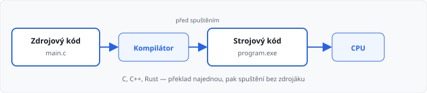
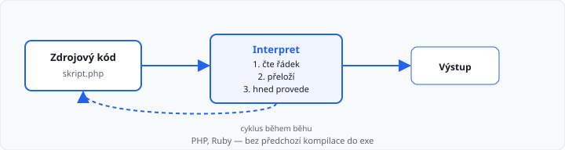
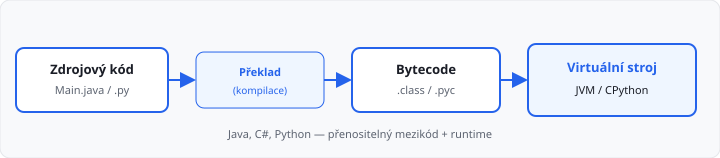

# Programování a programovací jazyky

## Cíle lekce

- Pochopíte, co je programování a k čemu slouží
- Naučíte se základní dělení programovacích jazyků a způsobů spuštění kódu
- Pochopíte, proč v Pythonu nemusíte paměť řešit ručně (automatická správa, ne „interpret“)
- Připravíte se na práci v Pythonu v dalších lekcích

## Co je programování?

**Programování** je systematický proces vytváření logických instrukcí (algoritmů), které počítač provádí. Nejedná se jen o psaní kódu — jde o:

- analýzu problému,
- návrh postupu řešení,
- automatizaci práce,
- ukládání a zpracování dat.

**Program** je zápis algoritmu ve zvoleném programovacím jazyce.

## Co je programovací jazyk?

Programovací jazyk je **prostředník** mezi člověkem a počítačem. Překlenuje propast mezi lidským uvažováním a strojovým kódem (jedničky a nuly).

Každý jazyk má:

- **syntaxi** — striktní pravidla zápisu,
- **sémantiku** — význam příkazů,
- **ekosystém** — nástroje, knihovny, komunitu.

## Vyšší a nižší jazyky

| Úroveň | Příklady | Charakteristika |
|--------|----------|-----------------|
| **Nižší** | Assembler, VHDL | Blíže stroji, konkrétní hardware |
| **Vyšší** | Python, Java, C# | Abstraktnější zápis, srozumitelnější pro člověka |

**Úroveň jazyka** říká, *jak blízko je zápis stroji* — neříká nic o tom, *jak se kód spouští* ani *kdo spravuje paměť*. C je vyšší jazyk než assembler, ale přesto se **kompiluje** a paměť se v něm často **spravuje ručně**. Python je také vyšší jazyk, ale běží přes **virtuální stroj** a paměť má **automatickou**.

## Paměť — samostatné téma

Počítač při běhu programu ukládá data do **paměti RAM** (proměnné, seznamy, texty…). Otázka zní: **kdo paměť hlídá?**

| Správa paměti | Kdo ji řeší | Typické jazyky |
|---------------|-------------|----------------|
| **Ruční** | programátor (rezervace / uvolnění) | C, C++ |
| **Automatická** | runtime, **garbage collector** | Python, Java, C# |

U **ruční správy** programátor sám alokuje a uvolňuje paměť — při chybě hrozí únik paměti nebo pád programu. U **automatické správy** runtime uvolní data, na která už nic neodkazuje.

> **Důležité:** to **nesouvisí** s tím, zda je jazyk kompilovaný nebo interpretovaný. Java se kompiluje do bytecode a přesto má garbage collector. C se kompiluje do exe a paměť je ruční. Python má GC kvůli **prostředí runtime (CPython)**, ne proto, že je „vyšší“ nebo „interpretovaný“.

V **Pythonu** tedy paměť ručně neřešíte — stará se o ni garbage collector. **Proměnné a paměť** probereme podrobně v [lekci 06](../06-promenne-a-pamet/lekce.md).

## Kompilátor vs. interpret

Program v jazyce vyšší úrovně počítač **nepřečte přímo** — musí se **přeložit** do podoby, kterou procesor nebo runtime umí spustit.

| | **Kompilátor** | **Interpret** |
|---|----------------|---------------|
| **Kdy překládá** | před spuštěním (najednou) | za běhu (po řádcích nebo blocích) |
| **Výstup** | spustitelný soubor (strojový kód / exe) | překládá a hned vykonává |
| **Typické jazyky** | C, C++, Rust | dříve „čistý“ PHP, Ruby |
| **Chyby v kódu** | často už při kompilaci | až při spuštění dané části |
| **Rychlost běhu** | obvykle vyšší | obvykle nižší |

Oba pojmy se u moderních jazyků **prolínají** — jde o to, *jak* a *kdy* se kód překládá. **Správu paměti to neurčuje** — ta závisí na návrhu jazyka a runtime (viz tabulka výše).

## Tři způsoby spuštění kódu

### 1. Kompilované jazyky

Zdrojový kód se **před spuštěním** přeloží kompilátorem do strojového kódu.

**Příklady:** C, C++, Pascal, Rust

| Výhody | Nevýhody |
|--------|----------|
| vysoký výkon | složitější kód |
| distribuce bez zdrojáků | strmější učící křivka |

### 2. Interpretované jazyky

Kód se **překládá za běhu** — interpret čte instrukce a postupně je vykonává.

**Příklady:** PHP, Ruby (čistý interpret); **Python spíše hybrid** (viz níže)

| Výhody | Nevýhody |
|--------|----------|
| rychlý vývoj | nižší výkon než nativní exe |
| snadné učení | některé chyby až při spuštění |
| okamžité spuštění bez kompilace | |

### 2b. Python — kompilace do bytecode + interpret

Python není „čistý“ interpret jako starší BASIC. Při spuštění souboru `.py` se kód nejdřív **přeloží do bytecode** (`.pyc`), pak ho **spouští virtuální stroj Pythonu** (CPython). Pro vás to vypadá jako interpret — napíšete kód a hned ho spustíte — ale technicky jde o **kompilaci + interpret bytecode**.

To je důvod, proč Python spadá mezi **interpretované** jazyky v praxi, i když uvnitř bytecode existuje.

### 3. Jazyky s virtuálním strojem

Kompromis — kód se kompiluje do mezikódu (bytecode), který běží na virtuálním stroji.

**Příklady:** Java, C#

| Výhody | Nevýhody |
|--------|----------|
| lepší výkon než interpret | nižší výkon než nativní kompilace |
| přenositelnost | |
| distribuce bez zdrojáků | |

## Programovací, značkovací a datové formáty

Ne všechno, co píšeme v počítači, je **program**. Rozlišíme tři typy zápisu:

### Programovací jazyky

Popisují **postup** — co má počítač udělat (algoritmus).

**Příklady:** Python, Java, C#

### Značkovací jazyky

Nepopisují algoritmus, ale **strukturu obsahu** pomocí **značek (tagů)**.

**Příklady:** HTML (`
…
`), XML (`<položka>…</položka>`)

### Datové formáty

Také neobsahují algoritmus — popisují **strukturu dat** (hodnoty, seznamy, vnoření). Na rozdíl od značkovacích jazyků ale **nepoužívají značky**, nýbrž vlastní syntaxi (závorky, čárky, uvozovky).

**Příklady:** JSON, YAML, CSV

> **Poznámka:** JSON se proto **nepočítá** mezi značkovací jazyky — je to datový formát. XML může sloužit obojím účelům (značky i výměna dat); u prvního ročníku stačí vědět, že jde o příbuzné, ale odlišné kategorie.

| Typ | Otázka | Spouští se? |
|-----|--------|-------------|
| Programovací jazyk | *Co* má počítač **udělat**? | ano |
| Značkovací jazyk | *Jak* je obsah **označen**? | ne |
| Datový formát | *Jak vypadají data*? | ne |

## Proč právě Python?

Python je **jazyk s automatickou správou paměti** (garbage collector), **dynamicky typovaný**, spouštěný přes **bytecode a virtuální stroj** — ideální pro začátečníky:

- čitelná syntaxe (odsazování místo složených závorek),
- **nemusíte ručně alokovat ani uvolňovat paměť** (na rozdíl od C/C++),
- rychlá zpětná vazba — spustíte `.py` bez složité kompilace do exe,
- široké uplatnění (web, data, automatizace, AI),
- bohatá komunita a knihovny.

Detailněji v další lekci: [02-python-a-prostredi](../02-python-a-prostredi/lekce.md).

## Shrnutí

| Pojem | Význam |
|-------|--------|
| Algoritmus | Postup řešení problému |
| Program | Algoritmus zapsaný v jazyce |
| Kompilátor | Překladač zdrojového kódu před spuštěním |
| Interpret | Spouští (a překládá) kód za běhu |
| Bytecode | Mezikód (Python `.pyc`, Java `.class`) |
| Garbage collector | Automatické uvolňování nepoužívané paměti (Python, Java) |
| Ruční správa paměti | Programátor sám alokuje a uvolňuje (typicky C, C++) |
| Datový formát | Zápis strukturovaných dat (JSON, YAML) |

## Co dál

→ [Lekce 02: Python a vývojové prostředí](../02-python-a-prostredi/lekce.md)
