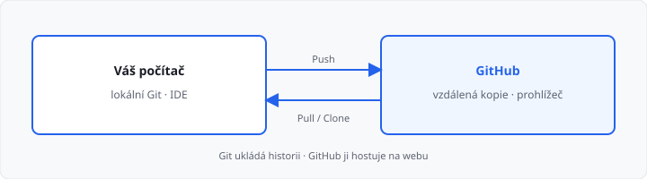
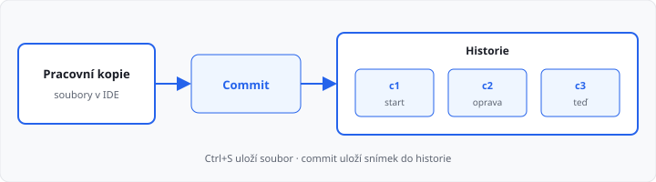

# Git a GitHub (bonus)

## Cíle lekce

- Pochopíte, **proč** se kód verzuje, ne jen kopíruje
- Rozlišíte **Git** (nástroj v počítači) a **GitHub** (služba na internetu)
- Budete vědět, co je **repozitář**, **commit** a **vzdálená kopie**
- Změnu uložíte a historii prohlédnete **v editoru** (PyCharm, VS Code, Cursor)

Tahle lekce **není v 81 hodinách**. Je **bonus** na konci 1. ročníku — smíte ji přeskočit. Python z lekcí 01–27 se nemění. Tady jde o **nástroj okolo kódu**: jak si práci nenechat zničit a jak ji později poslat dál.

Příkazy do konzole (`git add`, `git commit`) **nepotřebujete**. Stejné úkony umí tlačítka v IDE. Konzole existuje, ale v 1. ročníku stačí panel **Source Control** / **Git**.

## Proč nestačí „záloha do složky“

Bez verzování vznikají soubory jako `ukol_final.py`, `ukol_final2.py`, `ukol_opravdu_final.py`. Za týden nevíte, která verze platí a **co** jste v které změnil.

| Přístup | Co se stane |
|---------|-------------|
| Přejmenovat soubor | Historie zmizí, zůstane jen poslední název |
| Zkopírovat celou složku | Zabírá místo, nevíte rozdíl mezi kopiemi |
| Správa verzí (Git) | Každý uložený stav má **zprávu** a jde se k němu vrátit |

**Správa verzí** (*version control*) ukládá **snímky projektu** — ne jeden soubor, ale stav celé složky v daný okamžik. K snímku patří **kdo**, **kdy** a **proč** (zpráva commitu).

To není jen „pro firmy“. I u školního úkolu se hodí: rozbijete program, a místo hádání z paměti se vrátíte k poslednímu funkčnímu snímku.

## Git a GitHub — dva různé pojmy

Žáci (i inzeráty) slova často slučují. **Neslučujte je.**

| | **Git** | **GitHub** |
|---|---------|------------|
| Co to je | program na vašem disku | webová služba |
| Kde běží | u vás (a v IDE) | na internetu |
| Bez sítě | funguje | neotevřete vzdálený projekt |
| Úkol | ukládat historii | hostovat kopii, prohlížet, spolupracovat |

**Git** je nástroj. Repozitář může existovat **jen u vás** — bez účtu, bez cloudu.

**GitHub** je jeden z **hostitelů** vzdálené kopie. Jiné služby (GitLab, Bitbucket) dělají totéž jiným webem. V kurzu říkáme GitHub, protože ho potkáte nejčastěji.

> **Analogie:** Git je foťák a album na počítači. GitHub je cloud, kam album nahrajete, aby ho viděl učitel nebo spolužák.

## Repozitář

**Repozitář** (*repository*, zkráceně *repo*) je projekt **sledovaný Gitem**. Vypadá jako obyčejná složka s vašimi `.py` soubory. Navíc v ní Git drží skrytou historii (složka `.git` — do ní **nesaháte** rukou).

| Pojem | Význam |
|-------|--------|
| **Pracovní kopie** | soubory, které právě editujete v IDE |
| **Repozitář** | pracovní kopie + historie snímků |
| **Vzdálený repozitář** | kopie historie na GitHubu |

Nový repozitář v IDE **inicializujete** (Create Git Repository / Init). Nebo ho **klonujete** z GitHubu — IDE stáhne soubory i historii a otevře je jako projekt.

## Commit — uložený snímek

**Commit** není „uložit soubor“ (Ctrl+S). Ctrl+S zapíše soubor na disk. Commit **zaznamená stav projektu do historie**.

Každý commit má:

- **seznam změn** (které soubory přibyly, zmizely, změnily se),
- **zprávu** — krátká věta, *proč* ten stav ukládáte,
- autora a čas.

Bez srozumitelné zprávy je historie k ničemu. Pište česky nebo anglicky, ale **konkrétně**:

| Špatně | Lépe |
|--------|------|
| `úpravy` | `Oprava výpočtu průměru u prázdného seznamu` |
| `asdf` | `Přidání čtení známek ze souboru` |
| `finální verze` | `Hotový výpis nejdelšího řádku` |

### Příprava (stage) a commit

IDE často ukáže **dvě skupiny** souborů:

1. **Změněné** — Git ví, že soubor není stejný jako v posledním commitu.
2. **Připravené (staged)** — ty, které chcete do *tohoto* commitu.

Plus (`+`) nebo zaškrtnutí přesune soubor mezi skupinami. Pak napíšete zprávu a stisknete **Commit**. Do jednoho snímku tak nemusíte dát úplně všechno — třeba oddělíte opravu chyby od nového cvičení.

Na začátku smíte dát do commitu **všechny smysluplné soubory projektu**. Důležitější je *nedávat* sem odpad (viz `.gitignore`).

## Co do Gitu nepatří

Git má hlídat **zdrojový kód a texty, které píšete vy**. Ne patnáct kopií Pythonu, ne hesla.

Soubor **`.gitignore`** je seznam názvů a vzorů, které Git **přeskočí**. V IDE u nich nebude „změněno“, i když na disku jsou.

Typicky ignorujte:

| Vzor | Proč |
|------|------|
| `__pycache__/` | dočasné soubory interpretu |
| `.venv/`, `venv/` | izolovaný Python — každý si ho vytvoří u sebe |
| `.idea/`, `.vs/` | nastavení konkrétního počítače a editoru |
| `*.pyc` | přeložený bytecode |
| `.env` | hesla a tajné klíče — **do Gitu nikdy** |

→ vzor souboru: `priklady/gitignore-python.txt` (v projektu ho uložte jako `.gitignore`)

> **Pravidlo:** kdyby se repozitář omylem zveřejnil, nesmí v něm být heslo k e-mailu, k AMOS ani k databázi. Tajemství patří mimo Git.

## Větev — paralela, ne nutnost

**Větev** (*branch*) je pojmenovaná linie commitů. Výchozí se obvykle jmenuje `main` (starší projekty `master`).

Představte si sešit: `main` je čistopis. Novou větev založíte, když chcete **zkoušet**, aniž byste čistopis přepisovali. Když pokus vyjde, změny **sloučíte** (*merge*) zpět.

V 1. ročníku větev **nepotřebujete**. Stačí `main` a srozumitelné commity. Slovo si zapamatujte — ve 2. a 3. ročníku a v práci ho uvidíte pořád.

Když dvě osoby upraví **stejné místo** ve stejném souboru, Git sloučení sám neuhádne. Vznikne **konflikt**: IDE označí obě verze a vy vyberete, která má zůstat (nebo je spojíte). To není pád Gitu — je to otázka na člověka.

## Spolupráce bez konzole

Jakmile existuje vzdálená kopie na GitHubu, přibývají tři akce. V IDE jsou to tlačítka, ne příkazy.

| Akce | Směr | Kdy |
|------|------|-----|
| **Clone** | GitHub → nová složka u vás | poprvé otevíráte cizí (nebo školní) projekt |
| **Push** (nebo Sync) | váš počítač → GitHub | chcete zálohu nebo ukázat práci |
| **Pull** (nebo Sync) | GitHub → váš počítač | někdo (nebo vy z jiného PC) mezitím commitnul |

**Sync** ve VS Code / Cursor často udělá pull i push za sebou.

Účet na GitHubu je **zdarma**. Škola může používat i školní GitLab — myšlenka je stejná: vzdálená kopie + web.

Na GitHubu uvidíte záložky jako **Code** (soubory), **Commits** (historie) a někdy **Issues** (úkoly / chyby). Pro vás teď stačí Code a seznam commitů.

## Práce v IDE

V [lekci 02](../02-python-a-prostredi/lekce.md) jste zvolili editor. Git je ve všech třech na stejném místě: **boční panel historie**, ne terminál.

### VS Code a Cursor

1. Vlevo ikona **větve** (*Source Control*).
2. Otevřete složku projektu (**File → Open Folder**), ne jen jeden `.py`.
3. Pokud Git ještě nehlídá složku, nabídne **Initialize Repository**.
4. U změněných souborů **+** (připravit), dole **zpráva**, tlačítko **Commit**.
5. **Publish Branch** / **Sync** nabídne přihlášení na GitHub a založení vzdálené kopie.
6. Historii commitu otevřete u souboru v **Timeline**, nebo rozšířením s grafem větví.

Cursor vypadá jako VS Code — stejný panel, stejné ikony.

### PyCharm

1. **VCS → Enable Version Control Integration… → Git** (nebo *Create Git Repository*).
2. Dole nebo vlevo panel **Commit**: zaškrtnete soubory, napíšete zprávu, **Commit**.
3. **Git → Push…** odešle snímky na GitHub (při prvním pushi PyCharm nabídne založení vzdáleného repa).
4. **Git → Pull…** stáhne cizí commity.
5. **Git → Show History** / *Log* ukáže řadu snímků. Kliknutím vidíte diff — **co** se v souboru změnilo.

### Co máte v IDE kontrolovat

| Otázka | Kde v IDE |
|--------|-----------|
| Co se změnilo od minula? | seznam souborů v Source Control / Commit |
| Čím se liší dva řádky? | *diff* (červená = pryč, zelená = nové) |
| Kam se mohu vrátit? | historie / Log / Timeline |
| Je projekt na GitHubu? | po Sync / Push; nebo webová adresa v nastavení *remote* |

Když IDE hlásí, že Git **není nainstalovaný**, doinstalujte Git pro Windows z [git-scm.com](https://git-scm.com/) a editor restartujte. Instalátor zapněte s výchozími volbami — pak ho IDE najde samo. Stále **nemusíte** otevírat Git Bash.

## Časté situace

- **„Mám samé změny, ale nic jsem nepsal.“** — IDE nebo Python vytvořily `__pycache__` nebo soubory editoru. Doplňte `.gitignore`.
- **„Commit je šedý / nejde stisknout.“** — chybí zpráva, nebo není vybraný žádný soubor.
- **„Publish se ptal na účet.“** — přihlaste se do GitHubu v editoru (prohlížeč otevře autorizaci). Bez účtu lokální commity **fungují** — jen neodejdou na web.
- **„Push odmítnut.“** — na GitHubu je novější historie než u vás. Nejdřív **Pull**, případně vyřešte konflikt, pak znovu Push.
- **„Smazal jsem soubor omylem.“** — v historii commitu soubor ještě je. V Logu / History ho IDE umí obnovit. Proto se commituje **průběžně**, ne jednou za měsíc.

## Shrnutí

| Pojem | Význam |
|-------|--------|
| Správa verzí | ukládání snímků projektu s popisem |
| Git | nástroj v počítači (a v IDE) |
| GitHub | hostitel vzdálené kopie v prohlížeči |
| Repozitář | složka projektu + historie |
| Commit | jeden pojmenovaný snímek |
| Stage | výběr, co do *tohoto* commitu patří |
| `.gitignore` | co Git nemá sledovat |
| Push / Pull | odeslat / stáhnout historii |
| Clone | stáhnout vzdálený projekt jako novou složku |
| Větev | paralelní linie commitů (`main` stačí) |

## Co dál

→ [Lekce 29: Docker (bonus)](../29-docker/lekce.md) — jak spustit program ve stejném „balíčku“ na jiném počítači
