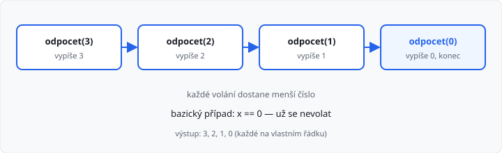

# Rekurze — základ

Lekce má **10 hodin** (dva týdny). Navazuje na funkce z 1. ročníku.

## Cíle lekce

- Pochopíte, co je rekurze a k čemu je bazický případ
- Napíšete rekurzivní funkci, která tiskne i která **vrací** hodnotu
- Použijete další parametr (např. mez nebo index v seznamu)

## Co je rekurze?

**Rekurze** je postup, při kterém funkce **volá sama sebe**. Takovému volání se říká **rekurzivní volání**. Funkce, která to dělá, je **rekurzivní**.

Myšlenka: problém rozložíte na **stejný problém, jen menší**. Až je problém tak malý, že znáte výsledek hned, rekurze skončí.

Z 1. ročníku umíte totéž často **cyklem**. Rekurze je druhý způsob zápisu. Na střední škole stačí umět jednoduché příklady — ne každý problém se rekurzí řeší lépe.

## Dvě povinné části

Každá rekurzivní funkce potřebuje:

| Část | Účel |
|------|------|
| **Bazický případ** | kdy už se **nevolat** (úloha je vyřešená) |
| **Rekurzivní volání** | stejná funkce s **menším** vstupem |

Bez bazického případu se funkce volá pořád dokola a Python skončí chybou `RecursionError`.

## Odpočet — první příklad

Funkce vypíše celá čísla od zadaného čísla **dolů k nule**:

```python
def odpocet(x):
    print(x)
    if x > 0:
        odpocet(x - 1)


cislo = int(input())
odpocet(cislo)
```

Pro vstup `3` se stane toto:

1. `odpocet(3)` vypíše `3` a zavolá `odpocet(2)`
2. `odpocet(2)` vypíše `2` a zavolá `odpocet(1)`
3. `odpocet(1)` vypíše `1` a zavolá `odpocet(0)`
4. `odpocet(0)` vypíše `0` — `x > 0` neplatí, **konec**



→ viz `priklady/odpocet.py`

## Návratová hodnota

Stejně jako u obyčejné funkce může rekurze **vracet** výsledek přes `return`.

Faktoriál `n! = n × (n−1) × … × 1`, přičemž `0! = 1`. V 1. ročníku jste ho počítali cyklem. Rekurzivně:

```python
def faktorial(n):
    if n <= 1:
        return 1
    return n * faktorial(n - 1)


print(faktorial(5))  # 120
```

`faktorial(5)` čeká na `faktorial(4)`, to na `faktorial(3)` … až `faktorial(1)` vrátí `1`. Pak se násobení „složí“ zpátky: `2×1`, `3×2`, `4×6`, `5×24`.

→ viz `priklady/faktorial.py`

## Další parametr

Někdy nestačí jeden vstup. Přidáte parametr, který nese **mez**, **index** nebo **mezivýsledek**.

Součet čísel od `start` do `konec`:

```python
def soucet_od_do(start, konec):
    if start > konec:
        return 0
    return start + soucet_od_do(start + 1, konec)


print(soucet_od_do(1, 4))  # 10
```

Bez druhého parametru by funkce nevěděla, kde přestat.

## Rekurze nad seznamem

Místo cyklu `for` jdete **indexem**. Bazický případ: index je za koncem seznamu.

```python
def soucet_seznamu(polozky, index=0):
    if index >= len(polozky):
        return 0
    return polozky[index] + soucet_seznamu(polozky, index + 1)


print(soucet_seznamu([10, 20, 30]))  # 60
```

Výchozí hodnota `index=0` znamená: při volání `soucet_seznamu(seznam)` začínáte od začátku.

→ viz `priklady/soucet_seznamu.py`

## Časté chyby

| Chyba | Co se stane |
|-------|-------------|
| chybí bazický případ | `RecursionError` |
| vstup se **nezmenšuje** (`f(n)` volá `f(n)`) | stejná chyba |
| bazický případ je špatně (třeba `n < 0` u faktoriálu 0) | špatný výsledek nebo pád |
| výsledek rekurze se **nevrátí** (`f(n-1)` bez `return`) | funkce vrátí `None` |

```python
# špatně — chybí return
def faktorial_spatne(n):
    if n <= 1:
        return 1
    n * faktorial_spatne(n - 1)
```

## Rekurze, nebo cyklus?

| Situace | Spíš cyklus | Spíš rekurze |
|---------|-------------|--------------|
| odpočet, součet 1…n | `for` / `while` | jde, ale není nutná |
| „stejný problém na menších datech“ | jde složitěji | přirozený zápis |

V úkolech této lekce **cyklus použít nesmíte** (kromě toho, co zadání výslovně dovolí, např. `range` na jeden řádek). Cílem je nacvičit rekurzi, ne hledat nejkratší zápis.

Automatický test v AMOS kontroluje **výstup**. Učitel může zkontrolovat, že v kódu opravdu je rekurze.

## Shrnutí

| Pojem | Význam |
|-------|--------|
| rekurze | funkce volá sama sebe |
| bazický případ | kdy se už nevolat |
| rekurzivní volání | volání se **menším** vstupem |
| `return` | vrátí hodnotu z vnořeného volání nahoru |

## Co dál

→ [Lekce 02: Vyhledávání a řazení — základ](../02-vyhledavani-a-razeni/lekce.md)
