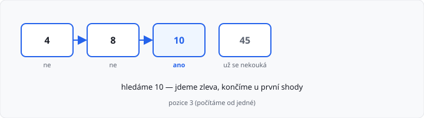
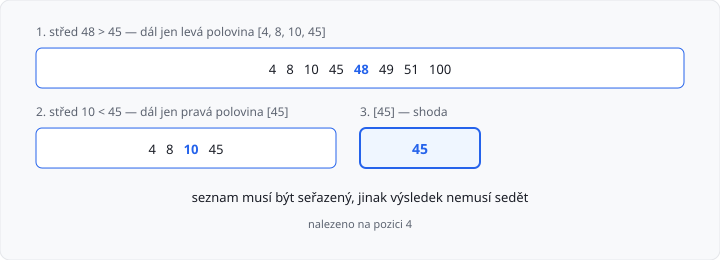
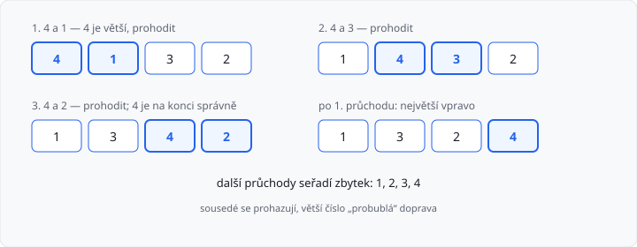

# Vyhledávání a řazení — základ

Lekce má **10 hodin** (dva týdny). Navazuje na [rekurzi](../01-rekurze/lekce.md). U každého postupu uvidíte, **kolik kroků** potřebuje vzhledem k počtu položek.

V 1. ročníku jste v seznamu hledali cyklem a řadili jste `sort()`. Tady uvidíte, **jak** hledání a řazení funguje uvnitř. Vestavěné `sort()` / `sorted()` v úkolech **nejsou** povolené.

## Cíle lekce

- Projdete seznam **lineárně** (od začátku) cyklem i rekurzí
- Použijete **binární hledání**, když je seznam **seřazený**
- Napíšete **bublinkové řazení** — bez `sort()` a `sorted()`
- Odhadnete, jak počet kroků roste s délkou seznamu

## Kdy který postup

| Potřebujete | Použijte |
|-------------|----------|
| najít prvek, seznam **není** seřazený | lineární hledání |
| najít prvek, seznam **je** seřazený | binární hledání |
| seznam seřadit vlastním kódem | bublinkové řazení (nebo jiný vlastní algoritmus) |

## Lineární hledání

Jdete prvek po prvku, dokud nenajdete hledané číslo, nebo seznam neskončí.

```python
def linearni(pole, x):
    for i in range(len(pole)):
        if pole[i] == x:
            return i + 1
    return None


pole = [4, 8, 10, 45]
print(linearni(pole, 10))  # 3
print(linearni(pole, 7))   # None
```

Pozice v této lekci počítáme **od jedné** (první prvek je 1), stejně jako v úkolech.



Tohle umíte z 1. ročníku jako cyklus. Teď totéž **rekurzí** — index je další parametr:

```python
def linearni_rek(pole, x, i=0):
    if i >= len(pole):
        return None
    if pole[i] == x:
        return i + 1
    return linearni_rek(pole, x, i + 1)
```

Bazický případ: index je za koncem → prvek tam **není**.

**Složitost:** v nejhorším případě (prvek chybí, nebo je až na konci) zkontrolujete **každou** položku. U `n` prvků je to až **`n` porovnání**. Tisíc položek → až tisíc kroků.

→ viz `priklady/linearni_hledani.py`

## Binární hledání

Funguje jen nad **seřazeným** seznamem (od nejmenšího). Myšlenka: podíváte se **doprostřed**.

- je to hledané číslo? hotovo
- střed je **větší** → hledejte jen v **levé** polovině
- střed je **menší** → hledejte jen v **pravé** polovině

Každý krok **rozřízne seznam na dvě poloviny** a dál pracujete jen s jednou z nich.

```python
def binarni(pole, x):
    if not pole:
        return None
    stred = len(pole) // 2  # celočíselné dělení: 5 // 2 je 2, ne 2.5
    if pole[stred] == x:
        return stred + 1
    if pole[stred] > x:
        return binarni(pole[:stred], x)
    nalez = binarni(pole[stred + 1:], x)
    if nalez is None:
        return None
    return stred + 1 + nalez


pole = [4, 8, 10, 45, 48, 49, 51, 100]
print(binarni(pole, 45))  # 4
print(binarni(pole, 7))   # None
```

`//` je **celočíselné dělení** — desetinnou část zahodí, aby `stred` byl platný index.

`pole[:stred]` je **levá** polovina (čísla před středem), `pole[stred + 1:]` **pravá**. Prázdný seznam → číslo tam není. Pozice počítáme **od jedné**. V pravé polovině je první prvek dál v původním seznamu, proto k nalezené pozici přičtěte `stred + 1`.

Hledání 45 v `[4, 8, 10, 45, 48, 49, 51, 100]`:

1. střed je 48 — větší než 45 → dál jen `[4, 8, 10, 45]`
2. střed je 10 — menší než 45 → dál jen `[45]`
3. 45 — **shoda**, pozice 4

**Složitost:** seznam se pořád **půlí**. U `n` prvků stačí zhruba **`log₂ n` porovnání** (8 položek → 3 kroky, 1000 položek → kolem 10). To je mnohem míň než lineární hledání.



→ viz `priklady/binarni_hledani.py`

Když seznam **není** seřazený, binární hledání může říct „není“, i když číslo v seznamu je. Nejdřív seřadit, nebo použít lineární hledání.

## Bublinkové řazení

Chcete seznam od nejmenšího po největší **vlastním** algoritmem. Vestavěné `seznam.sort()` a `sorted()` v úkolech **nejsou** povolené.

**Bublinkové řazení:** jdete sousední dvojice. Když je levé číslo větší, **prohodíte** je. Větší hodnoty „probublají“ doprava. Celý průchod opakujete, dokud je co prohazovat.

```python
def bublinkove(pole):
    n = len(pole)
    for i in range(n):
        for j in range(n - 1 - i):
            if pole[j] > pole[j + 1]:
                pole[j], pole[j + 1] = pole[j + 1], pole[j]
    return pole


print(bublinkove([4, 1, 3, 2]))  # [1, 2, 3, 4]
```

První průchod `[4, 1, 3, 2]`:

1. 4 a 1 → prohodit → `[1, 4, 3, 2]`
2. 4 a 3 → prohodit → `[1, 3, 4, 2]`
3. 4 a 2 → prohodit → `[1, 3, 2, 4]`

Největší číslo je vpravo. Další průchody seřadí zbytek.



`n - 1 - i`: po každém průchodu je na konci o jedno správně umístěné číslo víc, takže příště stačí kratší úsek.

**Složitost:** dva vnořené cykly. Počet porovnání roste se **čtvercem** počtu položek (zhruba `n²`). Dvakrát delší seznam → zhruba **čtyřikrát** víc práce. Deset položek je v pohodě, tisíc už je stovky tisíc porovnání.

Prohození bez třetí proměnné:

```python
a, b = b, a
```

→ viz `priklady/bublinkove_razeni.py`

Jiný řadící algoritmus (třeba výběrem minima) je taky v pořádku — v úkolu řazení stačí **libovolný vlastní** (ne `sort`).

## Načtení seznamu z konzole

Úkoly čtou **jeden řádek čísel** a často ještě druhé číslo. `input()` bez textu:

```python
pole = [int(x) for x in input().split()]
x = int(input())
```

`split()` rozdělí řádek podle mezer. `int` každé slovo změní na číslo.

## Časté chyby

| Chyba | Následek |
|-------|----------|
| binární hledání na neseřazeném seznamu | špatná odpověď |
| pozice od nuly, úkol chce od jedné | o jednu vedle |
| `return binarni(...)` zapomenete | výsledek z poloviny seznamu se zahodí |
| `pole.sort()` v úkolu | nedostatečná |

## Složitost podle počtu položek

`n` je počet prvků v seznamu. Zajímá nás **nejhorší případ**.

| Algoritmus | Nejhorší případ | 8 položek | 1000 položek |
|------------|-----------------|-----------|--------------|
| lineární hledání | až `n` porovnání | 8 | 1000 |
| binární hledání | zhruba `log₂ n` | 3 | ~10 |
| bublinkové řazení | zhruba `n²` porovnání | ~64 | ~1 000 000 |

Binární hledání se vyplatí u **dlouhého seřazeného** seznamu. Bublinkové řazení je srozumitelné, ale u velkých dat pomalé.

## Shrnutí

| Pojem | Podmínka | Postup | Kroky |
|-------|----------|--------|-------|
| lineární hledání | žádná | prvek po prvku | `n` |
| binární hledání | seznam je seřazený | půlení seznamu | `log₂ n` |
| bublinkové řazení | — | prohazovat sousedy | `n²` |

Automatický test v AMOS u cvičných úkolů kontroluje **výstup**. Učitel může zkontrolovat, že v kódu opravdu je rekurze, binární půlení, nebo vlastní řazení (ne `sort`).

Lekce končí **známkovaným úkolem** s tajným zadáním — dostanete ho od učitele.

## Co dál

→ [Lekce 03: Třídy, objekty a atributy](../03-tridy-a-objekty/lekce.md)
