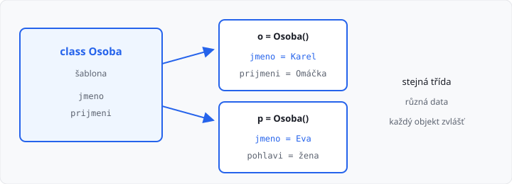

# Třídy, objekty a atributy

Lekce má **5 hodin** (jeden týden). Začíná **objektové programování** — do konce ročníku s ním budete pracovat pořád.

Z 1. ročníku umíte slovník (`student["jmeno"]`) a metody u hotových typů (`seznam.append`, `"ahoj".upper()`). Teď si takovou „věc s daty“ **navrhnete sami**.

Zatím **bez konstruktoru** (`__init__`) a **bez vlastních metod** — to je lekce 04 a 05. Tady stačí třída, objekt a tečka.

## Cíle lekce

- Pochopíte, co je **třída** a co je **objekt** (instance)
- Nastavíte **atributy** operátorem tečka
- Uvidíte, že dva objekty stejné třídy mají **vlastní** data

## Třída je šablona

**Třída** je nový složený datový typ. Složíte ho z typů, které už znáte (`int`, `str`, `float`, seznam… později i z jiných tříd).

Nejjednodušší zápis — zatím prázdná šablona:

```python
class Osoba:
    pass


o = Osoba()
```

`class Osoba` je **definice** (plán). `Osoba()` **vytvoří objekt** — jednu konkrétní osobu podle té šablony. Říká se jí taky **instance**.

Název třídy pište s velkým písmenem (`Osoba`, `Kniha`, `Auto`). `pass` znamená „tělo je zatím prázdné“.



## Atributy — data objektu

**Atribut** (vlastnost) je údaj, který patří **tomu jednomu** objektu. Vytvoříte ho tečkou. Pravidla pro jméno jsou stejná jako u proměnné (`jmeno`, ne `jméno`).

```python
class Osoba:
    pass


o = Osoba()
o.jmeno = "Karel"
o.prijmeni = "Omáčka"

print(o.jmeno)      # Karel
print(o.prijmeni)   # Omáčka
```

Atribut nemusí být ve třídě předem vypsaný. Musí ale **existovat, než ho čtete**. Jinak Python skončí chybou `AttributeError`.

```python
p = Osoba()
p.pohlavi = "muž"
print(p.jmeno)  # AttributeError — p ještě jméno nemá
```

→ viz `priklady/osoba.py`

## Dva objekty, dvě sady dat

Každé `Osoba()` je **jiný** objekt. Změna u jednoho druhého **neovlivní**:

```python
class Osoba:
    pass


o = Osoba()
o.jmeno = "Karel"

p = Osoba()
p.jmeno = "Eva"

o.jmeno = "Petr"
print(o.jmeno)  # Petr
print(p.jmeno)  # Eva
```

Kdyby měly všechny osoby sdílet jednu hodnotu, šlo by o **statickou** proměnnou — to je až lekce 09.

→ viz `priklady/dva_objekty.py`

## Slovník, nebo třída?

Obojí umí držet `jmeno` a `vek`. Rozdíl je v tom, **jak** o datech přemýšlíte.

| Slovník (1. ročník) | Třída (teď) |
|---------------------|-------------|
| `student["jmeno"]` | `o.jmeno` |
| klíč je řetězec | atribut má jméno v kódu |
| kterýkoli slovník | typ má název: `Osoba` |
| později metody nepřidáte tak čistě | v dalších lekcích metody, konstruktor |

Na malých datech stačí slovník. Jakmile modelujete **osobu, knihu, účet**, třída se čte líp a půjde ji rozšiřovat.

## Atribut může být seznam i jiný objekt

Atribut není jen text nebo číslo. Může to být **seznam** — třeba knihy autora. Přidání znáte z 1. ročníku: `append`.

```python
class Kniha:
    pass


class Autor:
    pass


k = Kniha()
k.nazev = "Válka s Mloky"
k.zanr = "román"
k.pocet_stran = 280

a = Autor()
a.jmeno = "Karel"
a.prijmeni = "Čapek"
a.knihy = []
a.knihy.append(k)

print(a.jmeno, a.prijmeni)
print(len(a.knihy))           # 1
print(a.knihy[0].nazev)       # Válka s Mloky
```

`a.knihy[0]` je objekt `Kniha`. Tečku můžete řetězit: nejdřív prvek seznamu, pak jeho atribut.

→ viz `priklady/autor_a_kniha.py`

Vlastní metodu `pridej_knihu` zatím **nepište** — v úkolu stačí `append`. Metody jsou lekce 05.

## Výpis objektu

Když vypíšete celý objekt, Python ukáže jen typ a adresu v paměti — to k čtení není:

```python
print(o)  # <__main__.Osoba object at 0x...>
```

Tiskněte **atributy**, nebo je složte do věty. Úhledný `print(o)` zařídí metoda `__str__` v lekci 06.

## Časté chyby

| Chyba | Následek |
|-------|----------|
| čtete atribut, který jste nenastavili | `AttributeError` |
| `osoba` místo `Osoba()` | nevoláte vytvoření objektu |
| čekáte, že změna `o.jmeno` změní i `p.jmeno` | každý objekt má svá data |
| `print(o)` místo `print(o.jmeno)` | neužitečný výpis instance |
| `class osoba:` | konvence: velká písmena u třídy |

## Shrnutí

| Pojem | Význam |
|-------|--------|
| třída | šablona, nový datový typ (`class Osoba`) |
| objekt / instance | konkrétní kus podle šablony (`Osoba()`) |
| atribut | údaj objektu (`o.jmeno`) |
| tečka | přístup k atributu |
| `AttributeError` | čtete něco, co objekt ještě nemá |

Příště konstruktor: atributy nastavíte **při** vytvoření, ne až potom řádek po řádku.

Automatický test v AMOS kontroluje **výstup**. Učitel může zkontrolovat, že v kódu opravdu jsou třídy a atributy (ne jen `print` hotové věty).

## Co dál

Další lekce: **Konstruktor** — `__init__` a `self`.
