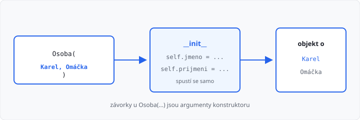

# Konstruktor

Lekce má **5 hodin** (jeden týden). Navazuje na [třídy a atributy](../03-tridy-a-objekty/lekce.md).

Minule jste atributy doplňovali **až po** vytvoření objektu, řádek po řádku. To je pracné a snadno na nějaký zapomenete (`AttributeError`). **Konstruktor** je nastaví hned, když objekt vzniká.

Vlastní metody (`vypis_jmeno`, `pridej_knihu`…) zatím nepište — to je lekce 05. Tady jde o `__init__` a `self`.

## Cíle lekce

- Pochopíte, že konstruktor je **speciální metoda**, která se spustí sama při `Osoba(...)`
- Zapíšete `self.jmeno = jmeno` a víte, proč je `self` potřeba
- Vytvoříte objekt **pozicně** i **pojmenovanými argumenty**
- Složíte objekt z jiných objektů (auto má motor)

## Co konstruktor dělá

**Konstruktor** se volá **automaticky** při vytvoření instance. V Pythonu se jmenuje `__init__` (dvě podtržítka z obou stran, čtěte „dunder init“).

```python
class Osoba:
    def __init__(self, jmeno, prijmeni):
        self.jmeno = jmeno
        self.prijmeni = prijmeni


o = Osoba("Karel", "Omáčka")
print(o.jmeno)      # Karel
print(o.prijmeni)   # Omáčka
```

`Osoba("Karel", "Omáčka")` znamená: vytvoř objekt a hned mu nastav jméno a příjmení. `__init__` sami **nevoláte**.



→ viz `priklady/osoba.py`

## self

První parametr konstruktoru je **`self`**. Je to **ten objekt, který právě vzniká**. Python ho do závorek při volání **nedáváte** — doplní ho sám.

| V kódu | Význam |
|--------|--------|
| `jmeno` | parametr, hodnota z volání (`"Karel"`) |
| `self.jmeno` | atribut **objektu** |

Bez `self` by šlo jen o lokální proměnnou metody — objekt by nic nedostal:

```python
def __init__(self, jmeno, prijmeni):
    jmeno = jmeno          # špatně — objekt jméno nemá
    self.prijmeni = prijmeni
```

Název `self` je zvyk. Pište ho tak, ať se kód čte stejně jako u ostatních.

## Minule a teď

| Minule (lekce 03) | Teď |
|-------------------|-----|
| `o = Osoba()` | `o = Osoba("Karel", "Omáčka")` |
| `o.jmeno = "Karel"` | atributy nastaví `__init__` |
| snadno zapomenete atribut | objekt je hned kompletní |

Pořád smíte atribut **změnit** později (`o.jmeno = "Petr"`). Konstruktor jen zajišťuje **výchozí** stav.

## Když argument chybí

Jakmile má `__init__` povinné parametry, prázdné `Osoba()` už nestačí:

```python
o = Osoba()  # TypeError: missing 2 required positional arguments
```

Musíte předat tolik hodnot, kolik konstruktor (kromě `self`) čeká. Pořadí u **pozicních** argumentů platí:

```python
o = Osoba("Karel", "Omáčka")
#         jmeno     prijmeni
```

## Pojmenované argumenty

Z [1. ročníku](../../1-rocnik/15-funkce-zaklady/lekce.md) umíte u funkce napsat `f(a=5, b=3)`. U konstruktoru je to **stejné** — `self` do závorek pořád nepatří.

```python
o = Osoba(jmeno="Karel", prijmeni="Omáčka")
o = Osoba(prijmeni="Omáčka", jmeno="Karel")  # pořadí u jmen nehraje roli
```

Hodí se, když má konstruktor hodně parametrů (auto, kniha) a z pouhých hodnot v závorkách by nebylo poznat, co je značka a co SPZ.

Pozicní argumenty musí být **před** pojmenovanými:

```python
Osoba("Karel", prijmeni="Omáčka")  # ano
Osoba(jmeno="Karel", "Omáčka")     # ne — SyntaxError
```

`self` se nepíše ani u pojmenovaného volání: `Osoba(self=o, jmeno="Karel")` nepoužívejte.

## Výchozí hodnota

Parametr může mít **implicitní** hodnotu, když ji při volání vynecháte:

```python
class Produkt:
    def __init__(self, nazev, cena, mena="Kc"):
        self.nazev = nazev
        self.cena = cena
        self.mena = mena


a = Produkt("chleba", 32)
b = Produkt("syr", 48, "EUR")
print(a.mena)  # Kc
print(b.mena)  # EUR
```

Seznam v konstruktoru založte **uvnitř** (`self.knihy = []`). Nedávejte `knihy=[]` rovnou do hlavičky — to by všechny objekty omylem sdílely jeden seznam.

→ viz `priklady/produkt.py`

## Objekt uvnitř objektu

Atribut může být **jiný objekt**. V konstruktoru ho vytvoříte stejně jako kterýkoli jiný:

```python
class Motor:
    def __init__(self, typ, obsah, palivo):
        self.typ = typ
        self.obsah = obsah
        self.palivo = palivo


class Auto:
    def __init__(self, znacka, spz, motor):
        self.znacka = znacka
        self.spz = spz
        self.motor = motor


m = Motor("TSI", 1500, "benzin")
a = Auto("Skoda", "1A2 3456", m)
print(a.znacka)          # Skoda
print(a.motor.palivo)    # benzin
```

Motor můžete vytvořit i **uvnitř** auta, když nemá smysl existovat zvlášť:

```python
class Auto:
    def __init__(self, znacka, spz, typ_motoru, obsah, palivo):
        self.znacka = znacka
        self.spz = spz
        self.motor = Motor(typ_motoru, obsah, palivo)
```

→ viz `priklady/auto_a_motor.py`

V úkolu autoservisu bude auto mít motor a čtyři kola — stejný postup, jen víc atributů.

## Časté chyby

| Chyba | Následek |
|-------|----------|
| zapomenete `self` v hlavičce | `TypeError` už při vytvoření |
| `jmeno = jmeno` místo `self.jmeno = jmeno` | objekt atribut nemá |
| `__init` (málo podtržítek) | konstruktor se nespustí |
| voláte `o.__init__(...)` ručně | zbytečné, stačí `Osoba(...)` |
| `Osoba()` bez argumentů | `TypeError: missing … arguments` |
| `Osoba(jmeno="Karel", "Omáčka")` | `SyntaxError` — pojmenované až za pozicními |
| `knihy=[]` v hlavičce `__init__` | objekty sdílejí jeden seznam |

## Shrnutí

| Pojem | Význam |
|-------|--------|
| konstruktor | kód, který se spustí při vzniku objektu |
| `__init__` | jméno konstruktoru v Pythonu |
| `self` | objekt, který právě vzniká |
| `self.jmeno = jmeno` | parametr uložíte jako atribut |
| `Osoba(jmeno="Karel")` | pojmenovaný argument — jako u funkce |
| složení | atributem je jiný objekt (`a.motor`) |

Příště metody: objekt umí i **něco udělat**, nejen data držet.

Automatický test v AMOS kontroluje **výstup**. Učitel může zkontrolovat, že atributy nastavuje konstruktor (ne jen tečka po `Osoba()`).

## Co dál

→ [Lekce 05: Metody a self](../05-metody/lekce.md)
