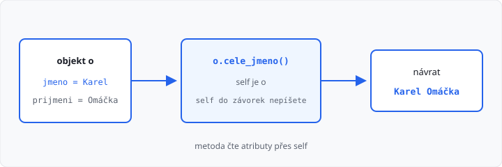

# Metody a self

Lekce má **5 hodin** (jeden týden). Navazuje na [konstruktor](../04-konstruktor/lekce.md).

Dosud objekt **držel data** (atributy). **Metoda** je funkce, která k objektu **patří** — umí data přečíst, spočítat z nich výsledek nebo je změnit.

Speciální metoda `__str__` je až lekce 06. Dědičnost (společný rodič u oblečení) až lekce 07. Tady stačí obyčejné metody a `self`.

## Cíle lekce

- Odlišíte **funkci** (1. ročník) od **metody** (teď)
- Napíšete metodu se `self`, která **vrací** hodnotu nebo **mění** atribut
- Z jedné metody zavoláte metodu **jiného** objektu

## Metoda je funkce u objektu

Z 1. ročníku:

```python
def cele_jmeno(jmeno, prijmeni):
    return jmeno + " " + prijmeni


print(cele_jmeno("Karel", "Omáčka"))
```

Stejná práce jako **metoda** — první parametr je `self`, voláte ji **tečkou** na objektu:

```python
class Osoba:
    def __init__(self, jmeno, prijmeni):
        self.jmeno = jmeno
        self.prijmeni = prijmeni

    def cele_jmeno(self):
        return self.jmeno + " " + self.prijmeni


o = Osoba("Karel", "Omáčka")
print(o.cele_jmeno())  # Karel Omáčka
```

`o.cele_jmeno()` znamená: vezmi objekt `o` a spusť jeho metodu. Python do `self` **sám** dosadí `o`. Do závorek `self` nepíšete — stejně jako u konstruktoru.



→ viz `priklady/osoba.py`

## self znovu

U konstruktoru byl `self` objekt, který **vznikal**. U metody je `self` objekt **před tečkou**.

| Zápis | Co se stane |
|-------|-------------|
| `o.cele_jmeno()` | Python zavolá `cele_jmeno` a do `self` dá `o` |
| `p.cele_jmeno()` | totéž pro objekt `p` — jiná data |

Bez `self` v hlavičce spadne volání na `TypeError`. Bez `self.jmeno` uvnitř metoda nevidí atributy objektu.

## Návratová hodnota, nebo změna

Metoda může **vrátit** výsledek (`return`) — volající ho vypíše nebo uloží:

```python
text = o.cele_jmeno()
print(text)
```

Nebo **změnit** atribut a nic nevracet:

```python
class Osoba:
    def __init__(self, jmeno, prijmeni, vek):
        self.jmeno = jmeno
        self.prijmeni = prijmeni
        self.vek = vek

    def nastav_vek(self, vek):
        self.vek = vek

    def jsem_plnolety(self):
        return self.vek >= 18


o = Osoba("Karel", "Omáčka", 16)
o.nastav_vek(30)
print(o.jsem_plnolety())  # True
```

`vek` v závorkách je parametr metody. `self.vek` je atribut objektu. Po `nastav_vek(30)` má objekt nový věk.

Když zadání říká „vypište“, můžete `print` dát **do metody**, nebo metodu nechat vrátit text a `print` dát ven. V úkolech dodržte přesný tvar výstupu.

## Další parametry

Za `self` smí být další parametry — jako u funkce. Platí i [pojmenované argumenty](../../1-rocnik/15-funkce-zaklady/lekce.md):

```python
o.nastav_vek(30)
o.nastav_vek(vek=30)
```

`self` do volání pořád nepatří.

## Metoda volá jinou metodu

Objekt může mít v atributu **jiný objekt**. Jeho metodu zavoláte tečkou:

```python
class Kolo:
    def __init__(self, aktualni, maximum):
        self.aktualni = aktualni
        self.maximum = maximum

    def tlak_ok(self):
        return self.aktualni <= self.maximum


class Auto:
    def __init__(self, znacka, kolo):
        self.znacka = znacka
        self.kolo = kolo

    def pneu_ok(self):
        return self.kolo.tlak_ok()


k = Kolo(2.2, 2.5)
a = Auto("Skoda", k)
print(a.pneu_ok())  # True
```

`a.pneu_ok()` se zeptá kola. V autoservisu budete totéž dělat u **čtyř** kol.

→ viz `priklady/auto_a_kolo.py`

Přidání do seznamu, které jste minule psali jako `autor.knihy.append(k)`, teď zabalíte do metody:

```python
def pridej_knihu(self, kniha):
    self.knihy.append(kniha)
```

Pak `autor.pridej_knihu(k)` — čitelnější než sahat na seznam zvenku.

→ viz `priklady/autor.py`

## Časté chyby

| Chyba | Následek |
|-------|----------|
| chybí `self` v hlavičce metody | `TypeError` při `o.metoda()` |
| `jmeno` místo `self.jmeno` | `NameError`, nebo berete parametr místo atributu |
| zapomenete `return` | metoda vrátí `None` |
| `print` uvnitř, úkol chce návratovou hodnotu | AMOS neporovná to, co čeká |
| voláte `Osoba.cele_jmeno()` bez objektu | chybí `self` |
| `__str__` v této lekci | počkejte na lekci 06, stačí vlastní metoda |

## Shrnutí

| Pojem | Význam |
|-------|--------|
| metoda | funkce, která patří objektu |
| `self` | objekt před tečkou |
| `o.cele_jmeno()` | volání metody |
| `return` | výsledek ven z metody |
| změna atributu | `self.vek = vek` uvnitř metody |

Příště speciální metody — hlavně `__str__`, ať `print(o)` vypíše čitelný text.

Automatický test v AMOS kontroluje **výstup**. Učitel může zkontrolovat, že práce je v metodách (ne jen `print` v hlavním programu).

## Co dál

→ [Lekce 06: Speciální metody a vlastnosti](../06-specialni-metody/lekce.md)
