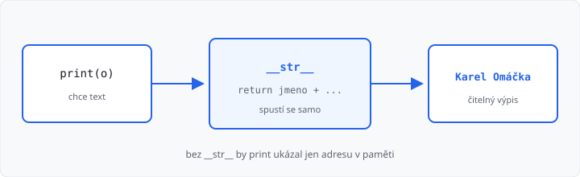

# Speciální metody a vlastnosti

Lekce má **5 hodin** (jeden týden). Navazuje na [metody](../05-metody/lekce.md).

Minule jste psali `print(o.cele_jmeno())`. Když vypíšete **celý objekt**, Python ukáže jen typ a adresu v paměti. **`__str__`** to změní: `print(o)` vypíše čitelný text.

Dědičnost je až lekce 07. Iterace (`__iter__`) až lekce 10.

## Cíle lekce

- Napíšete `__str__`, která **vrátí** řetězec (ne `print` uvnitř)
- Pochopíte, že `print(o)` a `str(o)` tu metodu **zavolají samy**
- Stav objektu změníte **metodou** (`nastav_…`), ne jen tečkou zvenku

## Proč print(o) nic neřekne

```python
class Osoba:
    def __init__(self, jmeno, prijmeni):
        self.jmeno = jmeno
        self.prijmeni = prijmeni


o = Osoba("Karel", "Omáčka")
print(o)  # <__main__.Osoba object at 0x...>
```

To k čtení není. Python neví, které atributy má složit do věty — to musíte napsat vy.

## Speciální metoda __str__

Metoda se dvěma podtržítky z obou stran je **speciální** (čtěte „dunder str“). Nesvoláváte ji sami. Spustí se, když objekt potřebujete jako **text**: `print(o)`, `str(o)`, nebo skládání řetězců.

```python
class Osoba:
    def __init__(self, jmeno, prijmeni):
        self.jmeno = jmeno
        self.prijmeni = prijmeni

    def __str__(self):
        return self.jmeno + " " + self.prijmeni


o = Osoba("Karel", "Omáčka")
print(o)       # Karel Omáčka
s = str(o)     # totéž do proměnné
print(s)
```

`return` je povinný a musí vrátit **řetězec**. Když uvnitř `__str__` použijete `print` a nic nevrátíte, `print(o)` vypíše `None`.



→ viz `priklady/osoba.py`

`__init__` už znáte — taky speciální metoda. Tady přibývá jen `__str__`. Ostatní dunder metody (porovnání, délka, iterace) zatím nepište.

## Objekt uvnitř objektu

Když má osoba adresu, v `__str__` osoby použijete `str(self.adresa)` — tím se spustí `__str__` adresy:

```python
class Adresa:
    def __init__(self, ulice, mesto):
        self.ulice = ulice
        self.mesto = mesto

    def __str__(self):
        return self.ulice + ", " + self.mesto


class Osoba:
    def __init__(self, jmeno, adresa):
        self.jmeno = jmeno
        self.adresa = adresa

    def __str__(self):
        return self.jmeno + ", " + str(self.adresa)


o = Osoba("Karel", Adresa("Komenskeho 12", "Brno"))
print(o)  # Karel, Komenskeho 12, Brno
```

→ viz `priklady/osoba_a_adresa.py`

## Vlastnosti — čtení a zápis metodou

Atribut pořád můžete změnit tečkou (`o.vek = 30`). V zadáních se ale často chce **zapouzdření**: stav mění metoda, která může kontrolovat vstup.

```python
class Osoba:
    def __init__(self, jmeno, vek):
        self.jmeno = jmeno
        self.vek = vek

    def vek_osoby(self):
        return self.vek

    def nastav_vek(self, vek):
        if vek < 0:
            vek = 0
        self.vek = vek

    def __str__(self):
        return self.jmeno + ", vek " + str(self.vek)


o = Osoba("Eva", 16)
o.nastav_vek(18)
print(o.vek_osoby())  # 18
print(o)
```

- metoda **vracející** hodnotu = čtení vlastnosti
- metoda **s parametrem**, která nastaví atribut = zápis vlastnosti

Stav raději měníte metodou, ne jen tečkou zvenku. ŠVP tomu říká *řádkové metody* (v C# vlastnosti get/set); v Pythonu stačí obyčejné metody.

→ viz `priklady/vlastnosti.py`

Python umí i zápis `@property`, ať se `cele_jmeno` čte bez závorek. V této lekci ho **nepotřebujete** — stačí `cele_jmeno()`.

## Časté chyby

| Chyba | Následek |
|-------|----------|
| `__str` (málo podtržítek) | `print(o)` pořád ukáže adresu |
| `print(...)` uvnitř `__str__` bez `return` | vypíše se `None` |
| `return` čísla místo textu | `TypeError: __str__ returned non-string` |
| `return self` | totéž — musí to být `str` |
| voláte `o.__str__()` ručně | zbytečné, stačí `print(o)` |

## Shrnutí

| Pojem | Význam |
|-------|--------|
| speciální metoda | jméno s `__` z obou stran, volá ji Python |
| `__str__` | textová podoba objektu |
| `print(o)` / `str(o)` | spustí `__str__` |
| zapouzdření | stav měníte metodou, ne jen tečkou |
| `nastav_…` / `…()` | zápis a čtení vlastnosti |

Příště dědičnost — společné atributy a metody přesunete do rodiče.

Automatický test v AMOS u cvičných úkolů kontroluje **výstup**.

Lekce končí **známkovaným úkolem** s tajným zadáním — dostanete ho od učitele. Hodnotí učitel.

## Co dál

→ [Lekce 07: Dědičnost](../07-dedicnost/lekce.md)
