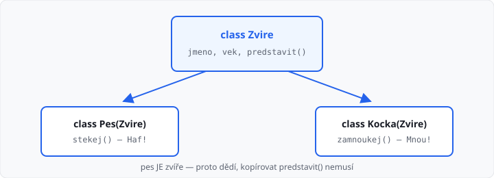

# Dědičnost

Lekce má **5 hodin** (jeden týden). Navazuje na [speciální metody](../06-specialni-metody/lekce.md).

Minule měly dvě třídy spoustu **stejného** kódu (atributy, `naskladnit`, `__str__`). Když platí, že jedna věc **je** druhá (pes **je** zvíře), společné věci napíšete jednou u **rodiče**. Potomek je zdědí a přidá jen to svoje.

Přepisování stejné metody u více potomků (polymorfismus) je až lekce 08. Tady jde o vztah rodič → potomek a `super()`.

## Cíle lekce

- Pochopíte dědičnost jako vztah **„je“**, ne „má“
- Potomek **zavolá** metodu, kterou napsal rodič
- Když potomek potřebuje další atribut, použijete **`super()`**

## Je, nebo má?

| Ze života | V kódu | Vztah |
|-----------|--------|--------|
| pes **je** zvíře | `class Pes(Zvire)` | dědičnost |
| žák **je** osoba | `class Zak(Osoba)` | dědičnost |
| tričko **je** oblečení | `class Triko(Obleceni)` | dědičnost |
| auto **má** motor | `self.motor = Motor(...)` | složení (lekce 04) |

Kolo u auta **není** auto — proto kolo z auta **nedědí**. Pes zvíře **je**, proto dědí.



## Potomek použije rodiče

Rodič drží to, co mají všichni. Potomek v závorkách uvede jméno rodiče:

```python
class Zvire:
    def __init__(self, jmeno, vek):
        self.jmeno = jmeno
        self.vek = vek

    def predstavit(self):
        return self.jmeno + ", vek " + str(self.vek)


class Pes(Zvire):
    def stekej(self):
        return "Haf!"


p = Pes("Azor", 5)
print(p.predstavit())  # Azor, vek 5  — metoda z Zvire
print(p.stekej())      # Haf!         — metoda z Pes
print(p.jmeno)         # Azor         — atribut z konstruktoru Zvire
```

`Pes("Azor", 5)` funguje, protože pes **nemá vlastní** konstruktor — použije se `__init__` zvířete.

Kočka je taky zvíře, jen jiný zvuk:

```python
class Kocka(Zvire):
    def zamnoukej(self):
        return "Mnou!"


k = Kocka("Micka", 3)
print(k.predstavit())
print(k.zamnoukej())
```

→ viz `priklady/zvire.py`

## Zaměstnanec je osoba

Stejný nápad jako v učebnici: zaměstnanec **je** osoba, plus má práci.

```python
class Osoba:
    def __init__(self, jmeno, prijmeni):
        self.jmeno = jmeno
        self.prijmeni = prijmeni

    def cele_jmeno(self):
        return self.jmeno + " " + self.prijmeni


class Zamestnanec(Osoba):
    def nastav_pozici(self, pozice):
        self.pozice = pozice


z = Zamestnanec("Karel", "Omáčka")
z.nastav_pozici("skladnik")
print(z.cele_jmeno())  # Karel Omáčka
print(z.pozice)        # skladnik
```

→ viz `priklady/osoba_zamestnanec.py`

## super() — potomek má navíc atribut

Pes má navíc plemeno. Konstruktor potomka nejdřív nechá rodiče nastavit jméno a věk, pak doplní svoje:

```python
class Pes(Zvire):
    def __init__(self, jmeno, vek, plemeno):
        super().__init__(jmeno, vek)
        self.plemeno = plemeno

    def stekej(self):
        return "Haf!"


p = Pes("Azor", 5, "labrador")
print(p.jmeno)     # Azor
print(p.plemeno)   # labrador
```

`super()` znamená „rodič této třídy“. `super().__init__(...)` spustí konstruktor zvířete. Bez toho by pes neměl `jmeno` a `vek`.

Nepíšete `Zvire.__init__(self, ...)` — `super()` je kratší a méně chybové.

## Společné metody u oblečení

Tričko i kalhoty jdou naskladnit. To nekopírujte dvakrát — patří rodiči `Obleceni`:

```python
class Obleceni:
    def __init__(self, pocet_kusu, velikost, barva):
        self.pocet_kusu = pocet_kusu
        self.velikost = velikost
        self.barva = barva

    def naskladnit(self, pocet):
        self.pocet_kusu = self.pocet_kusu + pocet


class Triko(Obleceni):
    def __init__(self, pocet_kusu, velikost, barva, s_lemecek):
        super().__init__(pocet_kusu, velikost, barva)
        self.s_lemecek = s_lemecek


t = Triko(10, "L", "modra", True)
t.naskladnit(5)
print(t.pocet_kusu)  # 15
```

V lekci 05 bylo jen tričko. Teď vidíte, proč se hodí rodič: kalhoty dostanou `naskladnit` zadarmo.

→ viz `priklady/obleceni.py`

## __str__ u potomka

Potomek zdědí i `__str__`. Když chcete ve výpisu i plemeno, metodu **přepíšete** (napíšete ji znovu u psa). Víc o přepisování je v lekci 08 — tady stačí vědět, že to jde:

```python
class Pes(Zvire):
    def __init__(self, jmeno, vek, plemeno):
        super().__init__(jmeno, vek)
        self.plemeno = plemeno

    def __str__(self):
        return self.jmeno + ", vek " + str(self.vek) + ", " + self.plemeno
```

`print(p)` pak použije `__str__` **psa**, ne zvířete.

## Časté chyby

| Chyba | Následek |
|-------|----------|
| `class Pes: Zvire` místo `class Pes(Zvire)` | pes zvíře nezdědí |
| zapomenete `super().__init__(...)` | chybí atributy rodiče, `AttributeError` |
| auto dědí z motoru | špatný vztah — auto motor **má**, není jím |
| kopírujete stejnou metodu do tří potomků | patří k rodiči |
| `Zvire()` místo `Pes(...)` když chcete psa | dostanete jen zvíře, bez `stekej` |

## Shrnutí

| Pojem | Význam |
|-------|--------|
| rodič | společné atributy a metody (`Zvire`) |
| potomek | `class Pes(Zvire)` — **je** rodič plus svoje |
| dědičnost | potomek metody rodiče umí, aniž by je psal |
| `super()` | přístup k rodiči, hlavně ke konstruktoru |
| složení | objekt **má** jiný objekt (auto má motor) |

Příště polymorfismus — stejné volání, jiný výsledek podle typu potomka.

Automatický test v AMOS kontroluje **výstup**. Učitel může zkontrolovat, že společný kód je u rodiče (ne zkopírovaný).

## Co dál

→ [Lekce 08: Polymorfismus](../08-polymorfismus/lekce.md)
