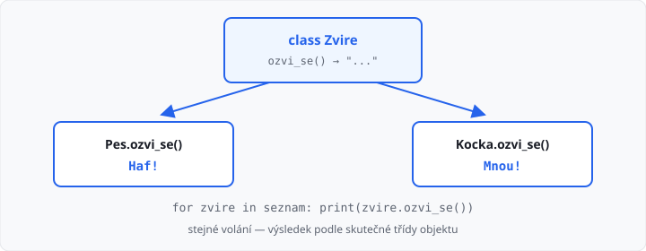

# Polymorfismus

Lekce má **3 hodiny**. Navazuje na [dědičnost](../07-dedicnost/lekce.md). Další čas z týdne patří [pololetnímu projektu](../11-oop-navrh-a-procviceni/lekce.md).

Minule pes **je** zvíře a společné věci patří rodiči. Tady mají potomci **stejnou** metodu, ale **jiné** tělo. Zavoláte `ozvi_se()` — pes řekne `Haf!`, kočka `Mnou!`. ŠVP tomu říká *mnohotvárnost*.

## Cíle lekce

- U potomka **přepíšete** metodu, kterou má rodič
- Python vybere tělo podle **skutečného** objektu, ne podle jména v seznamu
- Smíšený seznam projdete **jedním** cyklem — bez `if` podle typu

## Přepis metody

Rodič metodu má. Potomek ji napíše znovu **pod stejným jménem**. Tomu se říká přepis.

```python
class Zvire:
    def __init__(self, jmeno):
        self.jmeno = jmeno

    def ozvi_se(self):
        return "..."


class Pes(Zvire):
    def ozvi_se(self):
        return "Haf!"


class Kocka(Zvire):
    def ozvi_se(self):
        return "Mnou!"


print(Pes("Azor").ozvi_se())     # Haf!
print(Kocka("Micka").ozvi_se())  # Mnou!
print(Zvire("x").ozvi_se())      # ...
```

U psa se **nepoužije** `ozvi_se` zvířete. Platí to, co je napsané u `Pes`. Rodičovská verze zůstane pro čisté zvíře a jako základ, když ji později zavoláte přes `super()`.

Jméno metody musí sedět **přesně**. `stekej` místo `ozvi_se` není přepis — je to nová metoda navíc a `ozvi_se` pořád vrací `...`.

→ viz `priklady/ozvi_se.py`



## Seznam různých objektů

Do jednoho seznamu dáte psa i kočku. Cyklus volá **stejnou** metodu. Každý objekt odpoví po svém:

```python
seznam = [Pes("Azor"), Kocka("Micka"), Pes("Rex")]
for zvire in seznam:
    print(zvire.jmeno + ": " + zvire.ozvi_se())
```

Výstup:

```
Azor: Haf!
Micka: Mnou!
Rex: Haf!
```

Proměnná `zvire` je jednou pes, jednou kočka. Nepíšete `if` „když je to pes, vypiš Haf“. To by polymorfismus obešlo — a při dalším potomkovi byste museli podmínku doplňovat.

→ viz `priklady/seznam_zvirat.py`

## super() u přepsané metody

U konstruktoru už `super()` znáte. Stejně ho použijete, když chcete **rodičovské** tělo a k němu něco přidat. Minule šlo `__str__` u psa opsat celé. Teď rodiče znovu nekopírujte:

```python
class Zvire:
    def __init__(self, jmeno, vek):
        self.jmeno = jmeno
        self.vek = vek

    def __str__(self):
        return self.jmeno + ", vek " + str(self.vek)


class Pes(Zvire):
    def __init__(self, jmeno, vek, plemeno):
        super().__init__(jmeno, vek)
        self.plemeno = plemeno

    def __str__(self):
        return super().__str__() + ", " + self.plemeno


print(Pes("Azor", 5, "labrador"))
# Azor, vek 5, labrador
```

`super().__str__()` spustí výpis zvířete. Pes jen připojí plemeno. Když se změní `__str__` rodiče, potomek to zdědí automaticky.

→ viz `priklady/str_super.py`

## Časté chyby

| Chyba | Následek |
|-------|----------|
| jiný název metody než u rodiče | přepis se nekoná, volá se rodič |
| `if` podle typu v cyklu | další potomek = další větev, polymorfismus chybí |
| v přepsaném `__str__` znovu skládáte jméno a věk | patří do `super().__str__()` |
| voláte `Pes.ozvi_se()` bez objektu | chybí `self`, `TypeError` |
| do seznamu dáte třídu (`Pes`) místo instance (`Pes("Azor")`) | volání metody spadne |

## Shrnutí

| Pojem | Význam |
|-------|--------|
| přepis | potomek napíše stejnou metodu znovu, s jiným tělem |
| polymorfismus | stejné volání, výsledek podle skutečné třídy |
| seznam potomků | jeden cyklus, jedna metoda, různé odpovědi |
| `super().metoda()` | nejdřív rodič, pak doplníte svoje |

Příště statické metody a proměnné — členy, které patří třídě, ne jednomu objektu.

Automatický test v AMOS kontroluje **výstup**. Učitel může zkontrolovat, že v cyklu není `if` podle typu a že přepis má stejné jméno metody.

## Co dál

→ [Lekce 09: Statické metody a proměnné](../09-staticke-cleny/lekce.md)
