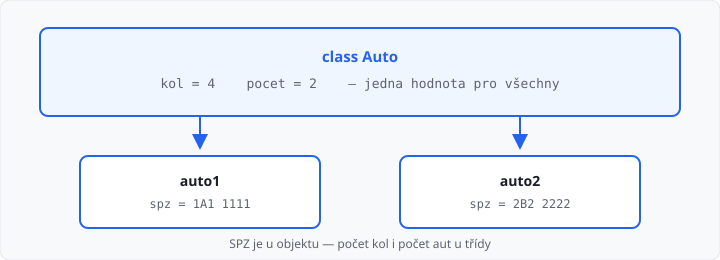

# Statické metody a proměnné

Lekce má **5 hodin** (jeden týden). Navazuje na [polymorfismus](../08-polymorfismus/lekce.md).

Doteď patřila data **objektu**: každé auto má svou SPZ, každá osoba své jméno. Něco ale platí **pro všechna** auta stejně — počet kol, DPH, kolik aut už vzniklo. To napíšete u **třídy**. ŠVP tomu říká *statický člen*.

## Cíle lekce

- U třídy držíte hodnotu, kterou **sdílejí** všechny objekty
- V konstruktoru zvýšíte **počítadlo** u třídy, ne u `self`
- Napíšete metodu **bez `self`**, kterou zavoláte na třídě

## Proměnná třídy

Atribut s `self` je u **jednoho** objektu. Proměnná hned pod `class` je u **třídy** — jedna pro všechny instance.

```python
class Auto:
    kol = 4

    def __init__(self, spz):
        self.spz = spz


a = Auto("1A1 1111")
b = Auto("2B2 2222")
print(a.spz)     # 1A1 1111  — jen auto a
print(b.spz)     # 2B2 2222  — jen auto b
print(Auto.kol)  # 4         — u třídy
print(a.kol)     # 4         — Python ji u objektu najde taky
```

Čtení `a.kol` funguje: když atribut u objektu není, Python se podívá na třídu. **Zápis** pište na třídu: `Auto.kol = 4`. Zápis `a.kol = 5` by vytvořil nový atribut **jen u auta a** a třídu by nezměnil.



→ viz `priklady/auto_kol.py`

## Počítadlo instancí

Kolik aut už program vytvořil, nepatří jednomu autu. Patří třídě. V konstruktoru přičtěte jedničku **u třídy**:

```python
class Auto:
    pocet = 0

    def __init__(self, spz):
        self.spz = spz
        Auto.pocet = Auto.pocet + 1


Auto("1A1 1111")
Auto("2B2 2222")
print(Auto.pocet)  # 2
```

Začínáte na nule u třídy. Každé `Auto(...)` přičte jedničku. `self.pocet = self.pocet + 1` je past: přečte nulu z třídy, ale uloží jedničku **jen do toho objektu**. `Auto.pocet` zůstane 0.

→ viz `priklady/pocitadlo.py`

## Statická metoda

Obyčejná metoda má `self` — potřebuje objekt. Převod jednotek objekt nepotřebuje. Taková metoda je **statická**: místo `self` dáte `@staticmethod` a voláte ji na **třídě**.

```python
class Cas:
    @staticmethod
    def hodiny_na_minuty(hodiny):
        return hodiny * 60


print(Cas.hodiny_na_minuty(2))  # 120
```

Objekt `Cas()` k tomu nepotřebujete. `@staticmethod` napište **těsně nad** `def`. Bez něj by Python do prvního parametru dosadil objekt a výpočet by se rozbil.

Statická metoda smí číst proměnnou třídy — ale jen přes jméno třídy (`Auto.kol`), ne přes `self`.

→ viz `priklady/staticka_metoda.py`

## Časté chyby

| Chyba | Následek |
|-------|----------|
| `self.pocet = self.pocet + 1` | počítadlo u třídy se nezvýší |
| `a.kol = 5` místo `Auto.kol = 5` | změní se jen to jedno auto |
| zapomenete `@staticmethod` | Python do prvního parametru dosadí objekt |
| voláte `hodiny_na_minuty(2)` bez `Cas.` | `NameError` — metoda žije u třídy |
| do statické metody dáte `self` | nepotřebujete ho; je to obyčejná metoda |

## Shrnutí

| Pojem | Význam |
|-------|--------|
| atribut objektu | `self.spz` — každé auto svoje |
| proměnná třídy | `Auto.kol` — jedna hodnota pro všechny |
| počítadlo | v `__init__` přičítáte `Auto.pocet` |
| `@staticmethod` | metoda bez `self`, volání `Trida.metoda(...)` |

Příště vlastní výjimky a iterace — `raise` vlastní chyby a průchod objektem v cyklu.

Automatický test v AMOS kontroluje **výstup**. Učitel může zkontrolovat, že počítadlo měníte u třídy a že u statické metody je `@staticmethod`.

## Co dál

→ [Lekce 10: Vlastní výjimky a iterace](../10-vyjimky-a-iterace/lekce.md)
