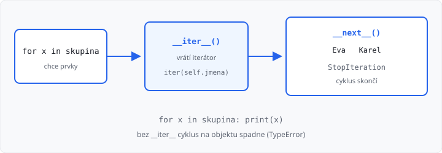

# Vlastní výjimky a iterace

Lekce má **3 hodiny**. Navazuje na [statické členy](../09-staticke-cleny/lekce.md). Další čas z týdne patří [pololetnímu projektu](../11-oop-navrh-a-procviceni/lekce.md).

V [1. ročníku](../../1-rocnik/11-chyby-a-vyjimky/lekce.md) umíte `try` / `except` a `raise ValueError`. Tady si výjimku **navrhnete sami** — je to třída, potomek `Exception`. Druhá polovina hodiny: `for x in objekt` funguje, až když objekt umí `__iter__`.

## Cíle lekce

- Vlastní výjimka je **třída** (`class VekError(Exception)`)
- V metodě ji **vyvoláte** (`raise`) a venku **odchytíte** (`except`)
- Cyklus `for` na vašem objektu potřebuje **`__iter__`**

## Vlastní výjimka

`ValueError` je hotová třída. Svoji napíšete stejně jako `Pes(Zvire)` — rodič je `Exception`:

```python
class VekError(Exception):
    pass
```

`pass` stačí. Jméno končí na `Error`, ať je v kódu vidět, že jde o výjimku.

V metodě špatný stav **neprintujte**. Vyvolejte výjimku. Kdo metodu volá, rozhodne, co s tím:

```python
class Osoba:
    def __init__(self, jmeno, vek):
        self.jmeno = jmeno
        self.nastav_vek(vek)

    def nastav_vek(self, vek):
        if vek < 0:
            raise VekError()
        self.vek = vek


try:
    Osoba("Eva", -1)
except VekError:
    print("vek nesmi byt zaporny")
```

Bez `except` program spadne. To je správně, když chybu nikdo neošetřil. V AMOS výstup z `except` testuje automatický test — `raise` proto vždycky odchytíte a vypíšete dohodnutou větu.

→ viz `priklady/vek_error.py`

## Iterace — for na vlastním objektu

`for x in seznam` znáte. Python u objektu zavolá **`__iter__`**. Ta metoda vrátí **iterátor** — něco, z čeho se berou prvky po jednom.

Nejjednodušší zápis: prvky máte v seznamu a iterátor z něj jen **půjčíte**.

```python
class Skupina:
    def __init__(self):
        self.jmena = []

    def pridej(self, jmeno):
        self.jmena.append(jmeno)

    def __iter__(self):
        return iter(self.jmena)


s = Skupina()
s.pridej("Eva")
s.pridej("Karel")
for jmeno in s:
    print(jmeno)
```

`iter(seznam)` je vestavěná funkce — z seznamu udělá iterátor. Cyklus pak vypíše `Eva` a `Karel`. Bez `__iter__` spadne `TypeError: 'Skupina' object is not iterable`.

Nepíšete `for jmeno in s.jmena`. Chcete, aby šlo `for jmeno in s` — objekt **je** skupina jmen.



→ viz `priklady/skupina.py`

## Vlastní __next__

Iterátor má `__next__`. Každé volání vrátí další prvek. Když další není, vyhodí **`StopIteration`** — cyklus `for` tím skončí (nespadne).

```python
class Cislovani:
    def __init__(self, n):
        self.n = n
        self.i = 1

    def __iter__(self):
        return self

    def __next__(self):
        if self.i > self.n:
            raise StopIteration
        hodnota = self.i
        self.i = self.i + 1
        return hodnota


for x in Cislovani(3):
    print(x)  # 1  pak  2  pak  3
```

`__iter__` tady vrací `self` — objekt je iterátor sám. V úkolech stačí `return iter(self.seznam)` jako u skupiny. `__next__` pište, až budete chtít číslo nebo prvek **počítat**, ne vytahovat z hotového seznamu.

→ viz `priklady/cislovani.py`

## Časté chyby

| Chyba | Následek |
|-------|----------|
| `class VekError:` bez `(Exception)` | `raise` spadne, není to výjimka |
| `raise` bez `except` v odevzdaném programu | AMOS uvidí pád, ne vaši větu |
| v metodě `print` místo `raise` | volající nemůže chybu ošetřit |
| chybí `__iter__` | `TypeError` u `for x in objekt` |
| `__iter__` nic nevrátí | cyklus dostane `None` |
| `__next__` nikdy neudělá `raise StopIteration` | nekonečný cyklus |

## Shrnutí

| Pojem | Význam |
|-------|--------|
| vlastní výjimka | `class VekError(Exception)` |
| `raise` | vyvoláte ji v metodě |
| `except VekError` | odchytíte a vypíšete dohodnutý text |
| `__iter__` | objekt jde do `for` |
| `iter(seznam)` | hotový iterátor ze seznamu |
| `StopIteration` | další prvek není, `for` skončí |

Příště pololetní projekt — víc tříd najednou, bez nového syntaxu.

Automatický test v AMOS kontroluje **výstup**. Učitel může zkontrolovat, že výjimka dědí z `Exception` a že cyklus jde přes objekt (`for x in skupina`), ne přes vnitřní seznam.

## Co dál

→ [Lekce 11: OOP — návrh a pololetní projekt](../11-oop-navrh-a-procviceni/lekce.md)
