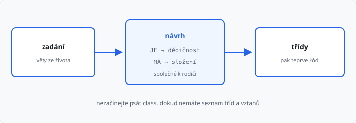

# OOP — návrh a pololetní projekt

Lekce má **9 hodin**. Dvě hodiny sem přišly z [polymorfismu](../08-polymorfismus/lekce.md), dvě z [výjimek a iterace](../10-vyjimky-a-iterace/lekce.md).

Nová syntaxe **nepřibývá**. První hodina je návrh. Zbytek je **pololetní projekt** — známkovaný, práce v hodině i doma. Závěrečný projekt ročníku (SQL, lekce 28–29) tohle **není**.

## Cíle lekce

- Ze zadání vypíšete třídy **než** napíšete `class`
- Odlišíte vztah **„je“** (dědičnost) a **„má“** (složení)
- Složíte jednu konzolovou aplikaci z lekcí 03–10

## Rozvrh 9 hodin

| Hodiny | Co dělat |
|--------|----------|
| 1 | návrh: třídy, je / má, seznam metod; téma schválí učitel |
| 2–8 | kód, zkoušení, opravy |
| 9 | výpis, odevzdání do AMOS, krátká ukázka učiteli |

Bez schváleného tématu v první hodině kód nepište.

## Mapa lekcí 03–10

| Lekce | V projektu musíte ukázat |
|-------|--------------------------|
| [03](../03-tridy-a-objekty/lekce.md) | víc objektů, každý má svá data |
| [04](../04-konstruktor/lekce.md) | konstruktor, `self` |
| [05](../05-metody/lekce.md) | metody, které vrací nebo mění stav |
| [06](../06-specialni-metody/lekce.md) | `__str__`, stav měníte metodou |
| [07](../07-dedicnost/lekce.md) | rodič a potomek, `super()` |
| [08](../08-polymorfismus/lekce.md) | stejná metoda, jiné tělo, cyklus přes seznam |
| [09](../09-staticke-cleny/lekce.md) | aspoň jedna proměnná třídy **nebo** `@staticmethod` |
| [10](../10-vyjimky-a-iterace/lekce.md) | vlastní výjimka + `for` přes váš objekt |

## Nejdřív návrh

Ze zadání podtrhejte podstatná jména. U každého se zeptejte:

| Otázka | Vztah | V kódu |
|--------|--------|--------|
| A **je** B? (pes je zvíře) | dědičnost | `class Pes(Zvire)` |
| A **má** B? (auto má motor) | složení | `self.motor = Motor(...)` |
| Mají A i B totéž? | společné k rodiči | metoda / atribut u rodiče |

Až máte seznam tříd, atributů a metod na papíře, teprve pište kód.

Opakující se způsoby, jak třídy poskládat, mají jména — **návrhové vzory**. Základ (iterátor, strategie, továrna) je volitelně v [bonusu](../../bonus/07-navrhove-vzory/lekce.md). Do projektu je **nemusíte** znát.



Připomínka z lekce 07 — auto motor **má**, není jím:

```python
class Motor:
    def __init__(self, vykon):
        self.vykon = vykon


class Vozidlo:
    def __init__(self, znacka):
        self.znacka = znacka

    def hlaska(self):
        return "jedeme"


class Auto(Vozidlo):
    def __init__(self, znacka, vykon):
        super().__init__(znacka)
        self.motor = Motor(vykon)

    def hlaska(self):
        return "brum"
```

`Auto(Vozidlo)` je **je**. `self.motor` je **má**. `hlaska` u auta je přepis (lekce 08).

→ viz `priklady/je_vs_ma.py`

## Téma projektu

Téma je **vaše**, učitel ho schválí v první hodině. Musí dávat smysl a splnit seznam v záložce **Úkoly**.

Nesmí to být kopie z hodin: knihovna, autoservis, mailer, oblečení, pizza, elektronika, filmotéka, škola, košík, tarify, VIP lístek, osoba s adresou.

Obsah podle školního řádu: slušné, bez urážek, násilí, erotiky, drog, zbraní a nenávisti. V datech nejsou známky spolužáků ani citlivé údaje o konkrétních lidech.

Nápady, které nemusíte použít: půjčovna (kolo / koloběžka), jídelna (jídlo / polévka), hon na poklady (místnost / předmět), sportovní klub (hráč / zápas). Herní strategie a šachovnice z původních úkolů 14, 15 a 18 jsou v pořádku, **když** je sami navrhněte — neopisujte.

## Časté chyby

| Chyba | Následek |
|-------|----------|
| hned `class` bez seznamu tříd | duplicity, špatný vztah je / má |
| auto dědí z motoru | motor **má**, není jím |
| tři třídy vedle sebe bez rodiče | společný kód třikrát |
| v cyklu `if` podle typu | chybí polymorfismus |
| výjimka jen `print` v metodě | volající ji neošetří |
| `for x in self.seznam` místo `for x in objekt` | chybí `__iter__` |

## Shrnutí

| Pojem | Význam |
|-------|--------|
| návrh | třídy a vztahy **před** kódem |
| je | dědičnost |
| má | složení |
| pololetní projekt | jedna aplikace z lekcí 03–10, známka |

Příště relační databáze — tabulky, klíče, žádný Python.

Volitelně: [návrhové vzory (bonus)](../../bonus/07-navrhove-vzory/lekce.md) — mimo 170 hodin.

Známku určuje **učitel** (téma, návrh, splnění seznamu, že kód umíte vysvětlit). Automatický test výstup nekontroluje.

## Co dál

Další lekce: **Principy relační databáze**.

