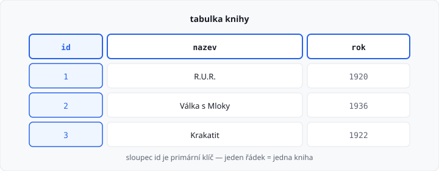
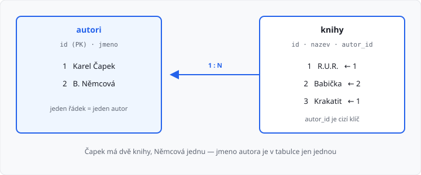
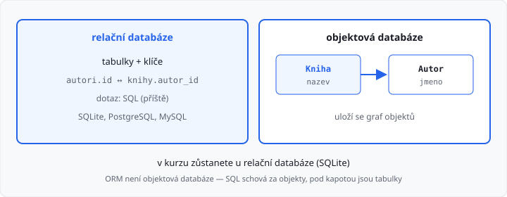

# Principy relační databáze

Lekce má **5 hodin** (jeden týden). Končí objektové programování, začíná **SQL**. Dnes **žádný nový příkaz Pythonu** a **žádné SQL** — to přijde v [lekci 13](../13-sql-a-sqlite/lekce.md). Tady jde o to, **jak data uspořádat**.

Z 1. ročníku umíte číst a zapisovat soubory. Z tohoto ročníku umíte **třídu a objekt**. Tabulka v databázi je k tomu blízko: sloupec je jako atribut, řádek jako jeden objekt.

## Cíle lekce

- Pochopíte, k čemu je **databáze**
- Poznáte **tabulku**, **řádek**, **sloupec** a **klíče**
- Uvidíte vztah **1:N** (jeden autor, víc knih)
- Porovnáte **relační** a **objektovou** databázi — v kurzu zůstanete u relační (SQLite)

## Proč ne jen soubor

Textový soubor stačí na deník nebo jeden seznam. Jakmile máte **stovky záznamů**, **vztahy** (žák patří do třídy) a data mají zůstat **konzistentní**, soubor začne vadit:

| Soubor | Databáze |
|--------|----------|
| hledáte řádek po řádku | umí najít podle sloupce |
| stejné jméno autora u každé knihy | jméno jednou, knihy na něj odkazují |
| dva programy zapisují najednou → chaos | správa přístupů a transakcí (později) |
| překlep ve struktuře poznáte pozdě | sloupce a typy jsou dané předem |

**Databáze** je program (nebo soubor, kterému ten program rozumí), který data **ukládá, hledá a hlídá pravidla**.

V tomto ročníku použijete **SQLite** — databáze v jednom souboru `.db`. Příště uvidíte SQL, jazyk, kterým se jí ptáte.

## Relační model — tabulky

**Relační** databáze skládá data do **tabulek** (v teorii se tabulce říká relace — odtud název).

Jedna tabulka `knihy`:

| id | nazev | rok |
|----|-------|-----|
| 1 | R.U.R. | 1920 |
| 2 | Válka s Mloky | 1936 |
| 3 | Krakatit | 1922 |

| Pojem | V tabulce | Jako v OOP |
|-------|-----------|------------|
| **sloupec** | jeden druh údaje (`nazev`) | atribut třídy |
| **řádek** | jedna kniha | jeden objekt |
| **tabulka** | všechny knihy stejného tvaru | třída `Kniha` |

Hodnoty v jednom sloupci mají **stejný význam** (všude rok vydání, ne jednou rok a jednou jméno). V jedné buňce je **jedna** hodnota — ne seznam jmen v jedné buňce.



Tohle **není** Excel ve škole. Excel umí tabulku nakreslit. Databáze navíc **vynucuje** typy, klíče a vztahy.

## Primární klíč

**Primární klíč** (*primary key*) jednoznačně určí řádek. V tabulce `knihy` je to `id`.

Pravidla:

- v tabulce je **právě jeden** primární klíč (může být složený z víc sloupců, u vás bude skoro vždy jeden sloupec),
- hodnoty se **nesmí opakovat**,
- hodnota **nesmí chybět**.

Jméno knihy jako klíč nestačí — dvě knihy se můžou jmenovat stejně. Číslo `id` přidělí databáze, vy ho neměňte jako „pořadí v seznamu“.

Vyhledání podle klíče je rychlé a jednoznačné: „kniha s `id = 2`“ je vždycky *Válka s Mloky*.

## Cizí klíč a vztah 1:N

Když u každé knihy napíšete jméno autora jako text, Čapek se u tří knih zopakuje. Překlep u jedné knihy udělá „jiného autora“.

Správně ve **dvou** tabulkách:

**autori**

| id | jmeno |
|----|-------|
| 1 | Karel Čapek |
| 2 | Božena Němcová |

**knihy**

| id | nazev | autor_id |
|----|-------|----------|
| 1 | R.U.R. | 1 |
| 2 | Babička | 2 |
| 3 | Krakatit | 1 |

`knihy.autor_id` je **cizí klíč** (*foreign key*). Odkazuje na `autori.id`. Říká: tahle kniha **patří** tomu autorovi.

Jeden autor má **více** knih, kniha má **jednoho** autora. To je vztah **1:N** (jedna ku N).



Spojení tabulek příkazem (`JOIN`) je [lekce 18](../18-join-a-relace/lekce.md). Dnes stačí vědět, že číslo v `autor_id` **musí existovat** v `autori`. Jinak by v databázi visela kniha „od nikoho“.

## Co databáze hlídá (integrita)

Tři pravidla, která soubor sám o sobě neuhlídá:

1. **Typ** — do sloupce `rok` nepatří text `loni`.
2. **Klíč** — dvě knihy se stejným `id` neprojdou.
3. **Odkaz** — `autor_id = 99` neprojde, pokud autor 99 v tabulce není.

Těmto pravidlům se říká **integrita**. V SQL je zapíšete u `CREATE TABLE`. Až budete data mazat, uvidíte, že nejde smazat autora, na kterého ještě visí knihy — pokud to tak nastavíte.

## Objektové databáze — srovnání

V paměti máte objekt `Kniha` a uvnitř odkaz na objekt `Autor`. **Objektová databáze** (*OODBMS*) se snaží **uložit ten graf objektů** skoro tak, jak je v programu: identita objektu, vnořené objekty, někdy i dědičnost tříd.

Nemusíte data stříhat do tabulek. Dotaz často vypadá jako procházka po atributech (`kniha.autor.jmeno`), ne jako SQL.

| | Relační (tabulky) | Objektová |
|--|-------------------|-----------|
| **Tvar dat** | tabulky, řádky, klíče | objekty a odkazy mezi nimi |
| **Dotaz** | SQL (příští lekce) | navigace po objektech, vlastní jazyk |
| **Blízko k** | Excelu, reportům, webu | třídám, které už umíte |
| **Kde to potkáte** | skoro všude (banky, školy, e-shopy) | úzce specializované systémy |
| **Příklady** | SQLite, PostgreSQL, MySQL | historicky db4o, ObjectDB; dnes spíš výjimka |

Objektová databáze **není** totéž co „program v Pythonu s třídami, který ukládá do SQLite“. Pořád byste měli tabulky a SQL — jen byste je schovali za objekty. Tomu se říká **ORM** a je volitelně v [bonusu 3. ročníku](../../bonus/04-orm/lekce.md). Pod kapotou je **relační** databáze.

Dokumentové databáze (třeba MongoDB) ukládají JSON-like dokumenty. To taky **není** klasická objektová databáze, jen další způsob, jak obejít striktní tabulky. V ŠVP a v tomto kurzu se neučí.

**Proč v kurzu relační databáze:** je v osnově, SQL umí skoro každý nástroj, SQLite je jeden soubor bez serveru, a data typu „žáci, známky, knihy“ do tabulek sedí. Objektový model necháte v Pythonu; trvalé uložení bude tabulka.



## Tabulka v Pythonu — jen analogie

Tak by **vypadala** tabulka `knihy` v paměti. Tohle **není** databáze — po vypnutí programu data zmizí.

```python
knihy = [
    {"id": 1, "nazev": "R.U.R.", "rok": 1920},
    {"id": 2, "nazev": "Válka s Mloky", "rok": 1936},
]

for k in knihy:
    if k["id"] == 2:
        print(k["nazev"])  # Válka s Mloky
```

Hledání cyklem je lineární. Databáze má k primárnímu klíči **index** — najde řádek bez projití celé tabulky. Příště místo smyčky napíšete SQL.

→ viz `priklady/tabulka_v_pameti.py`

## Časté chyby

| Chyba | Proč vadí |
|-------|-----------|
| jméno jako primární klíč | nemusí být jedinečné |
| autor jako text u každé knihy | duplicita, překlepy |
| víc údajů v jedné buňce (`Čapek, Němcová`) | nejde dobře hledat ani odkazovat |
| „objektová databáze = třídy v Pythonu“ | třídy jsou v programu; databáze je uložiště |
| Excel = databáze | chybí klíče, integrita, SQL |

## Shrnutí

| Pojem | Význam |
|-------|--------|
| databáze | uložiště s pravidly, nejen soubor |
| tabulka | sloupce + řádky stejného tvaru |
| primární klíč | jednoznačně určí řádek |
| cizí klíč | odkaz na klíč v jiné tabulce |
| 1:N | jeden záznam souvisí s více záznamy jinde |
| relační DB | tabulky a SQL — tohle budete používat |
| objektová DB | ukládá objekty; v kurzu ne |

## Co dál

→ [Lekce 13: Koncepce jazyka SQL a SQLite](../13-sql-a-sqlite/lekce.md)
