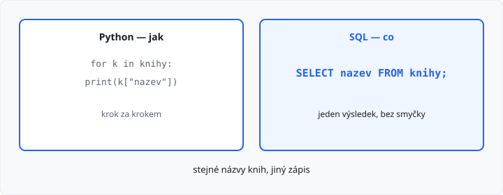
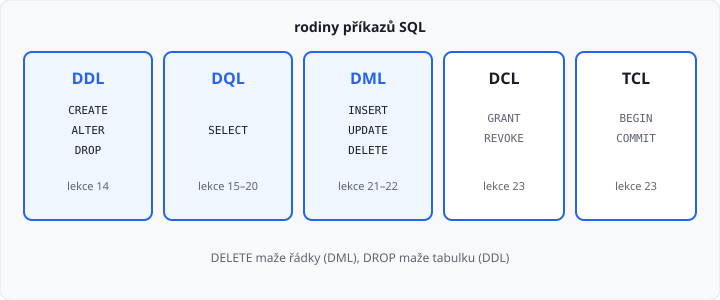
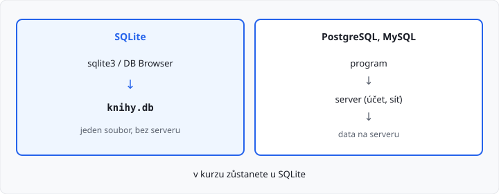

# Koncepce jazyka SQL a SQLite

Lekce má **5 hodin** (jeden týden). V [lekci 12](../12-relacni-databaze/lekce.md) jste data skládali do tabulek a hledali je cyklem v Pythonu. Dnes k tomu přibude **jazyk**, kterým se databáze ptáte: **SQL**.

Podrobné `CREATE TABLE` je [lekce 14](../14-create-table/lekce.md). `SELECT` po částech je lekce 15–20. Modul `sqlite3` v Pythonu je až [lekce 24](../24-sqlite3-select/lekce.md) — dnes SQL píšete do nástroje, ne do `main.py`.

## Cíle lekce

- Pochopíte, co je **SQL** a proč se jím ptáte místo smyčky
- Rozlišíte rodiny příkazů **DDL, DQL, DML, DCL** a **TCL**
- Poznáte **SQLite**: jeden soubor, bez serveru
- Spustíte první příkazy a prohlédnete si databázi

## Tři vrstvy

| Vrstva | Co to je | U vás |
|--------|----------|-------|
| **databáze** | uložená data | soubor `knihy.db` |
| **SŘBD** | program, který data hlídá | SQLite |
| **SQL** | jazyk, kterým se SŘBD ptáte | `SELECT`, `INSERT`, … |

**SŘBD** je systém řízení báze dat. SQLite, PostgreSQL a MySQL jsou různé SŘBD. SQL je jazyk, ne konkrétní program.

SQL vzniklo v 70. letech pro relační tabulky. Dnes je to **standard**: základy poznáte ve víc databázích. Drobné odchylky se jmenují **dialekt**. V kurzu píšete dialekt **SQLite**.

## SQL říká co, Python jak

V Pythonu popíšete **postup**: projdi řádky, vytiskni název. SQL popíše **výsledek**. Postup zvolí databáze.

```python
for k in knihy:
    print(k["nazev"])
```

```sql
SELECT nazev FROM knihy;
```

Obojí vypíše názvy. V SQL nepíšete cyklus. Tomu se říká **deklarativní** jazyk: řeknete, co chcete dostat. Python, jak ho píšete teď, je **imperativní**: říkáte krok za krokem.



SQL **není** další obecný programovací jazyk. Nemá vaše funkce, `if` a `for` v tom smyslu, jak je znáte z 1. ročníku. Umí se ptát na tabulky, měnit řádky a měnit strukturu.

## Proč SQL

| Python a soubor | SQL |
|-----------------|-----|
| hledáte smyčkou | databáze najde řádek podle klíče |
| pravidla hlídáte vy | integritu z lekce 12 hlídá SŘBD |
| jiná otázka = jiný cyklus | jiná otázka = jiná věta SQL |
| data v paměti po vypnutí zmizí | data zůstanou v souboru |

Jedna věta SQL platí, i když přibudou tisíce řádků. Program kvůli tomu nepřepisujete.

## Rodiny příkazů

SQL se učí po skupinách. Každá skupina má v ročníku vlastní lekce.

| Rodina | K čemu | Příkazy | Lekce |
|--------|--------|---------|-------|
| **DDL** | struktura (tabulky) | `CREATE`, `ALTER`, `DROP` | 14 |
| **DQL** | čtení | `SELECT` | 15–20 |
| **DML** | změna řádků | `INSERT`, `UPDATE`, `DELETE` | 21–22 |
| **DCL** | práva uživatelů | `GRANT`, `REVOKE` | 23 |
| **TCL** | transakce | `BEGIN`, `COMMIT`, `ROLLBACK` | 23 |



`DELETE` maže **řádky**. `DROP` maže **tabulku**. To jsou dvě různé rodiny (DML a DDL).

`GRANT` a `REVOKE` patří k serverovým databázím, kde existují účty. SQLite účty nemá — kdo smí soubor otevřít, řeší operační systém. Jméno **DCL** přesto znáte; v sqlite3 příkaz `GRANT` nezkoušejte, neprojde.

## SQLite je soubor

**SQLite** je SŘBD v jednom souboru. Žádný server, žádné heslo, žádná instalace služby. Databáze `knihovna` je soubor `knihovna.db`. Zkopírujete ho a máte zálohu.

| | SQLite | PostgreSQL, MySQL |
|--|--------|-------------------|
| **Kde běží** | ve vašem programu / nástroji | samostatný server |
| **Data** | jeden soubor `.db` | na serveru |
| **Přístup** | kdo otevře soubor | účet, heslo, síť |
| **V kurzu** | ano, celý zbytek ročníku | jen pro srovnání |



Na jednom souboru může pracovat víc programů, ale SQLite není školní server pro celou třídu najednou. Na to jsou PostgreSQL a MySQL. Pro úlohy v tomto ročníku soubor stačí.

## Nástroj

SQL je v obou nástrojích stejné. Liší se jen obal.

**sqlite3** (příkazová řádka):

```text
sqlite3 knihy.db
```

Když soubor neexistuje, založí se. Prompt `sqlite>` čeká na příkaz. Konec: `.quit`.

**DB Browser for SQLite** (okno): New Database, záložka Execute SQL, spuštění tlačítkem. Na Windows ve škole bývá po ruce častěji než příkaz `sqlite3`.

Tečkové příkazy (níže) fungují **jen** v `sqlite3`. V DB Browseru tabulky a strukturu ukáže samotné okno.

## První příkazy

Jeden soubor, jedna tabulka, dva řádky, výpis názvů. Každý příkaz SQL končí **středníkem**.

```sql
CREATE TABLE knihy (
    id INTEGER PRIMARY KEY,
    nazev TEXT
);

INSERT INTO knihy (id, nazev) VALUES (1, 'R.U.R.');
INSERT INTO knihy (id, nazev) VALUES (2, 'Krakatit');

SELECT nazev FROM knihy;
```

| Řádek | Rodina | Co udělá |
|-------|--------|----------|
| `CREATE TABLE` | DDL | založí tabulku; `id` je primární klíč z lekce 12 |
| `INSERT` | DML | přidá řádek |
| `SELECT` | DQL | vypíše sloupec `nazev` |

Text v SQL je v **jednoduchých** uvozovkách: `'R.U.R.'`. Dvojité uvozovky Pythonu tu pro hodnotu nepoužívejte.

`INTEGER` a `TEXT` jsou typy sloupců. Kdy který a jaká další pravidla u tabulky — to je lekce 14. `WHERE`, řazení a spojení tabulek zatím ne.

→ viz `priklady/prvni_dotaz.sql`

Spuštění na **novém** souboru:

```text
sqlite3 knihy.db < prvni_dotaz.sql
```

Výstup:

```text
R.U.R.
Krakatit
```

Když skript spustíte podruhé, `CREATE TABLE` spadne: tabulka už je. Smažte `knihy.db` a spusťte znovu.

Klíčová slova (`SELECT`, `CREATE`, …) může psát malými písmeny. V kurzu je pište **velkými**, ať oddělíte příkaz od názvů tabulek a sloupců.

## Tečka není SQL

V programu `sqlite3` jsou příkazy **nástroje**. Začínají tečkou, středník nemají, do jiné databáze je nepřenesete.

| Příkaz | Co ukáže |
|--------|----------|
| `.tables` | názvy tabulek |
| `.schema knihy` | `CREATE TABLE`, kterým tabulka vznikla |
| `.headers on` | nad výpisem názvy sloupců |
| `.mode column` | výpis zarovnaný do sloupců |
| `.quit` | konec |

```text
sqlite3 knihy.db < prohlidka.sql
```

→ viz `priklady/prohlidka.sql` (až po `prvni_dotaz.sql`, stejný soubor `knihy.db`)

V DB Browseru `.tables` nepište. Seznam tabulek je vlevo, strukturu ukáže záložka Database Structure, `SELECT` spusťte v Execute SQL.

## Časté chyby

| Chyba | Proč vadí |
|-------|-----------|
| chybí středník | `sqlite3` čeká na další řádek (`...>`) |
| `"R.U.R."` místo `'R.U.R.'` | hodnota textu je v jednoduchých uvozovkách |
| `DELETE` a `DROP` jako totéž | `DELETE` maže řádky, `DROP` maže tabulku |
| `.tables` v DB Browseru | tečka patří jen programu `sqlite3` |
| `GRANT` v SQLite | DCL je pro server s účty; SQLite hlídá soubor |
| `import sqlite3` v Pythonu | modul je lekce 24 |

## Shrnutí

| Pojem | Význam |
|-------|--------|
| SQL | jazyk pro tabulky; říkáte, co chcete |
| SŘBD | program, který databázi hlídá |
| dialekt | drobné odchylky SQL u konkrétního SŘBD |
| DDL | struktura: `CREATE`, `ALTER`, `DROP` |
| DQL | čtení: `SELECT` |
| DML | řádky: `INSERT`, `UPDATE`, `DELETE` |
| DCL | práva: `GRANT`, `REVOKE` (server) |
| TCL | transakce: `BEGIN`, `COMMIT`, `ROLLBACK` |
| SQLite | SŘBD v jednom souboru `.db` |
| `.tables` | příkaz nástroje sqlite3, ne SQL |

## Co dál

→ [Lekce 14: Definování tabulek (CREATE TABLE)](../14-create-table/lekce.md)
