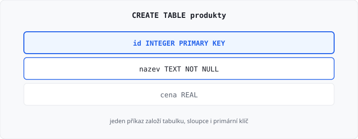

# Definování tabulek (CREATE TABLE)

Lekce má **5 hodin** (jeden týden). V [lekci 13](../13-sql-a-sqlite/lekce.md) jste SQL jen četli. Dnes tabulku **založíte** příkazem `CREATE TABLE`.

`SELECT` po sloupcích je [lekce 15](../15-select-zaklady/lekce.md). `INSERT` je lekce 21. Modul `sqlite3` v Pythonu je lekce 24 — odevzdáváte soubor `reseni.sql`.

## Cíle lekce

- Napíšete `CREATE TABLE` se sloupci a typy
- Nastavíte **primární klíč**, `NOT NULL` a `UNIQUE`
- Spojíte dvě tabulky **cizím klíčem**

## Příkaz CREATE TABLE

Jedna tabulka, jeden příkaz. Každý sloupec má **jméno** a **typ**. Příkaz končí středníkem.

```sql
CREATE TABLE produkty (
    id INTEGER PRIMARY KEY,
    nazev TEXT NOT NULL,
    cena REAL
);
```

| Část | Význam |
|------|--------|
| `produkty` | název tabulky |
| `id INTEGER PRIMARY KEY` | primární klíč z lekce 12 |
| `nazev TEXT NOT NULL` | text, řádek bez něj neprojde |
| `cena REAL` | desetinné číslo, smí chybět |



Názvy tabulek a sloupců pište malými písmeny bez mezer (`kategorie_id`). Klíčová slova velkými.

Když tabulka už existuje, druhý `CREATE TABLE` spadne. Nový pokus začíná na prázdné databázi. V úkolu hodnotitel vždy založí **novou** databázi v paměti a pustí váš soubor.

→ viz `priklady/produkty.sql`

## Typy sloupců

V SQLite si vystačíte se třemi:

| Typ | Co do něj patří | Příklad |
|-----|-----------------|---------|
| `INTEGER` | celé číslo | `id`, `rok` |
| `TEXT` | text | `nazev`, `spz` |
| `REAL` | desetinné číslo | `cena` |

Typ pište přesně takto. `INT` nebo `VARCHAR` v tomto kurzu nepoužívejte — test čeká `INTEGER`, `TEXT` a `REAL`.

## Omezení sloupce

Omezení je pravidlo, které databáze hlídá za vás.

| Zápis | Pravidlo |
|-------|----------|
| `PRIMARY KEY` | hodnota určí nejvýš jeden řádek a nesmí se opakovat |
| `NOT NULL` | hodnota musí být vyplněná |
| `UNIQUE` | hodnota se v sloupci nesmí opakovat, ale smí chybět, pokud není i `NOT NULL` |

Primární klíč je v tabulce jeden. `UNIQUE` může mít i jiný sloupec, třeba SPZ:

```sql
CREATE TABLE vozidla (
    id INTEGER PRIMARY KEY,
    spz TEXT NOT NULL UNIQUE,
    rok INTEGER
);
```

`id` je klíč, který se nemění. `spz` je taky jedinečná, ale není to klíč tabulky — může se přepsat, `id` ne.

## Cizí klíč

Cizí klíč z lekce 12 se v SQL zapíše jako `FOREIGN KEY`. Odkazuje na primární klíč **jiné** tabulky. Tu druhou tabulku založte **dřív**.

```sql
CREATE TABLE kategorie (
    id INTEGER PRIMARY KEY,
    nazev TEXT NOT NULL
);

CREATE TABLE produkty (
    id INTEGER PRIMARY KEY,
    nazev TEXT NOT NULL,
    kategorie_id INTEGER,
    FOREIGN KEY (kategorie_id) REFERENCES kategorie (id)
);
```

`kategorie_id` smí být prázdné, protože u něj není `NOT NULL`. Když hodnotu má, musí to být `id` z tabulky `kategorie`. V SQLite samotný `CREATE` projde i když nadřazenou tabulku napíšete až pod ním. Pište ji přesto **první** — při vkládání řádků už musí existovat.

→ viz `priklady/kategorie_a_produkty.sql`

`JOIN`, kterým z toho složíte jeden výpis, je lekce 18. Dnes stačí, že odkaz v tabulce **je**.

## Smazání tabulky

`DROP TABLE produkty;` tabulku smaže i s řádky. To je pořád DDL, jako `CREATE`. V úkolech tabulku nemažte — jen ji založte.

## Časté chyby

| Chyba | Proč vadí |
|-------|-----------|
| `INT` místo `INTEGER` | v kurzu jsou typy `INTEGER`, `TEXT`, `REAL` |
| čárka za posledním sloupcem | příkaz je neplatný |
| nadřazená tabulka v souboru chybí | cizí klíč nemá kam ukazovat |
| `PRIMARY KEY` u dvou sloupců zvlášť | klíč tabulky je jeden |
| `"nazev"` místo `nazev` | uvozovky v SQL jsou pro textovou hodnotu, ne pro jméno sloupce |

## Shrnutí

| Pojem | Význam |
|-------|--------|
| `CREATE TABLE` | založí tabulku |
| `INTEGER`, `TEXT`, `REAL` | typy sloupců v tomto kurzu |
| `PRIMARY KEY` | jednoznačný klíč řádku |
| `NOT NULL` | hodnota musí být vyplněná |
| `UNIQUE` | hodnota se ve sloupci neopakuje |
| `FOREIGN KEY` | odkaz na klíč v jiné tabulce |
| `DROP TABLE` | smaže tabulku |

## Co dál

→ [Lekce 15: SELECT — základy](../15-select-zaklady/lekce.md)
