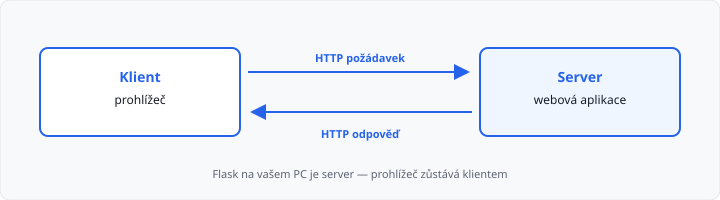
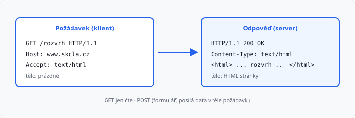
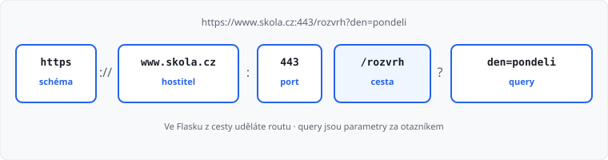
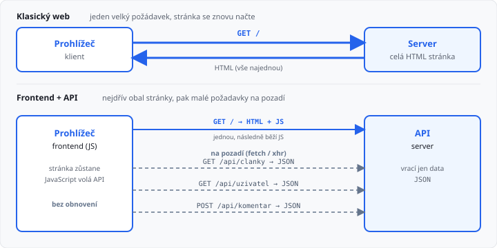

# Jak funguje web

## Cíle lekce

- Pochopíte, kdo je **klient** a kdo **server**
- Uvidíte, co se stane po zadání adresy do prohlížeče
- Naučíte se číst **URL** a základní **HTTP** (požadavek, odpověď, stavový kód)
- Poznáte, jak web funguje přes **frontend a API**
- Připravíte se na Flask — ten bude v dalších lekcích **webový server**, který píšete v Pythonu

HTML a CSS už znáte z jiných předmětů. Tady jde o **komunikaci**, ne o značky. Shrnutí HTML/CSS je v [lekci 02](../02-html-css-shrnuti/lekce.md).

## Klient a server

Web funguje na modelu **klient–server**.

| Role | Kdo to je | Co dělá |
|------|-----------|---------|
| **Klient** | prohlížeč (Chrome, Firefox, …), nebo jiný program | **žádá** o zdroj (stránku, obrázek, data) |
| **Server** | počítač s webovou aplikací | **přijme** žádost a **pošle** odpověď |

Když otevřete `https://www.skola.cz/rozvrh`, prohlížeč je klient. Na druhé straně běží server, který tu stránku připraví a odešle.



> **Důležité:** klient nic „nepočítá za server“. Požádá, počká, zobrazí to, co dostane. Logika webu (databáze, přihlášení, výpočet) běží **na serveru** — přesně to budete ve Flasku programovat.

Na jednom počítači můžou být obě role najednou: Flask spustíte **lokálně** a prohlížeč se připojí na `http://127.0.0.1:5000`. Prohlížeč je pořád klient, Flask je server.

## HTTP — společný jazyk

**HTTP** (*HyperText Transfer Protocol*) je pravidlo, podle kterého si klient a server vyměňují zprávy. Bez něj by se prohlížeč se serverem „nedomluvil“.

Jedna výměna má vždy dvě části:

1. **požadavek** (*request*) — posílá klient,
2. **odpověď** (*response*) — posílá server.



### Požadavek

Typický požadavek obsahuje:

| Část | Příklad | Význam |
|------|---------|--------|
| **Metoda** | `GET` | co chce klient udělat |
| **Cesta** | `/rozvrh` | který zdroj |
| **Hlavičky** | `Accept: text/html` | doplňující informace (jazyk, cookies, …) |
| **Tělo** | (u GET často prázdné) | data, která klient posílá |

Dvě metody, které budete ve Flasku používat pořád:

| Metoda | Účel | Mění data na serveru? |
|--------|------|------------------------|
| **GET** | *chci zobrazit* (stránka, seznam, detail) | ne — jen čte |
| **POST** | *chci odeslat* (formulář, uložení) | ano — typicky zapisuje |

Adresu v prohlížeči zadáváte jako **GET**. Odeslání formuláře „Uložit“ bývá **POST**.

### Odpověď

Server odpoví:

| Část | Příklad | Význam |
|------|---------|--------|
| **Stavový kód** | `200` | jak to dopadlo |
| **Hlavičky** | `Content-Type: text/html` | typ obsahu, délka, cache, … |
| **Tělo** | HTML, JSON, obrázek | to, co prohlížeč zobrazí nebo zpracuje |

Prohlížeč z těla odpovědi **vykreslí stránku**. Když Flask později vrátí HTML ze šablony, je to právě toto tělo.

## Stavové kódy

Kód je trojciferné číslo. První cifra říká kategorii:

| Rozsah | Význam | Příklady |
|--------|--------|----------|
| **2xx** | úspěch | `200 OK` — stránka je v pořádku |
| **3xx** | přesměrování | `302 Found` — jdi na jinou adresu |
| **4xx** | chyba klienta | `404 Not Found` — cesta neexistuje, `400` špatný požadavek |
| **5xx** | chyba serveru | `500 Internal Server Error` — spadl program na serveru |

Na `404` narazíte ve Flasku hned, jakmile otevřete neexistující routu. Na `500`, když v Pythonu vznikne neošetřená výjimka.

## URL — adresa zdroje

**URL** (*Uniform Resource Locator*) říká, *kde* zdroj je a *jak* se k němu připojit.

```
https://www.skola.cz:443/rozvrh?den=pondeli#dopoledne
│       │            │    │        │              │
│       │            │    │        │              └ fragment (kotva na stránce)
│       │            │    │        └ query (parametry)
│       │            │    └ cesta
│       │            └ port
│       └ hostitel (doména nebo IP)
└ schéma (protokol)
```



| Část | Příklad | Poznámka |
|------|---------|----------|
| **Schéma** | `https` | `http` = nešifrované, `https` = šifrované |
| **Hostitel** | `www.skola.cz` | jméno nebo `127.0.0.1` (tento počítač) |
| **Port** | `443` | u `https` se 443 často vynechává; Flask defaultně **5000** |
| **Cesta** | `/rozvrh` | ve Flasku z ní později uděláte **routu** |
| **Query** | `?den=pondeli` | dvojice `klíč=hodnota`, více parametrů spojíte `&` |
| **Fragment** | `#dopoledne` | zůstává v prohlížeči, **na server se neposílá** |

**`localhost`** a **`127.0.0.1`** označují *tento počítač*. Adresa `http://127.0.0.1:5000/rozvrh` znamená: HTTP, můj počítač, port 5000, cesta `/rozvrh`.

## Co se stane po zadání adresy

Zjednodušený postup (DNS a cache teď neřešíme do hloubky):

1. Do adresního řádku zadáte URL.
2. Prohlížeč sestaví **HTTP požadavek** (`GET` + cesta + hlavičky).
3. Požadavek dojde na **server**.
4. Server rozhodne, co vrátit (soubor, nebo výsledek programu).
5. Server pošle **odpověď** (kód + HTML).
6. Prohlížeč HTML vykreslí. U odkazů na CSS a obrázky pošle **další** požadavky.

Jedna stránka tedy často není jeden požadavek, ale **řada** požadavků. V prohlížeči to uvidíte na záložce **Síť** (Network) v nástrojích pro vývojáře (`F12`). Některé z nich vrací HTML, jiné CSS nebo obrázek, jiné **JSON z API**.

## Statická a dynamická stránka

| | Statická | Dynamická |
|---|----------|-----------|
| **Odpověď** | předem uložený soubor (`.html`) | server ji **sestaví** až na požadavek |
| **Stejná adresa** | vždy stejný obsah | obsah se může měnit (uživatel, databáze, čas) |
| **Příklad** | školní rozcestník z HTML souborů | seznam článků z databáze |

Flask píšete proto, aby server uměl stránku **složit** (šablona + data). K tomu budete potřebovat HTTP, URL a později formuláře — proto tato lekce.

## Frontend a API

Stejný HTTP se používá i u moderních webů, kde je práce rozdělená jinak:

| Část | Kde běží | Co dělá |
|------|----------|---------|
| **Frontend** | prohlížeč | HTML, CSS a JavaScript — vzhled a ovládání stránky |
| **API** | server | přijímá HTTP požadavky a vrací **data** (nejčastěji JSON), ne celou stránku |
| **Databáze** | server | ukládá data; API z ní čte a do ní zapisuje |

**API** (*Application Programming Interface*) je dohoda: klient ví, na jakou URL má sáhnout a jaký formát dat dostane.

U **klasického webu** prohlížeč pošle **jeden velký** požadavek a dostane celou HTML stránku. Kliknutí na odkaz = nový velký požadavek a stránka se znovu načte.

U **frontendu a API** se stránka (HTML + JavaScript) stáhne jednou. Další data bere JavaScript **na pozadí** — řada malých požadavků (`fetch` / `xhr`). Stránka se při tom **neobnoví**, mění se jen část obsahu.



Typický postup u frontendu a API:

1. Prohlížeč stáhne **obal** (`GET /` → HTML, CSS, JS) — to je pořád jeden „klasický“ požadavek.
2. JavaScript **na pozadí** posílá další požadavky na API (`GET /api/clanky`, `GET /api/uzivatel`, …).
3. API odpoví **JSON**, např. `[{"nazev": "Rozvrh", "den": "pondeli"}]`.
4. Frontend z dat **vykreslí** seznam — bez znovunačtení celé stránky.

HTTP je stejné (`GET` / `POST`, stavové kódy, URL). Liší se **tělo odpovědi**: HTML vs. JSON. JSON znáte z 1. ročníku jako datový formát.

V záložce Síť uvidíte u API často typ **fetch** nebo **xhr** — to je právě JavaScript volající server.

> Flask umí obojí: posílat HTML ze šablon i sloužit jako API. V tomto ročníku budete hlavně vracet **HTML**. API je stejný princip — hodí se, když máte samostatný frontend nebo mobilní aplikaci.

## HTTPS ve zkratce

**HTTPS** je HTTP uvnitř šifrovaného spojení (TLS). Cizí pozorovatel na síti pak nečte hesla ani obsah stránky tak snadno jako u čistého `http://`.

U učebního Flasku na `http://127.0.0.1:5000` šifrování neřešíte — provoz nejde přes internet. Na veřejném webu je HTTPS samozřejmost.

## Shrnutí

| Pojem | Význam |
|-------|--------|
| Klient | kdo žádá (prohlížeč) |
| Server | kdo odpovídá (webová aplikace, později Flask) |
| HTTP | protokol požadavku a odpovědi |
| GET / POST | čtení / odeslání dat |
| Stavový kód | `200`, `404`, `500`, … |
| URL | adresa zdroje (schéma, hostitel, port, cesta, query) |
| Frontend | HTML/CSS/JS v prohlížeči |
| API | server, který vrací data (typicky JSON) |
| `127.0.0.1:5000` | Flask na tomto počítači |

## Co dál

→ [Lekce 02: HTML a CSS — shrnutí](../02-html-css-shrnuti/lekce.md)
