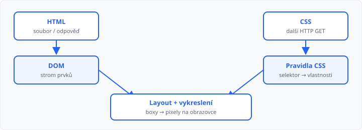
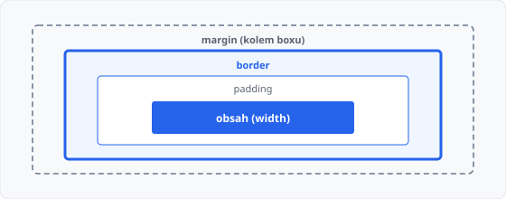

# HTML a CSS — shrnutí

## Cíle lekce

- Zopakujete, k čemu je **HTML** a k čemu **CSS**
- Uvidíte, **jak prohlížeč** z obou souborů složí stránku
- Připomenete si věci, které v praxi nejčastěji selžou — ne katalog značek

HTML a CSS už znáte z jiných předmětů. Tady jde o **shrnutí** před Flaskem: v šablonách budete znovu psát HTML, CSS půjde do složky se statickými soubory.

Navazuje na [lekci 01](../01-jak-funguje-web/lekce.md) (HTTP, URL). Další krok je server, který to HTML **vyrobí**.

## Dvě vrstvy jedné stránky

| | HTML | CSS |
|---|------|-----|
| **Otázka** | *Co* tu je? | *Jak* to vypadá? |
| **Příklad** | nadpis, odstavec, odkaz | barva, písmo, mezery, rozvržení |
| **Soubor** | `.html` | `.css` |

Prohlížeč nejdřív dostane HTML (tělo HTTP odpovědi z [lekce 01](../01-jak-funguje-web/lekce.md)). V `<head>` najde odkaz na CSS a stáhne ho **dalším** požadavkem.

```html
<link rel="stylesheet" href="styly.css">
```

Špatná cesta v `href` = stránka „bez stylů“. Ve Flasku to bude stejný princip, jen cesta povede do `static/`.

## Jak prohlížeč pracuje s HTML a CSS

HTML není obrázek. Prohlížeč z něj postaví **strom** (DOM) — každý prvek je uzel, vnořené značky jsou děti. CSS se nenačte „přes text souboru“, ale jako **sada pravidel**, která se přiřadí uzlům ve stromu.



Zjednodušený postup:

1. **HTML** → parser → **DOM** (strom prvků).
2. **CSS** → parser → seznam pravidel.
3. Prohlížeč **spojí** strom s pravidly (který selektor platí na který uzel).
4. Spočítá **boxy** (šířka, výška, okraje) — layout.
5. **Vykreslí** pixely na obrazovku.

Když v DevTools (F12) otevřete záložku Prvky / Elements, vidíte právě ten strom, ne surový soubor. Úprava CSS v inspectoru mění krok 3–5, HTML soubor na disku se nemění.

> Chyba v HTML (neuzavřená značka, zakázané vnoření) neznamená vždy červenou obrazovku. Prohlížeč strom **opraví odhadem** — a výsledek pak nesedí s tím, co jste mysleli. Proto se vyplatí psát platnou strukturu.

Minimální kostra, kterou budete v šablonách opakovat:

```html
<!DOCTYPE html>
<html lang="cs">
<head>
  <meta charset="UTF-8">
  <title>Rozvrh</title>
  <link rel="stylesheet" href="styly.css">
</head>
<body>
  <h1>Rozvrh</h1>
  <p>Pondělí</p>
</body>
</html>
```

`<!DOCTYPE html>` a `charset` předejdou „starému“ režimu a rozbité diakritice. `lang="cs"` pomáhá čtečkám a překladu.

## Co v praxi nejčastěji selže

### 1. Strom — vnoření a párové značky

- Značky se musí **uzavírat v opačném pořadí**, než se otevřely (`<strong><em>…</em></strong>`).
- Do `<p>` nepatří `<div>` ani `<h1>` — odstavec umí jen text a řádkové prvky (`a`, `span`, `strong`…). Prohlížeč `<p>` často **uzavře sám**, jakmile uvidí `<div>`, a zbytek stromu se posune.
- `<ul>` / `<ol>` mají uvnitř `<li>`, ne nahodilé `<div>`.

### 2. Box model — „proč je to širší než 200 px“

Prvek není jen `width`. K obsahu se přičítá **padding** a **border** (u výchozího `content-box`). `margin` je mezera *kolem* boxu, do šířky prvku se nepočítá.



```css
.box {
  width: 200px;
  padding: 20px;
  border: 2px solid;
}
```

Celková kreslená šířka je **244 px** (200 + 20+20 + 2+2), ne 200. Proto layout „uteče“. Častá oprava: `box-sizing: border-box` — `width` pak zahrnuje padding i border.

### 3. Kaskáda — které pravidlo vyhraje

Když na jeden prvek sedí víc pravidel:

1. **důležitost** (`!important` — v tomto kurzu ho nepoužívejte),
2. **specifita** (prvek `< třída `< id),
3. **pořadí v souboru** (pozdější vyhraje, když je specifita stejná).

```html
<p class="intro" id="uvod">Text</p>
```

```css
p { color: blue; }
.intro { color: red; }
#uvod { color: green; }
```

Barva bude **zelená** (`#uvod` je specifictější). Inline `style=""` na značce přebije stylesheet — proto styly držte v CSS souboru, ne v HTML.

### 4. Cesta k CSS a k obrázku

`href` a `src` jsou **cesty** (jako u souborů v Pythonu). `styly.css` = stejná složka, `css/styly.css` = podsložka, `/styly.css` = od kořene webu. Překlep = v Síti (F12) uvidíte **404** u souboru `.css` nebo obrázku.

## Co z HTML stačí mít v hlavě

Nepotřebujete seznam padesáti značek. Pro Flask šablony stačí:

- struktura dokumentu (`html`, `head`, `body`),
- nadpisy, odstavce, odkazy, seznamy, obrázky,
- **sémantika** tam, kde to dává smysl (`header`, `nav`, `main`, `footer` místo hromady `div`),
- formuláře (`form`, `input`, `button`) — podrobně až u obsluhy ve Flasku.

## Shrnutí

| Pojem | Význam |
|-------|--------|
| HTML | struktura a význam obsahu |
| CSS | vzhled, přiřazuje se uzlům ve stromu |
| DOM | strom prvků, který prohlížeč postaví z HTML |
| Layout | výpočet boxů (šířka, výška, okraje) |
| Box model | obsah + padding + border; margin kolem |
| Specifita | id přebije třídu, třída přebije prvek |
| `<link>` | další HTTP požadavek na CSS |

## Co dál

→ [Lekce 03: Úvod do Flasku](../03-uvod-do-flasku/lekce.md)
