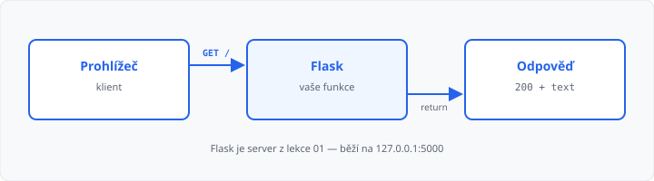

# Úvod do Flasku

## Cíle lekce

- Pochopíte, co je **Flask** a kdy dává smysl
- Znáte **výhody, nevýhody** a typické použití
- Vytvoříte **virtuální prostředí** a nainstalujete do něj Flask
- Spustíte **první stránku** v prohlížeči

V [lekci 01](../01-jak-funguje-web/lekce.md) byl server „někdo na druhé straně“. Od teď jste to **vy** — v Pythonu. HTML z [lekce 02](../02-html-css-shrnuti/lekce.md) budete později skládat v šablonách; dnes stačí vrátit text.

## Co je Flask

**Flask** je *mikroframework* pro web v Pythonu. Mikro znamená: jádro je malé (routy, požadavek, odpověď). Databáze, přihlášení nebo admin si přidáte, až je budete potřebovat — na rozdíl od velkých frameworků, které nesou hodně věcí hned.

V modelu klient–server je Flask **server**. Prohlížeč pošle `GET /`, Flask spustí vaši funkci a vrátí tělo odpovědi (zatím řetězec, později HTML).



## Výhody

| Výhoda | Proč to tady záleží |
|--------|---------------------|
| **Python** | Stejný jazyk jako v 1. a 2. ročníku — funkce, řetězce, později SQL. |
| **Málo kódu na start** | První stránka je pár řádků, ne desítky souborů. |
| **Přehledné adresy** | Cesta v URL (`/`, `/rozvrh`) se mapuje na funkci. |
| **Výuka i praxe** | Hodí se na školní projekt, prototyp i malé API (JSON). |
| **Rozšiřitelnost** | Až budete chtít šablony, relace nebo SQLite, Flask na to má navázání. |

## Nevýhody

| Nevýhoda | Co z toho plyne |
|----------|-----------------|
| **Není „vše v jednom“** | Django má admin, uživatele a ORM z krabice. Ve Flasku to skládáte sami (nebo knihovnami). |
| **Víc rozhodnutí** | Struktura složek, přihlášení, databáze — není jeden povinný předpis. |
| **Vývojový server** | `flask run` je na učení. Na veřejný internet patří jiný server (to teď neřešíme). |
| **Velké týmy / obří weby** | Jde to, ale musíte si pravidla držet sami. Na náš ročník to vadit nebude. |

Nevýhody nejsou důvod Flask nepoužít. Jsou důvod **nečekat Django v pěti řádcích**.

## Kde se Flask běžně používá

- malé a střední **weby** (školní, spolkové, interní),
- **prototypy** — ověřit nápad, než se staví větší systém,
- **API** — server vrací JSON, frontend nebo mobil si data bere sám (viz lekce 01),
- **nástroje a dashboardy** (výpis z databáze, formulář, správa položek),
- výuka — právě proto je v tomhle kurzu.

V praxi uvidíte i FastAPI (hlavně API) nebo Django (větší projekty). Flask je rozumný střed: web i API, pořád čitelný kód.

## Instalace

Flask není součást Pythonu. Je to balíček třetí strany a instaluje se přes [PIP](../../1-rocnik/02-python-a-prostredi/lekce.md) (1. ročník, lekce 02).

Na školním Windows často **nemáte právo zapisovat** do složky, kde je nainstalovaný Python (`C:\Program Files\…`). Příkaz `python -m pip install flask` pak skončí hláškou, že **přístup byl odepřen**. Balíček proto dáme do **virtuálního prostředí** ve vaší složce — tam práva máte a nepotřebujete správce počítače.

**Virtuální prostředí** (`venv`) je oddělená kopie Pythonu jen pro tenhle projekt. Knihovny z ní se nemíchají s jinými projekty.

Vytvořte si složku na práci ve 3. ročníku (třeba `flask`) a v terminálu do ní přejděte. Prostředí založíte jednou:

```bash
python -m venv test
```

Vznikne složka `test`. Do Moodle ji neodevzdávejte — každý si ji vytvoří u sebe znovu.

### Zapnutí prostředí

Než cokoli instalujete nebo spouštíte, prostředí **zapněte**. Na začátku řádku se pak objeví `(test)`.

V **příkazovém řádku** (cmd):

```bat
test\Scripts\activate.bat
```

V **PowerShellu**:

```powershell
test\Scripts\Activate.ps1
```

PowerShell na školním počítači skripty často blokuje. Pro **aktuální okno** to obejdete bez správce:

```powershell
Set-ExecutionPolicy -Scope Process -ExecutionPolicy Bypass
test\Scripts\Activate.ps1
```

Nové okno terminálu prostředí samo nezapne. Před každou další hodinou ho zapněte znovu ze stejné složky. Odteď `python` i `pip` patří tomuhle prostředí, ne Pythonu v `Program Files`.

### Flask do prostředí

Až je na řádku `(test)`:

```bash
python -m pip install flask
```

Ověření:

```bash
python -m flask --version
```

Když se vypíše verze, instalace sedí. Příkazy `python -m flask --app … run` v dalších lekcích spouštějte **se zapnutým** `test`.

| Co vidíte | Co s tím |
|-----------|----------|
| `Přístup byl odepřen` u `pip install` | Flask šel do systémového Pythonu. Založte `test`, zapněte ho a instalujte znovu. |
| PowerShell: *running scripts is disabled* | `Set-ExecutionPolicy -Scope Process -ExecutionPolicy Bypass`, pak aktivace znovu. |
| `No module named flask` | V tom okně není zapnuté `test`, nebo jste Flask instalovali jinde. |

## První program

Soubor `ahoj.py`:

```python
from flask import Flask

app = Flask(__name__)


@app.route("/")
def index():
    return "Ahoj, Flask!"
```

→ kompletní soubor: `priklady/ahoj.py`

Co řádky dělají:

| Část | Význam |
|------|--------|
| `Flask(__name__)` | vytvoří aplikaci |
| `@app.route("/")` | tahle funkce obslouží cestu `/` |
| `return "…"` | tělo HTTP odpovědi, stav **200** |

Odpověď je obyčejný pythonovský řetězec — můžete ho složit z proměnných (`f"Ahoj, {jmeno}"`). Když do něj dáte HTML značky (`<h1>…</h1>`), prohlížeč je vykreslí. Dnes stačí **jedna** cesta `/`. Další adresy (`/info`, `/kontakt`) až v [lekci 04](../04-routy-a-pohledy/lekce.md).

Spusťte z téže složky:

```bash
python -m flask --app ahoj run --debug
```

V konzoli uvidíte adresu, typicky `http://127.0.0.1:5000`. Otevřete ji v prohlížeči. `--debug` po uložení souboru server sám načte znovu a u chyb ukáže srozumitelnější stránku. **Na ostrý provoz se nehodí** — jen do školy.

Na `http://127.0.0.1:5000/neexistuje` dostanete **404** — Flask tu routu nemá. To je stejný stavový kód jako v lekci 01.

Druhá cesta, kterou najdete v návodech:

```python
if __name__ == "__main__":
    app.run(debug=True)
```

Pak stačí `python ahoj.py`. V kurzu budeme držet `python -m flask --app … run`.

## Shrnutí

| Pojem | Význam |
|-------|--------|
| Flask | mikroframework — webový server v Pythonu |
| `app` | instance aplikace |
| `@app.route` | mapování URL na funkci |
| `return` | tělo odpovědi prohlížeči |
| `test` | virtuální prostředí — Flask běží v něm, ne v systémovém Pythonu |
| `127.0.0.1:5000` | Flask na tomto počítači |
| `--debug` | vývoj: reload a hlášky o chybách |

## Co dál

→ [Lekce 04: Routy a pohledové funkce](../04-routy-a-pohledy/lekce.md)
