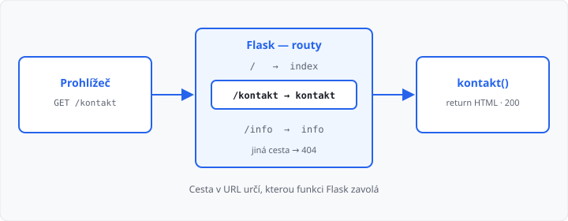

# Routy a pohledové funkce

## Cíle lekce

- Pochopíte, co je **routa** a **pohledová funkce**
- Napíšete aplikaci s **více adresami**
- Na každé adrese vrátíte **HTML** a stránky spojíte odkazem
- Uvidíte, jak Flask sestaví **HTTP odpověď** (200 vs. 404)

V [lekci 03](../03-uvod-do-flasku/lekce.md) měla aplikace jednu cestu `/`. Web ale není jedna stránka — v [lekci 01](../01-jak-funguje-web/lekce.md) byla cesta částí URL (`/rozvrh`, `/kontakt`). Dnes naučíte Flask, **která funkce** obslouží kterou cestu.

Šablony Jinja2 ještě nepoužíváme — HTML pořád vracíte jako řetězec, stejně jako v lekci 03. Dynamické kusy v URL (`/uzivatel/12`) přijdou v lekci 08.

## Routa a pohled

**Routa** je pravidlo: *tahle cesta v URL → tahle funkce*.

**Pohledová funkce** (*view*) je obyčejná pythonovská [funkce](../../1-rocnik/15-funkce-zaklady/lekce.md). Nespouštíte ji sami. Prohlížeč pošle `GET /kontakt`, Flask funkci najde, zavolá a to, co `return` vrátí, pošle jako tělo odpovědi.

```python
@app.route("/kontakt")
def kontakt():
    return "<h1>Kontakt</h1>"
```

| Část | Význam |
|------|--------|
| `@app.route("/kontakt")` | registrace cesty — **routa** |
| `def kontakt():` | **pohled** — Flask ho zavolá |
| `return "…"` | tělo odpovědi (text nebo HTML) |

Název funkce (`kontakt`) a cesta (`/kontakt`) nemusí být stejné, ale musí být **jednoznačné**: dvě funkce se stejným názvem, nebo dvě routy na stejnou cestu, Flask nerozumně přepíše / spadne.

## Jak Flask vybere funkci

Flask si z dekorátorů sestaví tabulku. Při požadavku se podívá na **cestu** a spustí odpovídající pohled.



Cesta, kterou v `@app.route` napíšete, musí sedět s tím, co je v adresním řádku za portem. `http://127.0.0.1:5000/kontakt` → `/kontakt`.

Když cesta v tabulce **není**, Flask nevolá žádný váš kód a odpoví **404** — stejný stavový kód jako v lekci 01.

## Více rout v jednom souboru

Stačí další dekorátor a další funkce. Pořád **jeden** `app = Flask(__name__)`.

```python
from flask import Flask

app = Flask(__name__)


@app.route("/")
def index():
    return "Hlavní stránka"


@app.route("/info")
def info():
    return "Flask běží"
```

Spustění beze změny: `python -m flask --app NAZEV run --debug`. V prohlížeči otevřete `/` i `/info`.

## HTML na každé stránce

Každý pohled vrací **vlastní** řetězec. Prohlížeč ho znovu vykreslí jako HTML (Flask u řetězce posílá `Content-Type: text/html`). Delší značky dejte do trojitých uvozovek.

Stránky spojíte obyčejným odkazem. Hodnota `href` je **cesta routy**, ne název funkce:

```python
@app.route("/")
def index():
    return """
    <h1>SPŠ ukázka</h1>
    <p>Vítejte na stránkách školy.</p>
    <p><a href="/kontakt">Kontakt</a></p>
    """


@app.route("/kontakt")
def kontakt():
    return """
    <h1>Kontakt</h1>
    <p>E-mail: info@skola.cz</p>
    <p><a href="/">Zpět na hlavní stránku</a></p>
    """
```

→ kompletní soubor: `priklady/skola.py`

Když v `href` překlepnete cestu, odkaz **otevře 404** — Flask nic „nedomyslí“. Velká a malá písmena se počítají (`/Kontakt` ≠ `/kontakt`).

Kostra `<!DOCTYPE html>…` z [lekce 02](../02-html-css-shrnuti/lekce.md) není povinná; na cvičení stačí `h1`, `p`, `a`, případně `ul`. CSS soubory zatím nedávejte — statické soubory jsou lekce 07.

## Odpověď serveru

Pohled vrací tělo. Flask k němu doplní zbytek HTTP odpovědi:

| Situace | Stav | Tělo |
|---------|------|------|
| routa existuje, `return "…"` | **200** | váš řetězec |
| cesta v aplikaci není | **404** | stránka Flasku „Not Found“ |

Otevřete v DevTools záložku Síť: u `/` uvidíte 200, u `/neexistuje` 404. To je stejná komunikace jako v lekci 01 — jen server píšete vy.

Cestu pište **přesně** jako v dekorátoru. `/info` a `/info/` Flask občas přesměruje, ale nespolehejte na to.

## Časté chyby

- dvě funkce se stejným `@app.route("/")` — platí ta poslední,
- v `href` je `kontakt` bez lomítka, nebo celá URL z jiného cvičení,
- server běží ze **starého** souboru — v příkazu musí být `--app` právě toho, který editujete,
- zapomenuté uvozovky u vícřádkového HTML.

## Shrnutí

| Pojem | Význam |
|-------|--------|
| routa | mapování cesty URL na funkci (`@app.route`) |
| pohledová funkce | funkce, kterou Flask zavolá při požadavku |
| `href="/cesta"` | odkaz na jinou routu **téže** aplikace |
| 200 | routa se našla, tělo je váš `return` |
| 404 | žádná routa na tu cestu |

## Co dál

→ [Lekce 05: Šablony Jinja2](../05-sablony-jinja/lekce.md)
