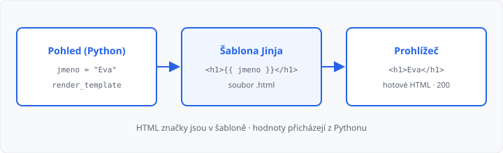

# Šablony Jinja2

## Cíle lekce

- Oddělíte **HTML** od Pythonu do souboru šablony
- Zařadíte šablonu a pohledovou funkci do **MVC**
- Předáte do stránky **proměnné** (`{{ }}`)
- Vypíšete **seznam** v šabloně (``)

V [lekci 04](../04-routy-a-pohledy/lekce.md) jste HTML vraceli jako řetězec v `return`. Na jednu stránku to stačí. Jakmile máte nadpisy, odkazy a seznam, Python se stane nečitelným a stejné značky kopírujete na každou routu.

**Šablona** je HTML soubor, do kterého Flask (knihovna **Jinja2**) doplní hodnoty z Pythonu. Pohled jen řekne *který soubor* a *jaká data*.

Dědičnost šablon (``) je [lekce 06](../06-dedicnost-sablon/lekce.md). CSS soubory [lekce 07](../07-staticke-soubory/lekce.md). `url_for` [lekce 08](../08-dynamicke-url/lekce.md) — odkazy zatím pořád jako `href="/cesta"`.

## Proč ne HTML v Pythonu

| V `return """<h1>…"""` | Ve šabloně |
|------------------------|------------|
| značky mezi uvozovkami | značky v `.html` jako v 2. ročníku |
| změna textu = editace Pythonu | změna vzhledu = editace šablony |
| seznam = skládání řetězců | `` v HTML |

Šablona **není** nový programovací jazyk. Je to HTML plus pár značek, které Flask před odesláním nahradí.



## MVC — tři role

Webové aplikace se často popisují zkratkou **MVC** (*Model–View–Controller*): data, vzhled a rozhodování zvlášť. Dnes to uvidíte poprvé — v [lekci 04](../04-routy-a-pohledy/lekce.md) byla funkce i HTML v jednom `return`.

| Role | Význam | U vás teď |
|------|--------|-----------|
| **Model** | data | seznam, slovník (později databáze) |
| **View** (pohled) | co uživatel **vidí** | šablona `.html` |
| **Controller** (řadič) | rozhodne, *co* vrátit | pohledová funkce (`def index():`) |

Ve Flasku je zmatek v názvech: funkci z lekce 04 říká **pohledová funkce** (*view function*), i když v MVC je to spíš **řadič**. Šablona je ten pohled, který uživatel vidí.

Když v dalších lekcích napíšeme „do pohledu“, myslíme tu **pythonovskou funkci** — ne soubor šablony.

## Složka templates

Flask hledá šablony ve složce **`templates`** vedle vašeho `.py`:

```
moje_app.py
templates/
  index.html
```

Spouštějte server **z téže složky**, kde leží `moje_app.py`. Když složka `templates` chybí nebo má jiný název, Flask ohlásí `TemplateNotFound` (v prohlížeči typicky **500**).

Kostra stránky je stejná jako v [lekci 02](../02-html-css-shrnuti/lekce.md) — `DOCTYPE`, `charset`, `h1`, `p`, `ul`. CSS do šablony zatím nedávejte.

## render_template

```python
from flask import Flask, render_template

app = Flask(__name__)


@app.route("/")
def index():
    return render_template("index.html")
```

`render_template("index.html")` načte `templates/index.html`, nechá Jinju doplnit značky a výsledek pošle jako tělo odpovědi (**200**), stejně jako dřív řetězec.

V šabloně zatím stačí obyčejné HTML — i bez `{{ }}` to funguje. Už ale **není** v Pythonu.

## Proměnné: {{ }}

Hodnotu předáte jako pojmenovaný argument. Jméno v Pythonu a ve šabloně musí sedět.

```python
@app.route("/")
def index():
    return render_template("index.html", skola="SPŠ ukázka")
```

```html
<h1>{{ skola }}</h1>
```

Prohlížeč uvidí `<h1>SPŠ ukázka</h1>`. Značky `{{ }}` v odpovědi **nezůstanou** — když je v DevTools pořád vidíte, šablona se nevykreslila (často `return` řetězce místo `render_template`).

Do šablony můžete poslat řetězec, číslo i seznam. Výraz v `{{ }}` je čtení hodnoty, ne `input()`.

Jinja hodnoty v `{{ }}` **escapuje**: kdyby ve jménu bylo `<`, prohlížeč ho ukáže jako text, nespustí ho jako značku. (Úmyslné útoky XSS jsou podrobněji v lekci 20.)

## Seznam: 

Hlášení, jídla, jména — v Pythonu je to seznam, v HTML cyklus:

```python
@app.route("/")
def index():
    return render_template(
        "index.html",
        skola="SPŠ ukázka",
        hlaseni=["Třídní schůzky ve čtvrtek", "Zítra odpadá 6. hodina"],
    )
```

```html
<ul>
  
    <li>{{ text }}</li>
  
</ul>
```

`` musí mít ``. Proměnná `text` existuje jen uvnitř cyklu.

Krátká podmínka, až ji budete potřebovat:

```html

  <ul>…</ul>

  <p>Dnes nic nehlásíme.</p>

```

→ kompletní příklad: `priklady/app.py` a `priklady/templates/index.html`

Víc šablon = víc souborů v `templates/` (`index.html`, `kontakt.html`). Každý pohled zavolá `render_template` s **jiným** souborem. Odkazy mezi stránkami zůstávají `href="/kontakt"`.

## Časté chyby

- `templates` vedle `.py` chybí, nebo server běží z jiné složky,
- v `render_template` je `"index.html"`, soubor se jmenuje `Index.html`,
- zapomenutý `` / ``,
- v šabloně `{{ jmeno }}`, v Pythonu předáváte `name=` — jiný název,
- HTML pořád v `return """…"""` — tohle cvičení má být šablona.

## Shrnutí

| Pojem | Význam |
|-------|--------|
| šablona | HTML soubor ve `templates/` (v MVC **view**) |
| pohledová funkce | Python, který vybere šablonu a data (v MVC spíš **řadič**) |
| `render_template` | Flask šablonu vyplní a vrátí jako odpověď |
| `{{ promenna }}` | výpis hodnoty z pohledu |
| ` … ` | cyklus v šabloně |
| `TemplateNotFound` | soubor nebo složka `templates` se nenašly |

## Co dál

→ [Lekce 06: Dědičnost šablon](../06-dedicnost-sablon/lekce.md)
