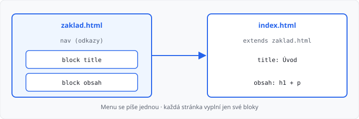

# Dědičnost šablon

## Cíle lekce

- Napíšete **základní šablonu** s prázdnými místy (bloky)
- **Odvozená** šablona základ rozšíří a vyplní jen svůj obsah
- Menu napíšete **jednou** — objeví se na každé stránce

V [lekci 05](../05-sablony-jinja/lekce.md) měla každá stránka vlastní soubor i s `DOCTYPE` a odkazy. Když změníte položku v menu, musíte ji opravit ve všech souborech.

**Dědičnost** to řeší stejně jako u tříd ve 2. ročníku: společné věci jsou v rodiči, potomek doplní jen to své.

CSS soubory ještě ne — [lekce 07](../07-staticke-soubory/lekce.md). Odkazy pořád `href="/cesta"`.

## Základ a potomek

| Soubor | Role |
|--------|------|
| `zaklad.html` | kostra: `DOCTYPE`, menu, prázdné **bloky** |
| `index.html`, `kontakt.html` | `` a vyplní bloky |

Pohled se **nemění**: pořád `return render_template("index.html")`. Flask nejdřív vezme potomka, dosadí ho do základu a teprve pak pošle HTML.



## Bloky

V základu označíte, *kam* smí potomek psát:

```html
<title>SPŠ ukázka</title>
…
<nav>
  <a href="/">Domů</a>
  <a href="/kontakt">Kontakt</a>
</nav>

```

Text mezi `` a `` je **záložní** — použije se, když potomek blok nevyplní.

Potomek začíná `extends` (před ním v souboru nesmí být značky HTML):

```html

Kontakt

  <h1>Kontakt</h1>
  <p>E-mail: info@skola.cz</p>

```

Jména bloků musí sedět (`obsah` ≠ `content`). HTML mimo bloky v potomkovi Flask **zahodí**.

## Dvě stránky, jedno menu

```
app.py
templates/
  zaklad.html
  index.html
  kontakt.html
```

```python
@app.route("/")
def index():
    return render_template("index.html")


@app.route("/kontakt")
def kontakt():
    return render_template("kontakt.html")
```

Menu je jen v `zaklad.html`. Nová stránka = nový potomek + nová routa + jeden odkaz v základu.

→ kompletní příklad: `priklady/app.py` a `priklady/templates/`

`{{ promenna }}` a `` z lekce 05 fungují **uvnitř** bloku stejně.

## Časté chyby

- v potomkovi chybí ``, nebo je až pod `<h1>`,
- blok se jmenuje jinak než v základu,
- menu zkopírujete do každého potomka — pak dědičnost nepomáhá,
- `render_template("zaklad.html")` — základ je prázdný, renderujte **potomka**.

## Shrnutí

| Pojem | Význam |
|-------|--------|
| `zaklad.html` | společná kostra a menu |
| `` | místo, které potomek vyplní |
| `` | tahle šablona používá základ |
| `` | konec bloku |

## Co dál

→ [Lekce 07: Statické soubory](../07-staticke-soubory/lekce.md)
