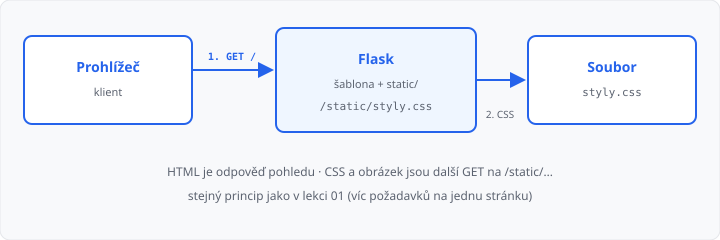

# Statické soubory

## Cíle lekce

- Dáte CSS a obrázky do složky **`static`**
- Napojíte je ze šablony tak, aby je Flask našel
- Uvidíte, že prohlížeč je stáhne **dalším požadavkem** (jako v [lekci 01](../01-jak-funguje-web/lekce.md))

Šablony z [lekce 05](../05-sablony-jinja/lekce.md) a [06](../06-dedicnost-sablon/lekce.md) vyrábějí HTML. Barvy, písmo a logo **nejsou** součást odpovědi pohledu — prohlížeč si je dožádá zvlášť.

CSS už umíte z jiných předmětů a ze [shrnutí](../02-html-css-shrnuti/lekce.md). Tady jde o **cestu**, ne o nový selektor.

`url_for` pro **routy** (`url_for("index")`) je [lekce 08](../08-dynamicke-url/lekce.md). Dnes ho použijete jen na soubor ve `static/`.

## Složka static

Flask má dvě vedlejší složky:

| Složka | Co tam patří | URL |
|--------|----------------|-----|
| `templates/` | šablony Jinja | (Flask je vyplní, soubor se nestahuje) |
| `static/` | CSS, obrázky, později JS | `/static/název-souboru` |

```
app.py
templates/
  zaklad.html
  index.html
static/
  styly.css
  logo.svg
```

Pro `static/styly.css` Flask sám obslouží `GET /static/styly.css`. **Nepíšete** na to `@app.route`.



Špatná cesta `href="styly.css"` hledá soubor u aktuální adresy stránky (`/styly.css`) — Flask ho nemá → stránka „bez stylů“. To je stejná past jako v lekci 02, jen teď soubor leží ve `static/`.

## Napojení v šabloně

V základu (jednou, pro všechny stránky):

```html
<link rel="stylesheet" href="{{ url_for('static', filename='styly.css') }}">
```

```html

```

`url_for('static', filename='…')` složí cestu `/static/styly.css`. Funguje i zapsat `/static/styly.css` natvrdo; `url_for` je jistější, až aplikace nepoběží v kořeni webu.

Odkazy **mezi stránkami** zůstávají `href="/kontakt"`.

→ kompletní příklad: `priklady/app.py`, `priklady/templates/`, `priklady/static/`

V DevTools záložce Síť po obnovení uvidíte nejméně dva požadavky: dokument `/` (**200**) a `/static/styly.css` (**200**). Červená 404 u CSS = špatný název nebo soubor mimo `static/`.

## Obrázek

Do `static/` dejte soubor (JPG, PNG, nebo **SVG** — SVG je text, snadno se odevzdá). V šabloně `img` + `url_for`, vyplňte `alt`.

Logo pište do **základu**, ne do každého potomka — stejně jako menu v lekci 06.

## Časté chyby

- CSS je ve `templates/` — tam Flask hledá jen šablony,
- `href="static/styly.css"` bez úvodního lomítka / bez `url_for`,
- server běží z jiné složky, než kde leží `static/`,
- v `filename` je překlep (`Styly.css` ≠ `styly.css`).

## Shrnutí

| Pojem | Význam |
|-------|--------|
| `static/` | CSS, obrázky — Flask je naservíruje |
| `/static/soubor` | URL statického souboru |
| `url_for('static', filename='…')` | složí tu URL v šabloně |
| další GET | prohlížeč stáhne CSS/obrázek zvlášť |

## Co dál

→ [Lekce 08: Dynamické URL a url_for](../08-dynamicke-url/lekce.md)
