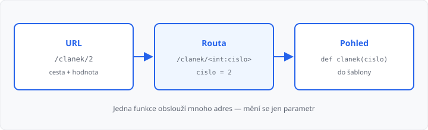

# Dynamické URL a url_for

## Cíle lekce

- Napíšete routu, kde část cesty je **proměnná** (`/clanek/2`)
- Tu hodnotu použijete v [pohledu](../04-routy-a-pohledy/lekce.md) a v šabloně
- Odkazy složíte přes **`url_for`** — podle názvu funkce, ne natvrdo

V [lekci 07](../07-staticke-soubory/lekce.md) už `url_for` znáte u souborů: `url_for('static', filename='styly.css')`. Dnes totéž pro **vaše** routy: `url_for('index')`.

Bez dynamické cesty byste na každý článek psali novou funkci. S parametrem stačí jedna.

## Kus cesty jako parametr

Hranaté závorky v dekorátoru jsou **místo pro hodnotu**:

```python
@app.route("/ahoj/<jmeno>")
def ahoj(jmeno):
    return render_template("ahoj.html", jmeno=jmeno)
```

| Adresa | `jmeno` |
|--------|---------|
| `/ahoj/Eva` | `Eva` |
| `/ahoj/Petr` | `Petr` |

Jméno v `<jmeno>` a parametr [funkce](../../1-rocnik/15-funkce-zaklady/lekce.md) musí být **stejné**. Flask hodnotu z URL předá jako argument — sami `input()` nevoláte.



## Typ: řetězec a int

Bez uvedení typu je hodnota **řetězec**. Číslo v cestě označíte `int`:

```python
@app.route("/clanek/<int:cislo>")
def clanek(cislo):
    return render_template("clanek.html", cislo=cislo)
```

`/clanek/2` → `cislo` je celé číslo `2`. `/clanek/abc` **není** tahle routa → **404**.

Jiné převodníky teď nepotřebujete. Query v URL (`?q=`) sem nepatří — to je objekt `request` v lekci 11.

## url_for — odkaz podle funkce

V [lekci 04](../04-routy-a-pohledy/lekce.md) jste psali `href="/kontakt"`. Když cestu změníte, všechny odkazy zůstanou staré.

`url_for` bere **název pohledové funkce**:

```html
<a href="{{ url_for('index') }}">Domů</a>
<a href="{{ url_for('clanek', cislo=2) }}">Článek 2</a>
```

| Zápis | Složí |
|-------|--------|
| `url_for('index')` | `/` |
| `url_for('clanek', cislo=2)` | `/clanek/2` |
| `url_for('static', filename='styly.css')` | `/static/styly.css` (lekce 07) |

První argument je jméno funkce (`def clanek`), ne cesta. Argumenty za ním = parametry routy.

V Pythonu totéž: `from flask import url_for` a `url_for("clanek", cislo=2)` — hodí se později u přesměrování.

## Seznam odkazů

Články v slovníku, odkazy cyklem:

```python
CLANKY = {
    1: "Zápis do kroužků začíná v pondělí.",
    2: "V pátek je ředitelské volno.",
}


@app.route("/")
def index():
    return render_template("index.html", clanky=CLANKY)


@app.route("/clanek/<int:cislo>")
def clanek(cislo):
    text = CLANKY.get(cislo, "Článek neexistuje.")
    return render_template("clanek.html", cislo=cislo, text=text)
```

```html

  <li><a href="{{ url_for('clanek', cislo=cislo) }}">Článek {{ cislo }}</a></li>

```

Neznámé číslo: `CLANKY.get(cislo, "Článek neexistuje.")` — stránka **200**, jen jiný text. Vlastní stránka 404 je lekce 09.

→ kompletní příklad: `priklady/app.py` a `priklady/templates/`

## Časté chyby

- `url_for('/kontakt')` — patří sem název funkce, ne cesta,
- v dekorátoru `<jmeno>`, ve funkci `def ahoj(name)` — Flask parametr nenajde,
- `href="/clanek/{{ cislo }}"` místo `url_for` — jde to, ale při změně routy se to rozbije,
- zapomenutý `int:` u čísla — `cislo` je pak řetězec `"2"`.

## Shrnutí

| Pojem | Význam |
|-------|--------|
| `<jmeno>` | proměnná část cesty (řetězec) |
| `<int:cislo>` | část cesty jako celé číslo |
| `url_for('index')` | složí URL k funkci `index` |
| `url_for('clanek', cislo=2)` | složí `/clanek/2` |

## Co dál

→ [Lekce 09: Konfigurace a chybové stránky](../09-konfigurace-a-chyby/lekce.md)
