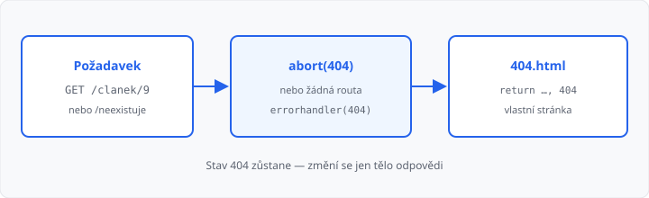

# Konfigurace a chybové stránky

## Cíle lekce

- Uložíte název webu a podobné údaje do **`app.config`**
- Nahradíte šedou stránku Flasku **vlastní 404**
- Když položka v datech chybí, zavoláte **`abort(404)`** — ne text se stavem 200

V [lekci 08](../08-dynamicke-url/lekce.md) neznámý článek vrátil větu „neexistuje“, ale stav byl pořád **200**. Prohlížeč i vyhledávač to berou jako úspěch. Správně je **404** a srozumitelná stránka pro člověka.

[Výjimky](../../1-rocnik/11-chyby-a-vyjimky/lekce.md) z 1. ročníku (`try` / `except`) tady neřešíte. `abort` je signál pro Flask: skonči a pošli tenhle stavový kód.

## app.config

Nastavení patří na instanci aplikace, ne do náhodných globálních proměnných:

```python
app = Flask(__name__)
app.config["NAZEV"] = "Školní nástěnka"
```

V šabloně je slovník `config` k dispozici sám:

```html
<h1>{{ config.NAZEV }}</h1>
```

Hodí se na titulek webu, e-mail správce, později řetězec k databázi. **Tajné údaje** (hesla, `SECRET_KEY` pro relace v lekci 14) do Gitu ani do Moodle materiálů nepatří.

`DEBUG` nechte na příkazu `flask run --debug`. Řádek `app.config["DEBUG"] = True` v souboru se snadno zapomene vypnout.

## Vlastní stránka 404

Bez routy Flask pošle anglické „Not Found“. Registrace:

```python
@app.errorhandler(404)
def nenalezeno(chyba):
    return render_template("404.html"), 404
```

Číslo **`404` za čárkou je povinné**. Bez něj by šablona odešla se stavem 200 — vypadalo by to jako běžná stránka.

Parametr `chyba` Flask předá vždy; nemusíte ho v šabloně používat.



Šablona `404.html` může dědit `zaklad.html` (menu, `url_for('index')`). Stejný handler platí pro `/nesmysl` i pro `abort(404)` uvnitř pohledu.

Stránka **500** (pád v kódu) se dá registrovat stejně. S `--debug` ji ale uvidíte jako ladicí obrazovku Flasku, ne jako svou šablonu. To teď stačí vědět.

## abort — položka neexistuje

Routa `/clanek/9` existuje (`<int:cislo>` sedí), ale ve slovníku klíč 9 není. Pak **vy** rozhodnete:

```python
from flask import abort


@app.route("/clanek/<int:cislo>")
def clanek(cislo):
    if cislo not in CLANKY:
        abort(404)
    return render_template("clanek.html", cislo=cislo, text=CLANKY[cislo])
```

`abort(404)` okamžitě skočí do `errorhandler`. Řádek s `return` se už neprovede.

| Situace | Stav | Co je na stránce |
|---------|------|-------------|
| žádná routa | 404 | vaše `404.html` |
| routa je, `abort(404)` | 404 | stejná `404.html` |
| `return "není"` bez abort | **200** | text, ale „úspěch“ |

→ kompletní příklad: `priklady/app.py` a `priklady/templates/`

V DevTools → Síť: u `/neexistuje` i u `/clanek/9` musí být **404**, ne 200.

## Časté chyby

- `return render_template("404.html")` **bez** `, 404`,
- `abort(404)` a zároveň `return` na stejném řádku — `abort` funkci ukončí,
- 404 šablona bez odkazu domů — návštěvník nemá kam kliknout,
- `CLANKY.get(cislo, "…")` a `return` — zase 200.

## Shrnutí

| Pojem | Význam |
|-------|--------|
| `app.config["…"]` | nastavení aplikace |
| `{{ config.NAZEV }}` | totéž v šabloně |
| `@app.errorhandler(404)` | vlastní odpověď na 404 |
| `return šablona, 404` | tělo + správný stav |
| `abort(404)` | „tato položka není“ |

## Co dál

→ [Lekce 10: Flask základy — procvičení](../10-flask-procviceni/lekce.md)
