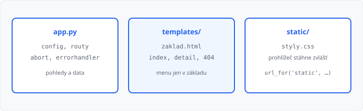

# Flask základy — souhrn a procvičení

## Cíle lekce

- Složíte **jednu malou aplikaci** z toho, co už umíte
- Odkazy napíšete přes **`url_for`**, neznámou položku přes **`abort(404)`**
- Dnes **nepřibývá** nová syntaxe — jen skládáte lekce 03–09

Formuláře, objekt `request` a databáze sem nepatří. To je od [lekce 11](../11-formulare-a-request/lekce.md).

## Mapa dosavadních lekcí

| Lekce | Kdy to potřebujete |
|-------|-------------------|
| [03](../03-uvod-do-flasku/lekce.md) | `Flask(__name__)`, `flask run --debug` |
| [04](../04-routy-a-pohledy/lekce.md) | `@app.route`, pohled, stav 200 / 404 |
| [05](../05-sablony-jinja/lekce.md) | `render_template`, `{{ }}`, `` |
| [06](../06-dedicnost-sablon/lekce.md) | `zaklad.html`, ``, `` |
| [07](../07-staticke-soubory/lekce.md) | `static/`, CSS, `url_for('static', filename=…)` |
| [08](../08-dynamicke-url/lekce.md) | `/polozka/<slug>`, `url_for('pohled', slug=…)` |
| [09](../09-konfigurace-a-chyby/lekce.md) | `app.config`, `errorhandler(404)`, `abort(404)` |

## Složky mini-aplikace

```
app.py
templates/
  zaklad.html
  index.html
  kolo.html
  404.html
static/
  styly.css
```



Menu a odkaz na CSS patří **jen** do `zaklad.html`. Potomci vyplní blok. Pohled renderuje potomka, ne základ.

Neznámý slug ve slovníku není „text se stavem 200“ — je to `abort(404)` a stejná `404.html` jako u cesty, na kterou žádná routa nesedí.

→ kompletní příklad: `priklady/app.py`, `priklady/templates/` a `priklady/static/`

## Kontrolní seznam

1. Server spouštíte **ze složky**, kde leží `.py`
2. Odkazy na routy skládáte **`url_for('název_funkce')`**, ne natvrdo `/cesta`
3. V šabloně `{{ hodnota }}` — když v HTML zbude `{{`, šablona se nevykreslila
4. `return render_template("404.html"), 404` — číslo **za čárkou** nesmí chybět
5. V DevTools → Síť: detail existuje → **200**, `/neexistuje` i špatný slug → **404**, `/static/styly.css` → **200**

## Časté chyby

- `href="/kolo/mesto"` místo `url_for` — při změně routy se odkazy rozbijí,
- `KOLA.get(slug, "není")` a `return` — zase stav 200,
- CSS v `templates/` — Flask ho nepodá jako `/static/…`,
- spuštění z jiné složky → `TemplateNotFound`.

## Shrnutí

Souhrnná lekce. Cílem je samostatně složit miniweb: seznam, detail, vlastní 404 a CSS.

## Co dál

→ [Lekce 11: Formuláře a objekt request](../11-formulare-a-request/lekce.md)
