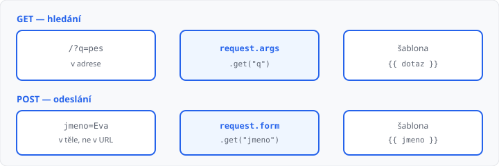

# Formuláře a objekt request

## Cíle lekce

- Napíšete **HTML formulář** tak, aby ho Flask uměl přečíst
- U hledání vezmete hodnotu z **adresy** (`request.args`)
- U odeslání vezmete hodnotu z **těla požadavku** (`request.form`)

Značky `form`, `input` a `button` znáte z [HTML](../02-html-css-shrnuti/lekce.md) a z 2. ročníku. Dnes k nim přibude **Python**: co prohlížeč pošle, Flask uloží do objektu **`request`**.

Kontrola prázdného pole a převod na číslo je [lekce 12](../12-validace-vstupu/lekce.md). Přesměrování po odeslání [lekce 13](../13-presmerovani-a-flash/lekce.md).

## Co musí mít formulář

| Atribut | Účel |
|---------|------|
| `name` na `input` | klíč, pod kterým hodnotu najdete v Pythonu |
| `method` | `get` (hledání) nebo `post` (odeslání) |
| `action` | kam se data pošlou — `url_for('index')`, nebo prázdné = stejná stránka |

Bez `name` prohlížeč pole **nepošle**. Název v HTML a klíč v Pythonu musí být **stejné**: `name="jmeno"` → `request.form.get("jmeno")`.

Tlačítko: `<button type="submit">`.

## GET — hodnota v adrese

V [lekci 08](../08-dynamicke-url/lekce.md) byla proměnná **v cestě** (`/clanek/2`). Hledání dává hodnotu **za otazník**: `/hledat?q=pes`.

Tohle je pořád **GET** (jako adresa v prohlížeči). Formulář:

```html
<form action="{{ url_for('index') }}" method="get">
  <label>Hledat <input name="q"></label>
  <button type="submit">Hledat</button>
</form>
<p>Hledáte: {{ dotaz }}</p>
```

```python
from flask import request


@app.route("/")
def index():
    dotaz = request.args.get("q", "")
    return render_template("index.html", dotaz=dotaz)
```

Po odeslání se v adresním řádku objeví `?q=pes`. Záložka tu adresu umí uložit. Prázdný řetězec `""` u `.get` je výchozí hodnota, když `q` v URL není (první otevření stránky).

`request.args["q"]` bez `.get` při chybějícím klíči **spadne**.

## POST — hodnota v těle

Odeslání jména, vzkazu, objednávky patří na **POST**. V URL nic nepřibude, data jsou v **těle** požadavku (lekce 01).

Stejná cesta musí umět **zobrazit** formulář (GET) i **přijmout** data (POST):

```python
@app.route("/", methods=["GET", "POST"])
def index():
    jmeno = ""
    if request.method == "POST":
        jmeno = request.form.get("jmeno", "")
    return render_template("index.html", jmeno=jmeno)
```

```html

  <p>Omluven: {{ jmeno }}</p>

<form action="{{ url_for('index') }}" method="post">
  <label>Jméno <input name="jmeno"></label>
  <button type="submit">Odeslat</button>
</form>
```

Bez `methods=["GET", "POST"]` Flask na POST odpoví **405** (metoda není dovolená).



| Vlastnost | `request.args` (GET) | `request.form` (POST) |
|-----------|----------------------|------------------------|
| Kde jsou data | v URL za `?` | v těle požadavku |
| Vidíte je v adrese | ano | ne |
| Typický účel | hledání, filtr | odeslání, zápis |

Dnes hodnotu **vypíšete zpět na stránku**. Do databáze se ještě neukládá.

Když po POST obnovíte stránku (F5), prohlížeč se zeptá, zda odeslat znovu. Tomu příště zabrání [přesměrování](../13-presmerovani-a-flash/lekce.md) — teď to stačí vědět.

→ kompletní příklad: `priklady/app.py` a `priklady/templates/index.html`

V DevTools → Síť: u hledání je GET a v URL `?q=…`, u omluvenky POST na `/` se stavem **200**.

## Časté chyby

- `input` bez `name` — Flask pole nevidí,
- `name="jmeno"` a v Pythonu `.get("name")` — jiný klíč,
- `request.args` u POST formuláře — data jsou v `request.form`,
- chybí `methods=["GET", "POST"]` → **405**,
- `method="get"` u odeslání jména — hodnota skončí v adrese.

## Shrnutí

| Pojem | Význam |
|-------|--------|
| `name` | klíč pole ve formuláři |
| `request.args` | query z GET (`?q=`) |
| `request.form` | pole z POST |
| `request.method` | `"GET"` nebo `"POST"` |
| `methods=[…]` | které metody routa přijme |
| `.get("klíč", "")` | hodnota, nebo prázdný řetězec |

## Co dál

→ [Lekce 12: Validace dat na serveru](../12-validace-vstupu/lekce.md)
