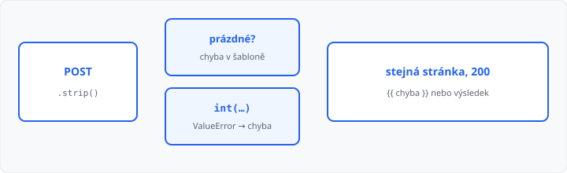

# Validace dat na serveru

## Cíle lekce

- Na serveru ověříte, že pole **není prázdné**
- Text z formuláře převedete na **číslo** a odchytíte `ValueError`
- Při chybě necháte formulář na stránce a vypíšete **hlášku**

V [lekci 11](../11-formulare-a-request/lekce.md) jste hodnotu jen vypsali. Prázdné jméno nebo `abc` místo počtu Flask nezastaví — spadne `int`, nebo uložíte nesmysl. Kontrola patří **do pohledu**, ne jen do HTML.

Atribut `required` nebo `type="number"` v prohlížeči pomůže člověku. Požadavek lze poslat i bez nich (jiný klient, DevTools). **Důvěřujte Pythonu, ne formuláři.**

Přesměrování a flash zpráva jsou [lekce 13](../13-presmerovani-a-flash/lekce.md). `try` / `except` už znáte z [1. ročníku](../../1-rocnik/11-chyby-a-vyjimky/lekce.md).

## Prázdný řetězec a strip

`request.form.get("jmeno", "")` může být `""` nebo samé mezery. Nejdřív **ořežte**:

```python
jmeno = request.form.get("jmeno", "").strip()
if not jmeno:
    chyba = "Vyplňte jméno."
```

`not jmeno` platí u prázdného řetězce. Mezery `"   "` po `strip()` taky zmizí.

Hlášku předejte do šablony. Formulář nechte na stránce (hodnota v `value`, ať se nemusí psát znovu):

```html

  <p>{{ chyba }}</p>

<input name="jmeno" value="{{ jmeno }}">
```

Stav zůstane **200**. Nejste na 404 — požadavek dorazil, jen data nesedí.

## Číslo: int a ValueError

Z formuláře vždy přijde **řetězec**. `"7"` není `7`, dokud nezavoláte `int`.

```python
raw = request.form.get("pocet", "").strip()
if not raw:
    chyba = "Zadejte počet."
else:
    try:
        pocet = int(raw)
    except ValueError:
        chyba = "Zadejte celé číslo."
    else:
        zprava = f"Objednáno sešitů: {pocet}"
```

| Vstup | Co se stane |
|-------|-------------|
| *(prázdné)* nebo mezery | `if not raw` → hláška o počtu |
| `abc`, `3.5` | `ValueError` → hláška o celém čísle |
| `7` | `pocet` je `7`, můžete vypsat výsledek |

Větev `else` u `try` se provede, **jen když výjimka nepřišla**. Patří sem výpočet, ne do `except`.

Později můžete přidat rozsah (`if pocet < 1`), stejný vzor: podmínka → `chyba`, jinak pokračovat.



V Síti je pořád **POST** a **200**. Mění se jen text na stránce.

## Časté chyby

- `int(request.form.get("pocet"))` bez `try` — u `abc` spadne celá aplikace (**500**),
- `.get("pocet")` bez `""` — přijde `None` a `None.strip()` spadne,
- kontrola jen v HTML `required` — server ji nevidí,
- úspěch i chyba zároveň — v šabloně ukazujte jednu hlášku.

## Shrnutí

| Pojem | Význam |
|-------|--------|
| validace | ověření dat **na serveru** |
| `.strip()` | ořeže mezery |
| `if not text` | prázdné pole |
| `int(…)` | řetězec → celé číslo |
| `except ValueError` | `int` selhal |
| `{{ chyba }}` | hláška ve formuláři |

## Co dál

→ [Lekce 13: Přesměrování a flash zprávy](../13-presmerovani-a-flash/lekce.md)
