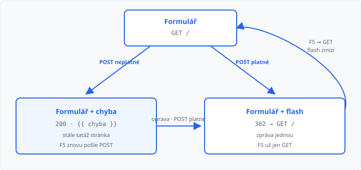

# Přesměrování a flash zprávy

## Cíle lekce

- Po **úspěšném** odeslání formuláře přesměrujete prohlížeč na GET
- Úspěch vypíšete **flash zprávou**, která se ukáže jednou
- Při chybě validace zůstanete na formuláři se stavem **200** — jako v [lekci 12](../12-validace-vstupu/lekce.md)

V [lekci 11](../11-formulare-a-request/lekce.md) po POST obnovení stránky (F5) prohlížeč chtěl odeslat znovu. Přesměrování to řeší: poslední požadavek v historii je **GET**.

Relace (`session`) jsou [lekce 15](../15-relace/lekce.md). Dnes z nich potřebujete jen `secret_key`, jinak `flash` spadne.

## POST, pak GET

Vzor: *zpracuj POST → odpověz 302 → prohlížeč sám pošle GET*.

```python
from flask import redirect, url_for


@app.route("/", methods=["GET", "POST"])
def index():
    if request.method == "POST":
        # … validace …
        return redirect(url_for("index"))
    return render_template("index.html")
```

`redirect` sestaví odpověď **302** a hlavičku `Location`. Cestu skládejte `url_for`, ne natvrdo `"/"`.

| Situace | Stav | Co dál |
|---------|------|--------|
| data v pořádku | **302** | prohlížeč načte cílovou stránku GET |
| validace selhala | **200** | stejný formulář, `{{ chyba }}` |
| F5 po úspěchu | **GET** | znovu se neodesílá |

V Síti uvidíte dva řádky: POST **302** a hned GET **200**.



## Flash — zpráva na jednu návštěvu

Po `redirect` už pohled **nemá** data z POST. Úspěch proto nenecháte v `zprava=` u `render_template`, ale uložíte na **příští** požadavek:

```python
from flask import flash

app.secret_key = "skola"
```

```python
flash("Zapsáno.")
return redirect(url_for("index"))
```

V šabloně:

```html

  <p>{{ zprava }}</p>

```

Zpráva se vypíše **jednou**. Další F5 ji už neukáže.

`secret_key` je podpis, bez kterého Flask flash (a později relaci) nepustí. Pro cvičení stačí krátký řetězec v kódu. Ostré tajemství do Gitu nepatří — to je lekce 15 a [lekce 09](../09-konfigurace-a-chyby/lekce.md).

Při chybě **neflashujte** a **nepřesměrovávejte**. Hláška `chyba` zůstane u formuláře, pole můžou zůstat vyplněná.

→ kompletní příklad: `priklady/app.py` a `priklady/templates/index.html`

## Časté chyby

- `return redirect("/")` — patří `url_for('index')`,
- `flash` bez `secret_key` — aplikace spadne,
- úspěch i chyba jdou přes `redirect` — u chyby zmizí obsah polí,
- `get_flashed_messages()` chybí v šabloně — zpráva se „ztratí“,
- po POST pořád `return render_template` u úspěchu — F5 znovu odešle.

## Shrnutí

| Pojem | Význam |
|-------|--------|
| `redirect(url_for(…))` | odpověď 302, prohlížeč jde na GET |
| `flash("…")` | zpráva na **příští** stránku |
| `get_flashed_messages()` | výpis flash ve šabloně |
| `secret_key` | nutný pro flash (podrobně lekce 15) |
| chyba validace | 200 + `{{ chyba }}`, bez redirect |

## Co dál

→ [Lekce 14: Nahrávání souborů a obrázků](../14-nahravani-souboru/lekce.md)
