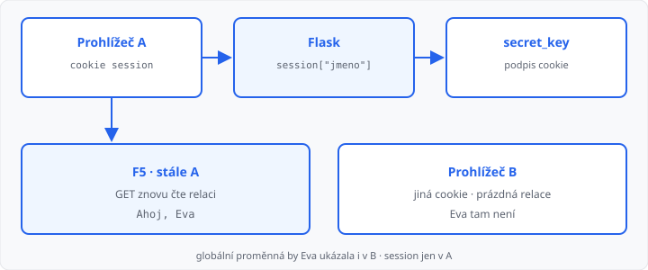

# Relace (session)

## Cíle lekce

- Zapamatujete si údaj **mezi požadavky** (`session`)
- Odlišíte ho od **flash** (jednou) a od **globální proměnné** (sdílí ji celý server)
- Relaci **smažete** — odhlášení

Každý HTTP požadavek je z pohledu serveru nový ([lekce 01](../01-jak-funguje-web/lekce.md)). Flask si u vás nic „sám od sebe“ nepamatuje. [Flash](../13-presmerovani-a-flash/lekce.md) vydrží **jednu** další stránku. Relace vydrží, dokud ji nesmažete nebo nezavřete prohlížeč.

Databáze to není — jméno v relaci zmizí s cookie. Trvalé uložení je [lekce 16](../16-pripojeni-databaze/lekce.md).

## session jako slovník

```python
from flask import session

app.secret_key = "skola"
```

```python
session["jmeno"] = jmeno
jmeno = session.get("jmeno", "")
session.pop("jmeno", None)
session.clear()
```

Chová se jako slovník z 1. ročníku: `session["jmeno"]` bez klíče spadne, `.get` vrátí výchozí hodnotu.

Po úspěšném POST zase `redirect` ([lekce 13](../13-presmerovani-a-flash/lekce.md)). Další GET už čte `session`, ne `request.form`.

V šabloně relace je sama:

```html

  <p>Ahoj, {{ jmeno }}</p>

```

```python
return render_template("index.html", jmeno=session.get("jmeno", ""))
```

Můžete psát i `{{ session.jmeno }}`. Do šablony předat hodnotu je přehlednější.

## Cookie a secret_key

Flask uloží relaci do **cookie** v prohlížeči a podepíše ji `secret_key`. Bez klíče `session` (i `flash`) spadne.

| Kde | Co platí |
|-----|----------|
| cvičení, úkol | `app.secret_key = "skola"` |
| ostrý web | dlouhý náhodný řetězec, **ne** v Gitu ([lekce 09](../09-konfigurace-a-chyby/lekce.md)) |

`app.config["SECRET_KEY"] = "skola"` je totéž. Když klíč změníte, staré cookie přestanou platit — všichni jsou „odhlášení“.

V DevTools → Aplikace → Cookies uvidíte cookie `session`. Upravovat ji ručně nemá smysl: bez podpisu ji Flask odmítne.

## Ne globální proměnná

```python
# Špatně — jeden údaj pro všechny návštěvníky webu
aktualni = ""
```

Dva prohlížeče = dvě relace. Globální `aktualni` by viděli oba stejně. Relace patří **tomuto** prohlížeči.



Flash vs. relace:

| | `flash` | `session` |
|--|---------|-----------|
| Vydrží | jeden další požadavek | dokud ji nesmažete |
| Účel | „Uloženo.“ | „jste Eva“ |
| F5 | zpráva zmizí | hodnota zůstane |

## Odhlášení

```python
@app.route("/odhlasit", methods=["POST"])
def odhlasit():
    session.clear()
    return redirect(url_for("index"))
```

```html
<form action="{{ url_for('odhlasit') }}" method="post">
  <button type="submit">Odhlásit</button>
</form>
```

`session.pop("jmeno", None)` smaže jeden klíč, `clear()` celou relaci. Obojí je dnes v pořádku. Odhlášení je **POST**, ne odkaz GET — mění stav, stejně jako odeslání formuláře.

Tohle **není** účet s heslem. Jméno v relaci jen říká, co si prohlížeč pamatuje. Účty a databáze přijdou později.

→ kompletní příklad: `priklady/app.py` a `priklady/templates/index.html`

## Časté chyby

- chybí `secret_key` — `session` spadne,
- údaj dáte do globální proměnné — vidí ho všichni,
- místo `session` použijete `flash` — po F5 jméno zmizí,
- po POST necháte `render_template` bez `redirect` — F5 znovu odešle,
- odhlášení je odkaz GET místo POST.

## Shrnutí

| Pojem | Význam |
|-------|--------|
| `session` | údaje tohoto prohlížeče mezi požadavky |
| `secret_key` | podpis cookie |
| `session.get` / `session[…]` | čtení a zápis |
| `session.clear()` | odhlášení |
| flash | jednorázová zpráva, ne paměť |

## Co dál

→ [Lekce 16: Připojení aplikace k databázi](../16-pripojeni-databaze/lekce.md)
