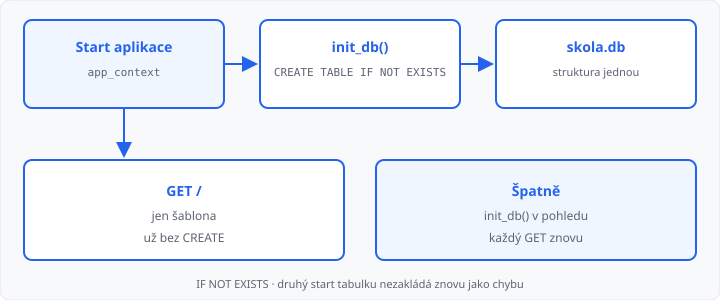

# Připojení aplikace k databázi

## Cíle lekce

- Z Flasku otevřete **SQLite** soubor
- Strukturu tabulek založíte **jednou při startu** aplikace — ne v každém GET
- Připojení držíte **na jeden požadavek** a na konci ho zavřete

SQL (`CREATE TABLE`, `SELECT`, `INSERT`) umíte z 2. ročníku. Dnes nejde o nový příkaz — jde o **kdy** ho Flask spustí.

[Relace](../15-relace/lekce.md) patří jednomu prohlížeči a zmizí s cookie. Databáze je **soubor na disku**: vidí ho celá aplikace, i po restartu. Čtení řádků do šablony je [lekce 17](../17-vypis-z-databaze/lekce.md), zápis z formuláře [lekce 18](../18-zapis-do-databaze/lekce.md). Dnes **žádné** `SELECT` ani `INSERT`.

## Soubor .db

Modul `sqlite3` je v Pythonu — `pip` nepotřebujete.

```python
import os
import sqlite3

app.config["DATABASE"] = os.path.join(
    os.path.dirname(os.path.abspath(__file__)),
    "skola.db",
)
```

Cesta přes `__file__` míří vedle `.py`, ne do složky, odkud jste zrovna spustili `flask`. Nastavení patří do `app.config` ([lekce 09](../09-konfigurace-a-chyby/lekce.md)).

Po prvním `connect` vznikne soubor `skola.db`. Do Moodle ho nahrávat nemusíte — aplikace si ho založí.

## Jedno připojení na požadavek

Globální `db = sqlite3.connect(...)` nahoře v souboru je stejná past jako globální jméno v lekci 15: jeden objekt pro všechny. Flask na to má `g` — úložku **tohoto** HTTP požadavku.

```python
from flask import g


def get_db():
    if "db" not in g:
        g.db = sqlite3.connect(app.config["DATABASE"])
        g.db.row_factory = sqlite3.Row
    return g.db
```

```python
@app.teardown_appcontext
def close_db(chyba=None):
    db = g.pop("db", None)
    if db is not None:
        db.close()
```

`row_factory = sqlite3.Row` umí řádek číst jako slovník. Dnes ho nepotřebujete číst — hodí se v lekci 17.

| Úložka | Jak dlouho | Pro koho |
|--------|------------|----------|
| `g` | jeden požadavek | toto volání pohledu / initu |
| `session` | dokud ji nesmažete | tento prohlížeč |
| soubor `.db` | na disku | celá aplikace |

## Struktura jednou při startu

`CREATE TABLE` v pohledu by běžel **při každém** GET. Tabulku zakládejte v `init_db` a tu zavolejte **jednou** po vytvoření aplikace.

`IF NOT EXISTS` zajistí, že druhý start (F5 serveru) nespadne — tabulka už tam je, zakládat znovu se nebude.

```python
def init_db():
    db = get_db()
    db.execute(
        """
        CREATE TABLE IF NOT EXISTS polozky (
            id INTEGER PRIMARY KEY,
            nazev TEXT NOT NULL
        )
        """
    )
    db.commit()
```

`get_db` potřebuje kontext aplikace. Při startu ho otevřete takto — **ne** z `index()`:

```python
with app.app_context():
    init_db()
```

```python
# Špatně — struktura se zakládá znovu a znovu
@app.route("/")
def index():
    init_db()
    return render_template("index.html")
```

Pohled dnes jen vykreslí šablonu. Data do tabulky přijdou později.



→ kompletní příklad: `priklady/app.py` a `priklady/templates/index.html`

## Časté chyby

- `CREATE TABLE` v pohledu — každý GET znovu spouští zakládání,
- `init_db()` bez `app_context` — `g` ještě neexistuje a volání spadne,
- `connect` bez cesty vedle `__file__` — soubor vznikne „někde jinde“,
- připojení nahoře v souboru místo `g`,
- chybí `teardown_appcontext` — spojení zůstanou viset,
- chybí `commit` po `CREATE`,
- chybí `IF NOT EXISTS` — druhý start hlásí, že tabulka už existuje.

## Shrnutí

| Pojem | Význam |
|-------|--------|
| `sqlite3.connect` | otevře (nebo založí) soubor `.db` |
| `app.config["DATABASE"]` | cesta k souboru |
| `g` | připojení na **jeden** požadavek |
| `teardown_appcontext` | zavře připojení |
| `init_db()` + `app_context` | struktura **jednou** při startu |
| `CREATE TABLE IF NOT EXISTS` | tabulka, když ještě není |

## Co dál

→ [Lekce 17: Výpis z databáze do šablony](../17-vypis-z-databaze/lekce.md)
