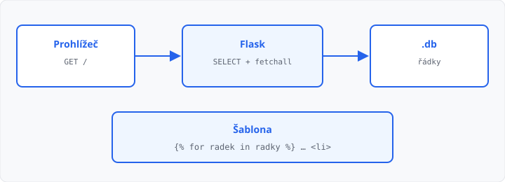

# Výpis dat z databáze do šablony

## Cíle lekce

- Načtete **všechny** řádky (`fetchall`)
- Načtete **jeden** řádek (`fetchone`)
- Seznam vypíšete `` — jako v [lekci 05](../05-sablony-jinja/lekce.md)

Připojení, `g` a `init_db` při startu už umíte z [lekce 16](../16-pripojeni-databaze/lekce.md). `CREATE TABLE` dál patří **jen** do initu. `SELECT` patří **do pohledu** — každé GET načte aktuální data.

**Dnes nic nevkládáte.** `INSERT` z formuláře je [lekce 18](../18-zapis-do-databaze/lekce.md). Řádky už v souboru `.db` jsou (cvičení: složka `data/`).

## execute nestačí

`db.execute("SELECT …")` jen **spustí** dotaz. Výsledek musíte **vyzvednout**:

| Metoda | Vrací | Kdy |
|--------|--------|-----|
| `fetchall()` | **seznam** řádků (klidně prázdný `[]`) | výpis, `` |
| `fetchone()` | **jeden** řádek, nebo `None` když nic | jeden záznam, `COUNT(*)` |

Bez `fetchall` / `fetchone` předáte do šablony kurzor — cyklus v HTML nebude dávat smysl.

`sqlite3.Row` (v `get_db`) se chová jako slovník: `radek["nazev"]`. V šabloně `{{ radek.nazev }}`.

## fetchall — všechny řádky

```python
@app.route("/")
def index():
    db = get_db()
    radky = db.execute("SELECT nazev FROM polozky").fetchall()
    return render_template("index.html", radky=radky)
```

```html
<ul>
  
    <li>{{ radek.nazev }}</li>
  
</ul>
```

Prázdná tabulka: `radky` je `[]`, cyklus se neprovede. Můžete přidat ``.

## fetchone — jeden řádek

`SELECT COUNT(*)` vrátí **jeden** řádek s jedním číslem. Speciální `fetch` pro agregace (`COUNT`, `SUM`, …) není — je to pořád jeden řádek, proto `fetchone`, ne `fetchall`:

```python
radek = db.execute("SELECT COUNT(*) FROM polozky").fetchone()
pocet = radek[0]
```

`fetchone()` je `None`, když výsledek nemá žádný řádek. U `COUNT(*)` řádek vždy je — i při nule položek. U `SELECT … WHERE cislo = 999` už `None` hlídejte, než sáhnete na `[0]`.

```python
radek = db.execute("SELECT nazev FROM polozky WHERE id = 1").fetchone()
if radek is None:
    nazev = ""
else:
    nazev = radek["nazev"]
```

`fetchall()[0]` u jednoho řádku taky funguje, ale u prázdného výsledku spadne. `fetchone()` je pro „chci nanejvýš jeden“ jistější.



→ kompletní příklad: `priklady/app.py`, `priklady/templates/index.html` a `priklady/skola.db`

## Časté chyby

- chybí `fetchall()` / `fetchone()` — v šabloně není seznam,
- `fetchone()[0]` bez kontroly `None`,
- seznam zůstane v Pythonu, do `render_template` ho nepředáte,
- v šabloně chybí `` nebo ``,
- `CREATE TABLE` znovu v pohledu — patří do `init_db`.

## Shrnutí

| Pojem | Význam |
|-------|--------|
| `execute` | spustí SQL, výsledek ještě nemáte |
| `fetchall()` | seznam všech řádků |
| `fetchone()` | jeden řádek, nebo `None` |
| `` | výpis seznamu v šabloně |
| `INSERT` | až [lekce 18](../18-zapis-do-databaze/lekce.md) |

## Co dál

→ [Lekce 18: Zápis z formuláře do databáze](../18-zapis-do-databaze/lekce.md)
