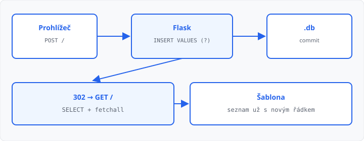

# Zápis z formuláře do databáze

## Cíle lekce

- Z **POST** formuláře vložíte řádek (`INSERT`)
- Hodnotu předáte **zástupným znakem `?`**, ne skládáním řetězce
- Po úspěchu **`commit`** a **přesměrování** — jako v [lekci 13](../13-presmerovani-a-flash/lekce.md)

Připojení a `init_db` (jen `CREATE TABLE`) máte z [lekce 16](../16-pripojeni-databaze/lekce.md). Výpis `SELECT` + `fetchall` z [lekce 17](../17-vypis-z-databaze/lekce.md). Formulář a `request.form` z [lekce 11](../11-formulare-a-request/lekce.md).

`INSERT` patří **do POST**, ne do GET a ne do `init_db`. Úprava a mazání jsou [lekce 19](../19-crud-v-aplikaci/lekce.md).

## INSERT a otazník

`execute` umí druhý argument — **tuple hodnot**. Místo hodnoty v SQL napíšete `?`, SQLite ji doplní samo:

```python
nazev = request.form.get("nazev", "").strip()
db.execute("INSERT INTO polozky (nazev) VALUES (?)", (nazev,))
db.commit()
```

Čárka u `(nazev,)` patří k tuple o jedné položce. Bez ní to není tuple a `execute` spadne.

Dva sloupce — dva otazníky, dvě hodnoty ve stejném pořadí:

```python
db.execute(
    "INSERT INTO vypujcky (jmeno, datum) VALUES (?, ?)",
    (jmeno, datum),
)
```

**Neskládejte** SQL f-řetězcem (`f"… {nazev} …"`). Hodnota z formuláře by se stala součástí příkazu. Proč je to nebezpečné, je [lekce 20](../20-bezpecnost-webu/lekce.md) — dnes stačí zvyk: **vždy `?`**.

Bez `commit()` je vložení jen v paměti. Restart (nebo někdy i další požadavek) ho zahodí. Stejné `commit` jako po `CREATE TABLE`.

`INSERT` nic nevrací k výpisu — seznam znovu načtete `SELECT` na **dalším** GET.

## Po úspěchu přesměrovat

Když po `INSERT` vrátíte šablonu (stav 200), F5 prohlížeč **znovu pošle POST** a řádek se zdvojí.

Proto stejný vzor jako v lekci 13: platná data → zápis → `flash` → `redirect`. Chyba validace → **200**, `{{ chyba }}`, **bez** `INSERT`.

```python
@app.route("/", methods=["GET", "POST"])
def index():
    chyba = ""
    if request.method == "POST":
        nazev = request.form.get("nazev", "").strip()
        if not nazev:
            chyba = "Vyplňte název."
        else:
            db = get_db()
            db.execute("INSERT INTO polozky (nazev) VALUES (?)", (nazev,))
            db.commit()
            flash("Přidáno")
            return redirect(url_for("index"))
    db = get_db()
    radky = db.execute("SELECT nazev FROM polozky").fetchall()
    return render_template("index.html", radky=radky, chyba=chyba)
```

`secret_key` je nutný kvůli `flash` — jako v lekci 13.

V Síti: POST **302**, hned GET **200** se seznamem, kde nový název už je.



→ kompletní příklad: `priklady/app.py` a `priklady/templates/index.html`

## Časté chyby

- `INSERT` v `init_db` nebo v GET — tabulka se plní mimo formulář,
- chybí `commit()` — po F5 serveru je tabulka zase prázdná,
- hodnota ve f-řetězci místo `?`,
- `(nazev)` bez čárky — to není tuple,
- po úspěchu `render_template` — F5 vloží znovu,
- prázdné pole stejně uložíte — nejdřív `.strip()` a `if not …`,
- chybí `methods=["GET", "POST"]` → **405**.

## Shrnutí

| Pojem | Význam |
|-------|--------|
| `INSERT` | nový řádek, jen z POST |
| `?` + tuple | hodnota mimo SQL text |
| `commit()` | zápis na disk |
| `redirect` po úspěchu | F5 nezdvojí řádek |
| chyba validace | 200, bez `INSERT` |

## Co dál

→ [Lekce 19: Úprava a mazání v aplikaci](../19-crud-v-aplikaci/lekce.md)
