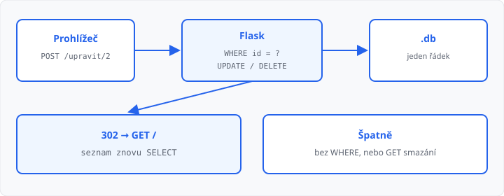

# Úprava a mazání záznamů v aplikaci

## Cíle lekce

- Smažete **jeden** řádek (`DELETE … WHERE id = ?`)
- Upravíte **jeden** řádek (`UPDATE … WHERE id = ?`)
- Když id v tabulce není, zavoláte **`abort(404)`** — jako v [lekci 09](../09-konfigurace-a-chyby/lekce.md)

Přidání (`INSERT`) umíte z [lekce 18](../18-zapis-do-databaze/lekce.md). Dnes saháte na **už existující** řádek. Poznáte ho podle sloupce `id` (primární klíč z `CREATE TABLE`).

Stejné zvyky: hodnota jen přes **`?`**, po úspěchu **`commit`** a **`redirect`**. Mazání i úprava patří na **POST**, ne na GET — F5 a náhled v prohlížeči by jinak řádek smazaly.

## Seznam musí znát id

V [lekci 17](../17-vypis-z-databaze/lekce.md) stačilo `SELECT nazev`. Odkaz „upravit“ a tlačítko „smazat“ potřebují **číslo řádku**:

```python
radky = db.execute("SELECT id, nazev FROM polozky").fetchall()
```

Cestu složíte `url_for` z [lekce 08](../08-dynamicke-url/lekce.md):

```html
<a href="{{ url_for('upravit', id=radek.id) }}">Upravit</a>
<form action="{{ url_for('smazat', id=radek.id) }}" method="post">
  <button type="submit">Smazat</button>
</form>
```

Odkaz je GET (otevře formulář). Mazání je **formulář POST** — ne `<a href="/smazat/2">`.

## DELETE — jeden řádek

Bez `WHERE` smažete **celou tabulku**. Vždy `WHERE id = ?`:

```python
@app.route("/smazat/<int:id>", methods=["POST"])
def smazat(id):
    db = get_db()
    db.execute("DELETE FROM polozky WHERE id = ?", (id,))
    db.commit()
    flash("Smazáno")
    return redirect(url_for("index"))
```

Routa bere **jen POST**. GET na `/smazat/2` má odpovědět **405**.

Neexistující id: `DELETE` smaže nula řádků a nespadne. Pro mazání to stačí. U úpravy chcete formulář — tam už `fetchone` a `abort` dávají smysl.

## UPDATE — nejdřív načíst

Stejné id v URL jako u článku v lekci 08. Nejdřív **`fetchone`**, pak buď 404, nebo formulář:

```python
from flask import abort


@app.route("/upravit/<int:id>", methods=["GET", "POST"])
def upravit(id):
    db = get_db()
    radek = db.execute(
        "SELECT id, nazev FROM polozky WHERE id = ?",
        (id,),
    ).fetchone()
    if radek is None:
        abort(404)
    chyba = ""
    if request.method == "POST":
        nazev = request.form.get("nazev", "").strip()
        if not nazev:
            chyba = "Vyplňte název."
        else:
            db.execute(
                "UPDATE polozky SET nazev = ? WHERE id = ?",
                (nazev, id),
            )
            db.commit()
            flash("Uloženo")
            return redirect(url_for("index"))
    return render_template("upravit.html", radek=radek, chyba=chyba)
```

V šabloně předvyplňte pole: `value="{{ radek.nazev }}"`. Pořadí v tuple je stejné jako pořadí `?`: nejdřív nový název, pak id v `WHERE`.

`UPDATE` bez `WHERE` přepíše **všechny** řádky. Chybějící `commit` úpravu neuloží — stejně jako u `INSERT`.



→ kompletní příklad: `priklady/app.py`, `priklady/templates/index.html` a `priklady/templates/upravit.html`

## Časté chyby

- `DELETE FROM polozky` nebo `UPDATE` bez `WHERE` — změní se celá tabulka,
- mazání odkazem GET — náhled nebo F5 smaže znovu,
- v `SELECT` chybí `id` — `url_for` nemá co dosadit,
- `fetchone()` je `None` a stejně sáhnete na `radek["nazev"]`,
- hodnota ve f-řetězci místo `?`,
- chybí `commit()` nebo `redirect`.

## Shrnutí

| Pojem | Význam |
|-------|--------|
| `id` v URL | který řádek měníte |
| `DELETE … WHERE id = ?` | smazat **jeden** řádek, jen POST |
| `UPDATE … WHERE id = ?` | změnit **jeden** řádek |
| `fetchone()` + `abort(404)` | id v tabulce není |
| `commit` + `redirect` | jako u `INSERT` |

## Co dál

→ [Lekce 20: Bezpečnost (XSS, SQL injection)](../20-bezpecnost-webu/lekce.md)
