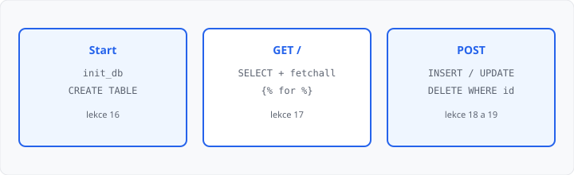

# Databáze — souhrn a procvičení

## Cíle lekce

- Složíte **jednu malou aplikaci** s databází z toho, co už umíte
- Propojíte výpis, přidání, úpravu a smazání
- Dnes **nepřibývá** nová syntaxe — jen skládáte lekce 16–19

Bezpečnost (XSS, skládání SQL z formuláře) je [lekce 22](../22-bezpecnost-webu/lekce.md). Mezi tím je bonus [ORM](../21-orm/lekce.md) — mimo 68 hodin, jde přeskočit. Dnes držíte zvyk **`?`** a `{{ }}`.

## Mapa dosavadních lekcí

| Lekce | Kdy to potřebujete |
|-------|-------------------|
| [16](../16-pripojeni-databaze/lekce.md) | `connect`, `g`, `init_db` + `app_context`, `CREATE TABLE` |
| [17](../17-vypis-z-databaze/lekce.md) | `SELECT`, `fetchall` / `fetchone`, `` |
| [18](../18-zapis-do-databaze/lekce.md) | POST, `INSERT … VALUES (?)`, `commit`, `redirect` |
| [19](../19-crud-v-aplikaci/lekce.md) | `id` v URL, `UPDATE` / `DELETE … WHERE id = ?`, `abort(404)` |

## Složky mini-aplikace

```
app.py
templates/
  index.html
  upravit.html
knihovna.db   ← vznikne při startu
```

`CREATE TABLE` patří **jen** do `init_db` při startu. `SELECT` / `INSERT` / `UPDATE` / `DELETE` do pohledů. Po úspěšném zápisu **302**, po chybě validace **200**.



→ kompletní příklad: `priklady/app.py` a `priklady/templates/`

## Kontrolní seznam

1. Cesta k `.db` vedle `.py` (`__file__`), když používáte `g`
2. `init_db` s `app_context` — ne z `index()`
3. Seznam potřebuje v `SELECT` i **`id`**, jinak nejde `url_for` na úpravu / smazání
4. Hodnota z formuláře jen **`?`**, po zápisu `commit`
5. Mazání jen **POST**, GET na `/smazat/…` → **405**
6. Chybějící řádek u úpravy → `abort(404)`

## Časté chyby

- `CREATE TABLE` v GET — každý refresh znovu zakládá,
- `INSERT` / `UPDATE` / `DELETE` bez `WHERE` u změny, nebo bez `commit`,
- po úspěchu `render_template` — F5 zopakuje POST,
- f-řetězec místo `?`,
- v `SELECT` chybí `id`.

## Shrnutí

Souhrnná lekce. Cílem je samostatně složit mini-evidenci: tabulka, seznam, přidání, úprava, smazání.

## Co dál

→ [Lekce 21: ORM (bonus)](../21-orm/lekce.md) — mimo hodinovou dotaci

→ [Lekce 22: Bezpečnost (XSS, SQL injection)](../22-bezpecnost-webu/lekce.md)
