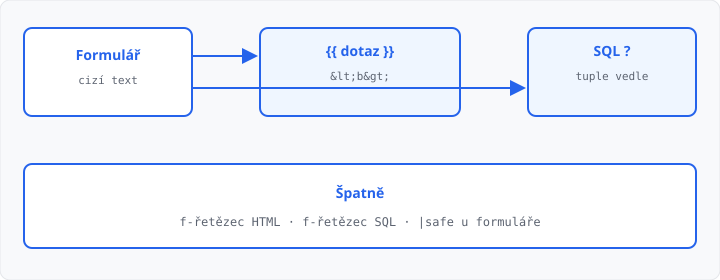

# Bezpečnost (XSS, SQL injection)

## Cíle lekce

- Text z formuláře vypíšete **`{{ }}`** — Jinja ho sama upraví
- Do SQL ho předáte jen **`?`**, jako v [lekci 18](../18-zapis-do-databaze/lekce.md)
- HTML ani SQL **neskládáte** f-řetězcem z toho, co přišlo z prohlížeče

Vstup z formuláře je **cizí text**. Nevíte, jestli je to „Eva“, nebo značka / kousek příkazu. Dvě pastí: prohlížeč (XSS) a databáze (SQL injection). Obrana je stejný nápad: hodnota zůstane **hodnotou**, nestane se kódem.

## XSS — značky v textu

Prohlížeč čte HTML. Když do stránky vložíte řetězec z formuláře jako značky, prohlížeč je **provede** (tučné písmo, odkaz, skript). Tomu se říká **XSS** (*cross-site scripting*).

```python
# Špatně — vstup se stane HTML
return f"<p>Hledáte: {dotaz}</p>"
```

V [lekci 05](../05-sablony-jinja/lekce.md) `{{ dotaz }}` Jinja **escapuje**: `<` se stane `&lt;`, takže v prohlížeči uvidíte znaky, ne značku.

```html
<p>Hledáte: {{ dotaz }}</p>
```

| Ve formuláři | Na stránce s `{{ }}` | S f-řetězcem HTML |
|--------------|----------------------|-------------------|
| `Eva` | Eva | Eva |
| `<b>x</b>` | znaky `&lt;b&gt;…` (ne tučně) | tučné **x** |

Filtr `|safe` escapování **vypne**. Patří jen k HTML, které jste napsali vy. Na `request.form` / `request.args` ho nedávejte.

## SQL injection — příkaz z formuláře

V lekci 18 byl zákaz f-řetězce u `INSERT`. Důvod: hodnota s uvozovkou **ukončí** SQL řetězec a zbytek se čte jako příkaz. Pak podmínka může platit pro **všechny** řádky, ne jen pro hledaný název.

```python
# Špatně — vstup se stane součástí SQL
db.execute(f"SELECT nazev FROM polozky WHERE nazev = '{dotaz}'")
```

```python
# Správně — SQL je pevný text, hodnota jde vedle
db.execute("SELECT nazev FROM polozky WHERE nazev = ?", (dotaz,))
```

U `?` SQLite hodnotu **nedosadí jako kód**. Uvozovky v názvu jsou pořád jen název.

`int()` u čísla injekci taky ztíží, ale u textu nepomůže. Zvyk je jeden: **vždy `?`**, i když už máte `int`.

Hledání přesným názvem stačí. Vzor `LIKE '%…%'` do SQL taky neskládejte z formuláře — i tam patří `?`.



→ kompletní příklad: `priklady/app.py` a `priklady/templates/index.html`

## Časté chyby

- `return f"<p>{dotaz}</p>"` místo šablony,
- `{{ dotaz|safe }}` u textu z formuláře,
- `execute(f"SELECT … {dotaz}")` nebo skládání uvozovkami `+`,
- `?` v SQL, ale tuple zapomenete,
- kontrola jen v HTML (`required`) — požadavek může přijít jinak.

## Shrnutí

| Pojem | Význam |
|-------|--------|
| XSS | vstup se stane HTML značkou |
| `{{ }}` | Jinja text upraví, značky se nespustí |
| filtr `safe` | úmyslně bez úpravy — ne na formulář |
| SQL injection | vstup se stane součástí SQL |
| `?` + tuple | hodnota mimo text příkazu |

## Co dál

→ [Lekce 22: Závěrečný projekt — zadání a práce](../22-projekt/lekce.md)
