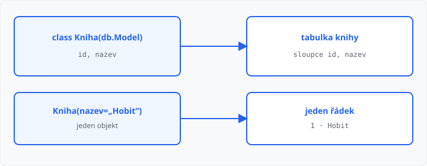

# ORM (bonus)

## Cíle lekce

- Pochopíte, že **ORM** spojuje **třídu s tabulkou** a **objekt s řádkem**
- Tabulku založíte **modelem** a `create_all`, ne řetězcem `CREATE TABLE`
- Řádky **přečtete a vložíte** přes objekty — SQL napíše knihovna

Tahle lekce **není v 68 hodinách**. Je **bonus** po procvičení databáze — smíte ji přeskočit. [Projekt](../23-projekt/lekce.md) později zůstává u `sqlite3` a SQL z lekcí 16–20. Tady je **jiný způsob** stejné práce s SQLite.

Třídu a objekt znáte z 2. ročníku. SQL taky. Nové je jen to, že mezi nimi stojí knihovna.

## Co je ORM

**ORM** (*object-relational mapping*) znamená: místo SQL řetězce pracujete s **objekty**.

| Vy napíšete | ORM z toho udělá |
|-------------|------------------|
| třída `Kniha` | tabulka (tady `knihy`) |
| atribut `nazev` | sloupec |
| jeden objekt `Kniha(...)` | jeden řádek |
| `Kniha.query.all()` | `SELECT` |
| `db.session.add` + `commit` | `INSERT` |

Soubor na disku je pořád **SQLite**. Mění se jen to, **kdo** SQL sestaví.



Dokud používáte model (`query`, `add`), hodnota z formuláře **není** součástí příkazu — podobná ochrana jako `?` v [lekci 18](../18-zapis-do-databaze/lekce.md). Do šablony dál `{{ }}` bez `|safe`. Proč je skládání SQL nebezpečné, je [lekce 22](../22-bezpecnost-webu/lekce.md).

## Instalace

Balíček není v Pythonu — nainstalujte ho přes PIP (1. ročník, lekce 02):

```bash
python -m pip install flask-sqlalchemy
```

Ověření: v Pythonu `from flask_sqlalchemy import SQLAlchemy` nesmí spadnout.

## Model místo CREATE TABLE

Cesta k `.db` zase vedle souboru (`__file__`), jako v [lekci 16](../16-pripojeni-databaze/lekce.md). Před cestu patří `sqlite:///`, jinak by Flask-SQLAlchemy soubor dalo jinam.

```python
import os

from flask import Flask
from flask_sqlalchemy import SQLAlchemy

app = Flask(__name__)
app.config["SQLALCHEMY_DATABASE_URI"] = "sqlite:///" + os.path.join(
    os.path.dirname(os.path.abspath(__file__)),
    "knihy.db",
)
db = SQLAlchemy(app)


class Kniha(db.Model):
    __tablename__ = "knihy"
    id = db.Column(db.Integer, primary_key=True)
    nazev = db.Column(db.Text, nullable=False)
```

`class Kniha(db.Model)` — třída **dědí** z modelu knihovny. `__tablename__` je název tabulky v souboru. Bez něj by se jmenovala podle třídy (`kniha`).

`g` a `get_db` z lekce 16 **nepotřebujete**. Připojení drží `db`.

Strukturu založte **jednou při startu** — `create_all` místo `CREATE TABLE IF NOT EXISTS`:

```python
def init_db():
    db.create_all()


with app.app_context():
    init_db()
```

Do Moodle soubor `.db` nahrávat nemusíte.

## Výpis a zápis

Řádky jsou objekty. V šabloně `{{ kniha.nazev }}`, ne `radek["nazev"]`.

```python
knihy = Kniha.query.all()
return render_template("index.html", knihy=knihy)
```

Vložení z POST: objekt, `add`, `commit`. Po úspěchu **přesměrování**, jako v [lekci 18](../18-zapis-do-databaze/lekce.md).

```python
db.session.add(Kniha(nazev=nazev))
db.session.commit()
return redirect(url_for("index"))
```

| Dřív (`sqlite3`) | Teď (ORM) |
|------------------|-----------|
| `CREATE TABLE …` | třída + `db.create_all()` |
| `SELECT … fetchall()` | `Kniha.query.all()` |
| `INSERT … VALUES (?)` | `db.session.add` + `commit` |
| `g` / `get_db` | instance `db` |

SQL řetězce (`CREATE TABLE`, `SELECT`, `INSERT`) do aplikace **nepatří**. Patří do modelu a relace.

→ kompletní příklad: `priklady/app.py` a `priklady/templates/index.html`

## Časté chyby

- chybí `python -m pip install flask-sqlalchemy`,
- v URI není `sqlite:///` a cesta z `__file__` — soubor vznikne jinde než vedle `.py`,
- chybí `__tablename__` — tabulka se jmenuje jinak, než čekáte,
- `create_all` v pohledu — každý GET znovu zakládá strukturu,
- `add` bez `commit` — řádek v souboru není,
- po úspěšném POST chybí `redirect` — F5 vloží znovu,
- v kódu zůstane `sqlite3` nebo SQL řetězec vedle modelu,
- v šabloně `|safe` u textu z formuláře.

## Shrnutí

| Pojem | Význam |
|-------|--------|
| ORM | objekty místo SQL řetězců |
| `db.Model` | třída = tabulka |
| objekt modelu | jeden řádek |
| `SQLALCHEMY_DATABASE_URI` | cesta k `.db` (`sqlite:///` + `__file__`) |
| `create_all` | struktura při startu |
| `query.all()` | výpis |
| `session.add` + `commit` | vložení |

## Co dál

→ [Lekce 22: Bezpečnost (XSS, SQL injection)](../22-bezpecnost-webu/lekce.md)
