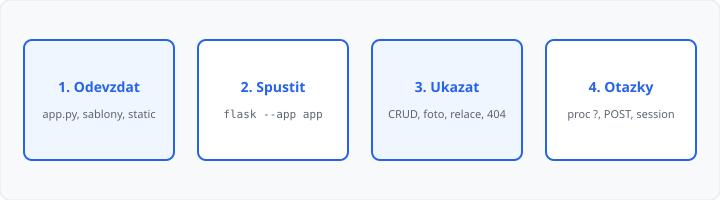

# Závěrečný projekt — odevzdání a prezentace

## Cíle lekce

- V prohlížeči předvedete aplikaci z [lekce 22](../22-projekt/lekce.md) (ne slidy místo programu)
- Ukážete **dvě související tabulky** a ostatní povinné chování
- Na otázku odpovíte z toho, co už umíte — **hlavní kritérium je znalost kódu**

Nová syntaxe **nepřibývá**. Úkol do Moodle u této lekce **není** — odevzdání aplikace je úkol z lekce 22, tady ji spustíte a obhájíte.

## Příprava ke zkoušení

Ze složky s hlavním `.py` (název řeknete učiteli, často `app.py`):

```bash
python -m flask --app app run --debug
```

V prohlížeči `http://127.0.0.1:5000`. Soubor `.db` vznikne při startu. Prázdné seznamy na začátku jsou v pořádku — data si při ukázce přidáte.

V archivu z lekce 22 mají být šablony, CSS ve `static/` a kód. Ne `venv`, ne `__pycache__`.

## Povinná ukázka (6 minut)

Mluvíte u **běžící** aplikace. Názvy cest jsou vaše. Pořadí funkcí dodržte. Když bod vynecháte, jako by v zadání nebyl.

1. **Téma** — jedna věta: co je rodič, co je potomek, jaký je druhý údaj u potomka.
2. **Vzhled** — název webu z config, menu přes `url_for`, CSS (DevTools → Síť: soubor ve `/static/` → 200).
3. **Session** — uložíte jméno, je vidět na jiné stránce, odhlášení ho schová.
4. **Rodič** — přidáte záznam (autor, sál…) a ukážete seznam.
5. **Potomek** — nejdřív prázdný odeslat (stav **200**, bez zápisu). Pak platný záznam **s fotkou a vybraným rodičem**, flash, seznam s **jménem potomka i rodiče** a **počtem**. Říct, že to je `JOIN`.
6. **Detail** — fotka, druhý údaj, jméno rodiče.
7. **Úprava** — změna textu nebo rodiče, flash.
8. **Smazání** — potomek jen POST (GET → **405**). Pokus smazat rodiče, který má potomky → bez `DELETE`, hláška.
9. **404** — neznámá cesta i neexistující id: vlastní stránka, stav 404.
10. **Bezpečnost** — jedna věta: text z formuláře do `{{ }}`, do SQL jen `?`.



Čas **6 minut** na body 1–10. Pak krátké otázky učitele.

## Otázky, které padnou

Umět odpovědět bez čtení celého souboru:

| Otázka | Čekaná myšlenka |
|--------|-----------------|
| Proč `JOIN` na seznamu potomků? | v tabulce potomka je jen cizí klíč, jméno rodiče je v druhé tabulce (2. ročník, SQL) |
| Proč nejde smazat rodiče s potomky? | odkazy by visely ve vzduchu |
| Proč `?` a ne f-řetězec v SQL? | hodnota nesmí být součástí příkazu ([lekce 21](../21-bezpecnost-webu/lekce.md)) |
| Proč po INSERT `redirect`? | F5 by zápis zopakoval ([lekce 13](../13-presmerovani-a-flash/lekce.md)) |
| Proč mazání POST, ne odkaz? | GET se smí přednačíst, 405 na GET ([lekce 19](../19-crud-v-aplikaci/lekce.md)) |
| K čemu `abort(404)`? | chybějící id není stránka 200 ([lekce 09](../09-konfigurace-a-chyby/lekce.md)) |
| Čím se liší `flash` a `session`? | flash jednou, `session` dokud ji nesmažete ([lekce 15](../15-relace/lekce.md)) |
| Kam patří `CREATE TABLE`? | `init_db` při startu, ne do GET ([lekce 16](../16-pripojeni-databaze/lekce.md)) |

## Hodnocení

**Hlavní kritérium je znalost kódu.** Ukážete, že kód je váš: vysvětlíte vybrané řádky a odpovíte na otázky výše **bez čtení celého souboru**. Když aplikace běží, ale kód nevysvětlíte, známka z toho nevzejde.

Bez spuštěné aplikace je projekt **nehodnocený**.

| Část | Co se počítá |
|------|----------------|
| Znalost kódu | vysvětlení vlastního kódu, odpovědi na otázky — **rozhoduje** |
| Zadání | dvě tabulky 1:N a chování z lekce 22 (ne konkrétní názvy) |
| Šablony a CSS | dědičnost, `url_for`, CSS ve `static/` |
| Data | `g`, `init_db`, `JOIN`, `?`, `commit`, CRUD u obou entit |
| Doplňky | nahrání fotky, session, 404, u vstupu žádný filtr safe |
| Ukázka | 6 minut podle seznamu výše |

Chybí-li povinná **funkce** (`JOIN`, mazání POST, 404…), úpravy navíc (třetí tabulka, hledání) zadání **nespraví**.

## Shrnutí

Aplikaci jste odevzdali v lekci 22. Tady ji spustíte, projdete deset bodů ukázky a **obhájíte kód**. Téma i názvy jsou vaše, chování je stejné u všech.
