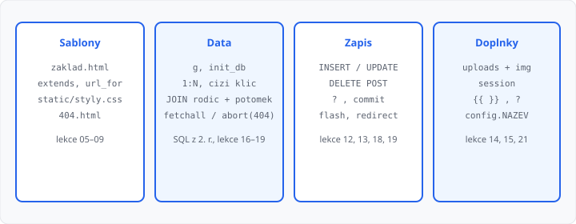

# Závěrečný projekt — zadání a práce

## Cíle lekce

- Složíte **jednu** Flask aplikaci z lekcí 03–20 a 22
- Propojíte **dvě tabulky** relací 1:N (znáte z 2. ročníku) — cizí klíč, `JOIN`, výběr ve formuláři
- Splníte **funkce** níže — chybějící chování znamená nesplněné zadání
- Téma, názvy tabulek, sloupců, souborů šablon i URL zvolíte sami; učitel návrh schválí v prvním týdnu

Nová syntaxe **nepřibývá**. Odevzdání a prezentace jsou [lekce 24](../24-projekt-prezentace/lekce.md). Bonus [ORM](../21-orm/lekce.md) do projektu nepatří — zůstáváte u `sqlite3`.

## Téma

Téma je **libovolné**, pokud:

- aplikace eviduje **dvě související entity** (1:N), třeba kniha a autor, akce a sál, pomůcka a předmět,
- obsah je v souladu se **školním řádem**: slušné, bez urážek, násilí, erotiky, drog, zbraní a nenávisti,
- v datech **nejsou** rodná čísla, hesla, známky spolužáků ani jiné citlivé údaje o konkrétních lidech.

V návrhu uveďte: název webu, obě entity, názvy tabulek a sloupců, které stránky budete mít. Bez schválení práci nepište.

Nápady, které nemusíte použít: knihovna (autor → kniha), školní akce (sál → akce), půjčovna (předmět → pomůcka), herbář (čeleď → rostlina).

## Složky

Aplikace se spouští ze složky, kde leží hlavní `.py` (doporučený název `app.py`):

```
app.py                 ← nebo jiný název; učitel musí vědět, který soubor spustit
templates/             ← šablony (názvy souborů jsou vaše)
static/                ← CSS a nahrané soubory
*.db                   ← vznikne při startu, neodevzdáváte ho
```

Cesta k databázi v `app.config` přes `os.path` a `__file__`. Název souboru `.db` je váš.

V kódu musí být `app.secret_key` a v konfiguraci **název webu**, který se vypíše v kořenové šabloně (třeba `app.config["NAZEV"]` a `{{ config.NAZEV }}`).

`get_db()` přes **`g`**, zavření v `@app.teardown_appcontext`.  
`init_db()` jen `CREATE TABLE IF NOT EXISTS` + `commit`. Volání:

```python
with app.app_context():
    init_db()
```

`CREATE TABLE` **nesmí** být v pohledu. V `get_db()` po `connect`:

```python
g.db.execute("PRAGMA foreign_keys = ON")
```

Bez toho SQLite cizí klíč nehlídá.

Odkazy skládejte **`url_for`**, ne natvrdo do HTML.

## Dvě tabulky (relace 1:N)

Relaci **1:N** znáte z 2. ročníku (SQL). Tady ji napojíte ve Flasku. Názvy tabulek a sloupců jsou **vaše** — v návrhu je napište.

| Role | Co v tabulce musí být |
|------|------------------------|
| **Rodič** (strana 1) | primární klíč, textový název (autor, sál, předmět…) |
| **Potomek** (strana N) | primární klíč, textový název, **ještě jeden** údaj (rok, datum, místo…), jméno nahraného souboru, **cizí klíč** na rodiče |

V `CREATE TABLE` u potomka **musí** být `FOREIGN KEY (… ) REFERENCES …`. Rodiče zakládejte **první**.

Seznam a detail potomka čtou **obě** tabulky (`JOIN`). Samostatné `SELECT` jen z potomka, bez jména rodiče, nestačí.

```sql
-- tvar; názvy si dosaďte
SELECT potomek.id, potomek.nazev, rodic.nazev
FROM potomek
JOIN rodic ON rodic.id = potomek.rodic_id
```

U detailu a úpravy `WHERE` podle **id potomka**.

## Povinné chování

Názvy cest jsou volné. Učitel musí v aplikaci **udělat totéž**:

### Rodič

- stránka se **seznamem** rodičů (`fetchall`, ``),
- **přidání** z formuláře: prázdný název → stav **200**, bez `INSERT`, viditelná chyba; vyplněný → `INSERT` s `?`, `commit`, `flash`, **302** (PRG),
- **úprava**: `fetchone`, chybějící id → `abort(404)`; prázdné pole → 200 bez `UPDATE`; úspěch → `UPDATE … WHERE id = ?`, flash, 302,
- **smazání jen POST** (GET na tutéž cestu → **405**). Když na rodiče ještě odkazuje potomek (`COUNT` > 0): **200**, bez `DELETE`, hláška že nejdřív smažte potomky. Jinak `DELETE … WHERE id = ?`, flash, 302.

### Potomek

- **seznam**: `JOIN`, v každém řádku **název potomka i rodiče**, odkaz na detail, počet potomků (`COUNT(*)` + `fetchone()`). Prázdná tabulka: srozumitelný text, ne prázdné `<ul>`,
- **přidání** (`GET` i `POST`): textová pole, **`<select>`** rodičů (`value` = id), `input type="file"`, `method="post"`, `enctype="multipart/form-data"`,
  - prázdný povinný text → **200**, bez zápisu,
  - chybí / neplatný rodič → **200**, bez zápisu,
  - chybí soubor (`filename == ""`) → **200**, bez zápisu,
  - vše OK → uložit soubor, `INSERT` včetně cizího klíče, `commit`, flash, **302**,
- **detail**: `JOIN` + `fetchone`, `None` → `abort(404)`; název, druhý údaj, jméno rodiče, `` z `static/`,
- **úprava**: totéž načtení a 404; lze změnit text i rodiče; nový soubor **není** povinný (prázdný výběr nechá starý soubor); úspěch → `UPDATE … WHERE id = ?`, flash, 302,
- **smazání jen POST**, GET → **405**, `DELETE … WHERE id = ?`, flash, 302.

Pořadí kontrol u přidání: text, pak rodič (`int` + `SELECT` zda id existuje), pak soubor. Chybu **neflashujte** — v šabloně ji vypište.

Soubor: `request.files`, `secure_filename`, složka pod `static/` (`os.makedirs(..., exist_ok=True)`), `.save()`. Do databáze **jen jméno souboru**, ne celá cesta.

### Session, 404, vzhled

Flask **`session`** z [lekce 15](../15-relace/lekce.md) (ne plést s relací tabulek):

- formulář se jménem (nebo přezdívkou): prázdné → 200 bez změny `session`; vyplněné → uložit, flash, 302,
- **odhlášení** smaže hodnotu (`pop` / `clear`) a přesměruje,
- když je jméno v `session`, je **vidět v kořenové šabloně na všech stránkách**.

Neznámá cesta i chybějící id → **vlastní** 404 (ne šedá stránka Flasku), stav **404**, odkaz zpět přes `url_for`:

```python
@app.errorhandler(404)
def stranka_nenalezena(chyba):
    return render_template("…"), 404
```

Kořenová šablona: menu, CSS, ``, `get_flashed_messages()`. Menu jen tam. Potomci `extends`. CSS ve `static/`, aspoň jedno pravidlo, `url_for('static', …)`. Text z formuláře a z databáze jen **`{{ }}`**, bez `|safe`, bez f-řetězce HTML.



Vzor návrhu: `priklady/navrh.md`

## SQL a bezpečnost

Hodnota z formuláře do SQL jen **`?`**. `WHERE id = ?` u `UPDATE` / `DELETE` je povinné.

## Co zadání nevyžaduje

- přihlášení heslem, více uživatelů, třetí tabulka, M:N,
- JavaScript, nasazení na veřejný server,
- `LIKE` s hledáním,
- konkrétní názvy tabulek, sloupců, šablon ani URL.

Když něco přidáte, povinné **chování** výše **nesmí** zmizet.

## Čas (10 týdnů × 2 h)

| Týden | Cíl |
|-------|-----|
| 1 | návrh: entity, názvy tabulek, schválení |
| 2 | Flask, kořenová šablona, CSS, 404, název webu |
| 3 | `init_db`, CRUD rodiče |
| 4 | seznam potomků s `JOIN`, počet |
| 5 | přidání potomka: `<select>`, soubor, `INSERT`, flash, redirect |
| 6 | detail, `abort(404)` |
| 7 | úprava potomka (i změna rodiče) |
| 8 | mazání potomka POST; mazání rodiče jen bez potomků |
| 9 | `session`, jméno v základu, odhlášení |
| 10 | kontrola funkcí, příprava ukázky k [lekci 24](../24-projekt-prezentace/lekce.md) |

## Kontrolní seznam

1. Obě entity: seznam, přidání, úprava, smazání (POST), 404 u chybějícího id
2. Cizí klíč, `JOIN` na seznamu i detailu potomka, `<select>` rodiče
3. `?` + `commit` + `redirect` po úspěšném zápisu; chyba validace = 200 bez zápisu
4. Fotka ve `static/`, dědičnost šablon, `url_for`, CSS
5. `session` na všech stránkách
6. `{{ }}` bez `|safe` u vstupu, žádný f-řetězec v SQL

## Časté chyby

- seznam potomků bez `JOIN` (chybí jméno rodiče),
- smazání rodiče, na kterého ještě odkazují potomci,
- mazání odkazem GET,
- po úspěchu `render_template` místo `redirect`,
- `CREATE TABLE` v GET,
- v `SELECT` chybí `id`,
- obrázek mimo `static/` — Flask ho na `/static/…` nepodá.

## Hodnocení

Hlavní kritérium je **znalost kódu**: u zkoušení v [lekci 24](../24-projekt-prezentace/lekce.md) vysvětlíte, co který kus dělá, a odpovíte na otázky **bez čtení celého souboru**. Aplikace, kterou nespustíte nebo neobhájíte, nestačí.

## Shrnutí

Dvě tabulky 1:N, fotka u potomka, `JOIN`, `session`, vlastní 404. Téma i názvy jsou vaše, **chování v kontrolním seznamu** musí jít předvést. Známku rozhodne hlavně to, jak kód znáte.

## Co dál

→ [Lekce 24: Odevzdání a prezentace](../24-projekt-prezentace/lekce.md)
