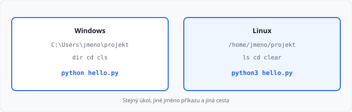

# Konzole — Windows a Linux

## Cíle lekce

- Pochopíte, **k čemu** je konzole, ne jen seznam zkratek
- Otevřete ji ve Windows a zjistíte, **kde** zrovna jste
- Základní úkony uděláte příkazem a uvidíte **linuxový protějšek**
- Budete vědět, v čem se Windows a Linux **liší**, ať vás to na serveru nepřekvapí

Tahle lekce **není v 81 hodinách** 1. ročníku. Je **bonus** — smíte ji přeskočit. Python z [lekce 02](../../1-rocnik/02-python-a-prostredi/lekce.md) se nemění. Už jste konzoli jednou použili (`python --version`). Tady jde o **stejné okno** jako nástroj, ne o novou syntaxi jazyka.

Ve škole budete skoro vždy na **Windows**. Linux tu není proto, abyste ho teď instalovali, ale proto, že obor je **Cloud**: vzdálený počítač často nemá Průzkumník, jen textový řádek.

## K čemu to je

Klikání v okně stačí na vlastní počítač. Konzole se vyplatí, když:

| Situace | Proč příkaz |
|---------|-------------|
| Program hlásí, že **soubor neexistuje** | často jste v **jiné složce**, než si myslíte |
| Spouštíte **Python** a **PIP** | přesně to už děláte v lekci 02 |
| Spolužák / učitel řekne „jdi do složky projektu“ | `cd` je rychlejší než hledat okno |
| **Cloud a Linux** | na serveru často není myš, jen terminál |
| Později Git / Docker | tlačítka v IDE stačí; až budete chtít, umíte i řádek |
| Stejný postup **zopakovat** | příkaz se dá zkopírovat, klikací cesta ne |

Bez konzole jste závislí na tom, že **vidíte** složky. S konzolí umíte počítači **říct**, kde má pracovat — i když okno Exploreru nemáte.

## Co je konzole

**Konzole** (také *terminál*, *příkazový řádek*) je textové okno: napíšete příkaz, Enter, počítač odpoví textem.

Není to Python. Python (`>>>`) je **uvnitř** interpretu. Konzole je **kolem** něj — složky, soubory, spuštění programů.

| Systém | Co otevřete | Poznámka |
|--------|-------------|----------|
| Windows | **PowerShell** nebo **Windows Terminal**; starší **cmd** | ve škole stačí PowerShell nebo terminál **v editoru** |
| Linux | Terminál, obvykle **bash** | stejná myšlenka, jiná jména příkazů |

V **VS Code / Cursor / PyCharm** dole bývá záložka **Terminál**. To je pořád konzole — jen uvnitř editoru, už ve složce projektu.

Řádek, kam píšete, se jmenuje **prompt**. Často ukazuje aktuální složku a na konci `>` (Windows) nebo `$` (Linux).

## Kde jste — aktuální složka

Každá konzole má **pracovní adresář** (*current directory*). Příkazy bez plné cesty hledají soubory **tady**.

| Co chcete | Windows (PowerShell) | Linux |
|-----------|----------------------|-------|
| Kde jsem? | `pwd` nebo `cd` (bez argumentu v cmd: `cd`) | `pwd` |
| Seznam souborů | `dir` (funguje i `ls`) | `ls` |
| Přejít jinam | `cd Desktop` | `cd Desktop` |
| O úroveň výš | `cd ..` | `cd ..` |
| Domů | `cd ~` | `cd ~` |

Tečka `..` je nadřazená složka. `cd` bez rozmyslu je nejčastější důvod „soubor `main.py` neexistuje“ — existuje, ale **vedle**, ne tady.



## Základní příkazy vedle sebe

| Úkol | Windows (PowerShell) | Linux (bash) |
|------|----------------------|--------------|
| Seznam | `dir` | `ls` |
| Změna složky | `cd cesta` | `cd cesta` |
| Nová složka | `mkdir cviceni` | `mkdir cviceni` |
| Smazat obrazovku | `cls` | `clear` |
| Vypsat soubor | `type poznamka.txt` nebo `Get-Content` | `cat poznamka.txt` |
| Kopírovat soubor | `copy a.py b.py` | `cp a.py b.py` |
| Kde je Python | `where python` | `which python3` |
| Nápověda k příkazu | `dir /?` nebo `Get-Help dir` | `ls --help` |

PowerShell na Windows **umí i** `ls`, `cat`, `pwd` — jsou to aliasy. Na **cmd** (`C:\>`) `ls` není; tam držte `dir` a `cd`.

**Mazání** (`del` / `rm`) teď necvičíme. Špatný příkaz smaže soubor bez koše. Dokud si nejste jistí, mažte v Průzkumníku.

Doplňování tabulátorem (**Tab**) nabídne název složky nebo souboru — méně překlepů.

## Cesty — hlavní rozdíly

| | Windows | Linux |
|---|---------|-------|
| Oddělovač | zpětné lomítko `\` (Python často bere i `/`) | lomítko `/` |
| Kořen | písmeno disku `C:\` | `/` |
| Domovská složka | `C:\Users\jmeno` | `/home/jmeno` |
| Velikost písmen | `Main.py` a `main.py` často totéž | **různé** soubory |
| Příkaz Pythonu | `python` | často `python3` (`python` nemusí existovat) |

Absolutní cesta začíná od disku nebo od `/`. Relativní je od **aktuální** složky (`.\main.py`, `./main.py`).

Windows v cestě snese mezery (`cd "Kurz programování"`). Bez uvozovek se `cd` zasekne na prvním slově.

## Python z konzole

Z [lekce 02](../../1-rocnik/02-python-a-prostredi/lekce.md):

```bash
python --version
python -m pip --version
python hello.py
```

Na Linuxu zkuste `python3`, když `python` selže.

`python` **bez souboru** otevře REPL (`>>>`). Pryč: `exit()` nebo Ctrl+Z a Enter (Windows) / Ctrl+D (Linux).

PIP:

```bash
python -m pip install -r requirements.txt
```

Stejný soubor `requirements.txt` — jen ho musíte spouštět **ve složce projektu** (`dir` / `ls` tam musí `requirements.txt` vidět).

## Časté chyby

- jste v `C:\Users\jmeno`, program leží na Ploše — `cd` nejdřív,
- v editoru máte otevřený soubor, ale terminál je v jiné složce,
- na Linuxu `Python` vs `python` (velikost písmen),
- `python` na Linuxu nic nespustí — zkuste `python3`,
- cesta s mezerou bez uvozovek,
- spletení Python REPL (`>>>`) s konzolí (`>` / `$`) — do `>>>` nepatří `dir`.

## Shrnutí

| Pojem | Význam |
|-------|--------|
| Konzole / terminál | textové příkazy místo klikání |
| Prompt | řádek, kam píšete (`>` nebo `$`) |
| Aktuální složka | kde příkazy hledají soubory (`pwd`, `cd`) |
| `dir` / `ls` | seznam |
| `cd` | změna složky (stejné na obou systémech) |
| `\` vs `/` | Windows vs Linux v cestě |
| `python` vs `python3` | Windows vs často Linux |

## Co dál

→ [Lekce 02: Git a GitHub](../02-git-a-github/lekce.md) — historii kódu v editoru, bez `git` příkazů

Zpět do 1. ročníku: [lekce 03 — bloky kódu](../../1-rocnik/03-bloky-kodu/lekce.md)
