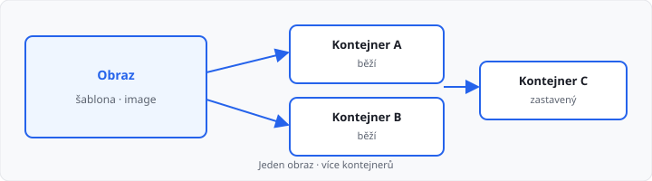
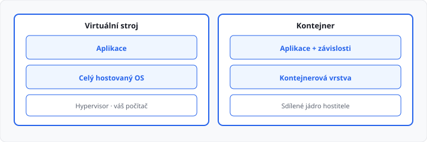

# Docker

## Cíle lekce

- Pochopíte, **proč** nestačí poslat samotný `main.py`
- Rozlišíte **obraz (image)** a **kontejner**
- Uvidíte rozdíl mezi kontejnerem a **virtuálním strojem**
- V IDE / Docker Desktop **poznáte**, co běží — bez zapamatování příkazů

Tahle lekce **není v 81 hodinách** 1. ročníku. Je **bonus** po Gitu. Python z 1. ročníku se nemění. Obor je **Informační technologie – Cloud**: Docker je jeden z nástrojů, na kterých cloudové služby stojí. Teď stačí **představa**, ne správa serveru.

Příkazy `docker run` a `docker build` **nejsou cíl hodiny**. Stejné akce umí tlačítka ve **Docker Desktop** a v panelu Docker v editoru.

## Problém „u mě to funguje“

Program, který vám běží ve škole, u spolužáka spadne. Časté důvody:

- jiná **verze Pythonu**,
- chybí **balíček**, který máte jen vy,
- jiná **cesta k souboru**,
- Windows vs. Linux.

Poslat `main.py` nestačí. Druhý počítač musí mít **stejné okolí** — interpret, knihovny, často i nastavení.

**Kontejner** je právě to okolí **zabalení spolu s programem**. Na jiném počítači (nebo v cloudu) se spustí **stejný balíček**, ne „skoro stejný Python“.

> **Analogie:** Git hlídá *historii kódu*. Docker hlídá *prostředí, ve kterém kód běží*. Doplňují se, nesoutěží.

## Obraz a kontejner

Dva pojmy, které se pletou. Zapamatujte si je jako **recept / pečivo** a **jeden upečený chleba**.

| Pojem | Anglicky | Co to je |
|-------|----------|----------|
| **Obraz** | *image* | šablona — „z čeho se to má spustit“ |
| **Kontejner** | *container* | **běžící** (nebo zastavený) exemplář z té šablony |

Z jednoho obrazu lze spustit **více kontejnerů**. Obraz se nemění, když kontejner píše dočasná data — proto se říká, že obraz je **neměnný vzor**.



| Otázka | Obraz | Kontejner |
|--------|-------|-----------|
| Lze ho „pustit“? | ne — je to předpis | ano |
| Je jich z jednoho vzoru víc? | jeden vzor | klidně několik |
| Kde ho v IDE uvidíte? | seznam *Images* | seznam *Containers* |

**Start** v Docker Desktop vezme obraz a z něj **vytvoří kontejner**. **Stop** kontejner zastaví. **Delete** u kontejneru maže exemplář, ne nutně obraz.

## Kontejner není virtuální stroj

Obojí **izoluje** program od zbytku počítače. Liší se tím, *kolik* izolují.

| | **Virtuální stroj (VM)** | **Kontejner** |
|---|-------------------------|---------------|
| Co obsahuje | skoro celý operační systém | aplikaci + její závislosti |
| Jádro OS | vlastní (hostitel ho emuluje) | **sdílí** jádro s počítačem |
| Velikost | gigabajty, minuty startu | často megabajty, start v sekundách |
| Kdy dává smysl | jiný OS, silné oddělení | stejná aplikace na mnoha strojích |



Kontejner **není** „lehčí Windows uvnitř Windows“. Je to **proces s vlastním souborovým stromem a sítí**, který vypadá, jako by měl svůj malý počítač — ale jádro si půjčuje.

Proto se kontejnery v cloudu spouští po desítkách: nestavíte deset kompletních OS kvůli deseti kopiím stejné služby.

## Dockerfile — recept v projektu

Obraz se neskládá ručně klikáním navždy. V projektu leží textový soubor **`Dockerfile`** (bez přípony). Je to **recept**: z jakého základu vyjít, co nainstalovat, který soubor spustit.

IDE ho umí obarvit a nabídnout **Build Image** — z receptu vznikne obraz. Konzoli k tomu nepotřebujete.

Ukázka (čtěte jako popis, ne jako úkol do terminálu):

```dockerfile
FROM python:3.12-slim
WORKDIR /app
COPY main.py .
CMD ["python", "main.py"]
```

| Řádek | Význam |
|-------|--------|
| `FROM` | výchozí obraz (tady oficiální Python) |
| `WORKDIR` | pracovní složka **uvnitř** kontejneru |
| `COPY` | zkopírovat váš soubor do obrazu |
| `CMD` | co se spustí, když kontejner nastartuje |

`FROM python:3.12-slim` znamená: neinstalujte Python ručně na každý počítač — **vezměte ho z obrazu**, který už někdo připravil.

→ celý soubor: `priklady/Dockerfile` (vedle něj v ukázce stačí `main.py`)

`Dockerfile` patří **do Gitu** — je to text, který píšete vy. Hotové obrazy (gigabajty) do Gitu **nepatří**; stahují se z registru.

## Odkud se obrazy berou

**Registr** je sklad obrazů. Nejznámější veřejný je **Docker Hub** ([hub.docker.com](https://hub.docker.com/)). Firmy a školy mají často **vlastní** registr.

Když v Desktopu nebo v IDE „stáhnete image“ `python`, nestahujete nahodilý soubor z webu — berete **pojmenovaný obraz** (a jeho verzi, např. `3.12`).

| Dobré jméno | Proč |
|-------------|------|
| Oficiální `python`, `nginx` | spravuje vydavatel, hodně stažení |
| Obraz od učitele / školy | víte, odkud je |
| Neznámý obraz s 12 staženími | cizí program s právy ve vašem počítači — **nedůvěřujte** |

To je stejná opatrnost jako u PIP v [lekci 02](../../1-rocnik/02-python-a-prostredi/lekce.md): instalujete **cizí prostředí**, ne jen jeden řádek kódu.

## Docker Desktop a práce v IDE

Na Windows Docker obvykle znamená aplikaci **Docker Desktop**. Ta na pozadí spouští malý Linux (přes WSL2). Bez běžícího Desktopu editor kontejnery neuvidí — není to chyba Pythonu.

### Docker Desktop

Okno má typicky sloupce **Images** a **Containers** (někdy *Volumes*).

- **Images** — co máte stažené / sestavené.
- **Containers** — co běží nebo je zastavené.
- U kontejneru: start, stop, logy (výstup programu, jako konzole v IDE), smazání.

To je celá „konzole“ pro 1. ročník: **vidět seznam a číst log**.

### VS Code a Cursor

Rozšíření **Docker** přidá do postraního panelu stejné stromy: Images, Containers, Registries.

- Pravý klik na obraz → **Run**
- Pravý klik na kontejner → logy, stop, attach
- Otevřený `Dockerfile` → příkaz **Build Image** v paletě příkazů

Cursor se chová stejně jako VS Code.

### PyCharm

Nabídka **Services** (View → Tool Windows → Services) umí Docker, když je v nastavení zapojený Docker Desktop.

- strom obrazů a kontejnerů,
- u `Dockerfile` akce *Build image*,
- log běžícího kontejneru v dolním panelu.

PyCharm Professional má integraci širší; Community často stačí Desktop plus otevřený `Dockerfile` jako text.

### Co v IDE kontrolovat

| Otázka | Kde |
|--------|-----|
| Mám obraz Pythonu? | Images |
| Běží kontejner? | Containers — stav *running* |
| Co program vypsal? | Logs u kontejneru |
| Proč se nic neděje? | běží Docker Desktop? zelená ikona v oznamovací oblasti |

Když Desktop neběží, editor hlásí *cannot connect to Docker*. Nejdřív zapněte Desktop, počkejte na „engine running“, pak obnovte panel.

## Proč to patří k cloudu

V cloudu nenasazujete „můj notebook“. Nasazujete **stejný obraz** na mnoho strojů: vývoj, test, provoz. Když obraz projde ve škole, stejný obraz může později běžet u poskytovatele.

Git umí říct: *toto je přesně ten kód*. Docker umí říct: *tohle je přesně to prostředí*. Teprve obojí dohromady je základ moderního nasazení.

V 1. ročníku **nemusíte** nic do cloudu posílat. Stačí vědět, že kontejner není magie — je to **balíček aplikace s předpisem**.

## Čemu Docker není

- **Není náhrada za učení Pythonu.** Pořád píšete `main.py`. Kontejner ho jen spustí jinde stejně.
- **Není povinný u úkolů v AMOS.** Hodnotitel VPL Docker nepoužívá.
- **Není totéž co virtuálka s Windows.** Viz tabulka výše.
- **Není záloha souborů.** Na to je Git.

## Časté nedorozumění

- **„Smazal jsem kontejner a ztratil jsem kód.“** — kód má zůstat **ve složce projektu** (a v Gitu). Kontejner je jen běh. Pokud jste soubor psali *jen uvnitř* kontejneru a nezkopírovali ho ven, ano, může zmizet. Pište v IDE u sebe.
- **„Image a kontejner je totéž.“** — image = šablona, kontejner = exemplář.
- **„Musím umět Linux.“** — na začátku ne. Desktop a IDE stačí k pohledu na seznamy a logy.
- **„Dockerfile je program.“** — je to **recept pro stavbu obrazu**, ne algoritmus jako Python.

## Shrnutí

| Pojem | Význam |
|-------|--------|
| „U mě to funguje“ | jiný počítač má jiné prostředí |
| Obraz (*image*) | neměnná šablona ke spuštění |
| Kontejner | běžící (nebo zastavený) exemplář obrazu |
| VM | izolace přes celý hostovaný OS |
| Dockerfile | textový recept v projektu |
| Registr / Docker Hub | sklad obrazů |
| Docker Desktop | aplikace, bez které Windows Docker nespustí |
| Logs | výstup programu v kontejneru |

## Co dál

Bonusové lekce Git a Docker končí. V **2. ročníku** navážete objekty a SQL — pořád v Pythonu na vašem počítači. Git a Docker zůstanou jako nástroje okolo kódu; v cloudu se k nim později vrátíte.
