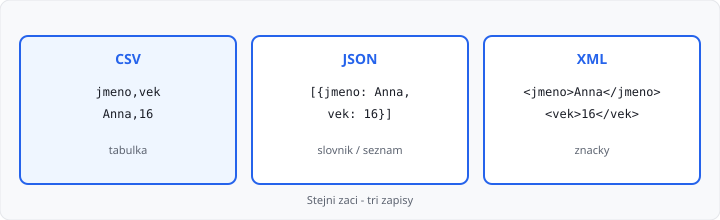

# CSV, JSON a XML

## Cíle lekce

- Poznáte **tři běžné textové formáty** dat
- Přečtete CSV, JSON i jednoduché XML ze souboru
- Vyberete formát podle toho, jestli jde o **tabulku**, **vnořená data**, nebo **značky**

Tahle lekce **není v 81 hodinách** 1. ročníku. Je **bonus** po práci se soubory — smíte ji přeskočit. Python z lekcí 01–27 se nemění. Místo „řádek textu“ tu má soubor **strukturu**.

Moduly `csv`, `json` a `xml.etree.ElementTree` jsou ve **standardní knihovně** — nic se nedoinstaluje.

Předpoklad: [čtení](../../1-rocnik/25-soubory-cteni/lekce.md) a [zápis](../../1-rocnik/26-soubory-zapis/lekce.md) souborů, [slovníky](../../1-rocnik/19-slovniky/lekce.md).

## Proč nestačí data.txt

Prostý text umíte. Jakmile má záznam **více údajů** (jméno, věk, třída), potřebujete pravidlo, kde který údaj je.

| Formát | Typický tvar | Kdy se hodí |
|--------|--------------|-------------|
| **CSV** | sloupce oddělené čárkou | tabulka, Excel, jeden řádek = jeden záznam |
| **JSON** | slovník a seznam v textu | vnořená data, weby, API |
| **XML** | značky `<nazev>…</nazev>` | starší systémy, dokumenty, RSS |

Stejní tři žáci ve třech zápisech:



## CSV — tabulka v textu

**CSV** (*comma-separated values*) je tabulka: první řádek často **hlavička** (názvy sloupců), další řádky záznamy. Oddělovač je čárka.

```text
jmeno,vek
Anna,16
Petr,17
```

Modul `csv` umí hlavičku mapovat na slovník — nemusíte počítat, který sloupec je který:

```python
import csv

with open("zaci.csv", "r", encoding="utf-8", newline="") as f:
    for radek in csv.DictReader(f):
        print(radek["jmeno"], radek["vek"])
```

`newline=""` u CSV na Windows zabrání prázdným řádkům navíc.

Zápis:

```python
import csv

zaci = [
    {"jmeno": "Anna", "vek": "16"},
    {"jmeno": "Petr", "vek": "17"},
]
with open("zaci.csv", "w", encoding="utf-8", newline="") as f:
    zapis = csv.DictWriter(f, fieldnames=["jmeno", "vek"])
    zapis.writeheader()
    zapis.writerows(zaci)
```

**Nesplitujte** řádek podle čárky ručně (`radek.split(",")`). V buňce může být čárka v uvozovkách — `csv` to zvládne, `split` ne.

→ viz `priklady/zaci.csv` a `priklady/cteni_csv.py`

## JSON — slovník a seznam v souboru

**JSON** (*JavaScript Object Notation*) zapisuje data podobně jako pythonovský slovník a seznam. Klíče jsou v **uvozovkách**, `True`/`False`/`None` se píše `true` / `false` / `null`.

```json
[
  {"jmeno": "Anna", "vek": 16},
  {"jmeno": "Petr", "vek": 17}
]
```

Čtení vrátí obyčejný `list` / `dict`:

```python
import json

with open("zaci.json", "r", encoding="utf-8") as f:
    zaci = json.load(f)

for zak in zaci:
    print(zak["jmeno"], zak["vek"])
```

Zápis (parametr `ensure_ascii=False` nechá českou diakritiku čitelnou):

```python
import json

with open("zaci.json", "w", encoding="utf-8") as f:
    json.dump(zaci, f, ensure_ascii=False, indent=2)
```

JSON umí **vnoření** — u žáka seznam předmětů, u knihy objekt autora. CSV má jen plochou tabulku.

Ve 3. ročníku API často vrací právě JSON místo HTML.

→ viz `priklady/zaci.json` a `priklady/cteni_json.py`

## XML — značky

**XML** (*eXtensible Markup Language*) obaluje údaje **značkami**. Každá otevírací značka má zavírací. Zanoření = vztah (škola → žák → jméno).

```xml
<zaci>
  <zak>
    <jmeno>Anna</jmeno>
    <vek>16</vek>
  </zak>
  <zak>
    <jmeno>Petr</jmeno>
    <vek>17</vek>
  </zak>
</zaci>
```

Ve standardní knihovně je `xml.etree.ElementTree`:

```python
import xml.etree.ElementTree as ET

strom = ET.parse("zaci.xml")
koren = strom.getroot()
for zak in koren.findall("zak"):
    jmeno = zak.find("jmeno").text
    vek = zak.find("vek").text
    print(jmeno, vek)
```

`findall("zak")` najde **přímé** děti se jménem `zak`. `find("jmeno")` vezme první takovou značku uvnitř.

XML je upovídanější než JSON. Na webu dnes spíš JSON; XML potkáte u starších rozhraní a exportů.

→ viz `priklady/zaci.xml` a `priklady/cteni_xml.py`

## Který formát zvolit

| Otázka | CSV | JSON | XML |
|--------|-----|------|-----|
| Jsou data **tabulka** (stejné sloupce)? | ano | jde, ale zbytečné | jde, ale zbytečné |
| Má záznam **vnořené** pole / objekt? | nehodí se | ano | ano |
| Má to číst **Excel** / tabulkový editor? | ano | ne | ne |
| Má to poslat **webové API**? | výjimečně | nejčastěji | starší API |
| Jsou v textu **čárky** uvnitř buněk? | `csv` modul, ne `split` | uvozovky ve stringu | značky |

**Databáze** (2. ročník) nahradí soubor, když dat přibývá, víc programů zapisuje najednou, nebo potřebujete relace. Pro malý export a školní úkol soubor stačí.

## Časté chyby

- CSV otevřené bez `newline=""`,
- `split(",")` místo `csv.DictReader`,
- u JSON zapomenuté uvozovky u klíčů, nebo `True` místo `true`,
- u XML `find` na značku, která tam není — výsledek je `None`, pak `.text` spadne,
- špatné kódování — pořád `encoding="utf-8"`.

## Shrnutí

| Pojem | Význam |
|-------|--------|
| CSV | tabulka, čárky, modul `csv` |
| JSON | slovník/seznam v textu, modul `json` |
| XML | značky, `ElementTree` |
| `DictReader` | řádek CSV jako slovník podle hlavičky |
| `json.load` / `dump` | čtení / zápis ze souboru |
| `findall` | seznam značek v XML |

## Co dál

→ [Lekce 27: Funkce — lokální a globální](../../1-rocnik/27-funkce-pokrocile/lekce.md) — zpět do 1. ročníku, pokud jste formáty vzali mezi soubory a závěrem

Volitelně později: [API — REST a GraphQL](../06-api-rest-graphql/lekce.md) (po 3. ročníku, jak funguje web) — JSON z téhle lekce tam bude tělo odpovědi.
