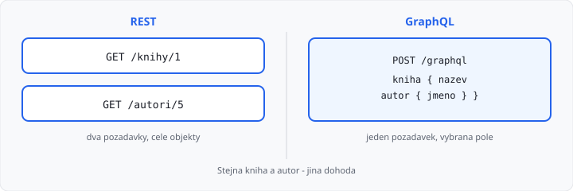

# API — REST a GraphQL

## Cíle lekce

- Pochopíte, že **API** je dohoda, ne konkrétní knihovna
- U **REST** uvidíte zdroje, cesty a HTTP metody
- U **GraphQL** uvidíte jeden endpoint a dotaz na **pole**, která klient chce
- Flask v tomhle kurzu zůstává u **HTML stránek** (a umí i JSON) — GraphQL server **nepíšete**

Tahle lekce **není v 68 hodinách** 3. ročníku. Je **bonus** po [Jak funguje web](../../3-rocnik/01-jak-funguje-web/lekce.md) — smíte ji přeskočit. HTTP, GET/POST a JSON se nemění. Mění se jen **jak** se klient se serverem dohodne na datech.

JSON jako soubor je v bonusu [CSV, JSON a XML](../05-csv-json-xml/lekce.md). Tady je JSON **tělo HTTP odpovědi**.

## API je dohoda

**API** (*Application Programming Interface*) říká:

- na jakou **URL** sáhnout,
- jakou **metodou** (`GET`, `POST`, …),
- v jakém **formátu** přijdou data (u webu nejčastěji JSON).

Klient může být prohlížeč, mobilní aplikace, nebo váš Python. Server může být Flask. Obě strany musí znát **stejnou** dohodu — jinak se „nedomluví“, i když HTTP funguje.

V [lekci 01](../../3-rocnik/01-jak-funguje-web/lekce.md) už je rozdíl: klasický web vrací **HTML stránku**, API vrací **data**. Dál jdou dvě běžné dohody: REST a GraphQL.

## REST — zdroje na adresách

**REST** (*Representational State Transfer*) je styl: data jsou **zdroje**, každý má **cestu**. HTTP metoda říká, co se zdrojem chcete udělat.

Příklad školní knihovny:

| Co chcete | Požadavek | Tělo odpovědi (zkráceně) |
|-----------|-----------|--------------------------|
| seznam knih | `GET /knihy` | `[ {"id": 1, "nazev": "Robot", "rok": 2020}, … ]` |
| jedna kniha | `GET /knihy/1` | `{ "id": 1, "nazev": "Robot", "rok": 2020, "autor_id": 5 }` |
| autor knihy | `GET /autori/5` | `{ "id": 5, "jmeno": "Novák" }` |
| přidat knihu | `POST /knihy` + JSON v těle | nový objekt nebo přesměrování |

Typické znaky:

- **víc URL** (`/knihy`, `/knihy/1`, `/autori/5`),
- metody **GET** (čtení) a **POST** (zápis) — stejné jako u Flask formulářů,
- odpověď je často **celý** objekt, i když jste chtěli jen název.

Flask routy (`@app.route("/knihy")`) jsou právě tyhle cesty. Když místo `render_template` vrátíte `jsonify(...)`, je to REST-ovské API na stejném principu. V povinné výuce vracíte **HTML**.

**Příliš dat:** `GET /knihy/1` pošle i `rok` a `autor_id`, přitom jste chtěli jen `nazev`.

**Málo dat:** k názvu potřebujete jméno autora → **druhý** požadavek `GET /autori/5`.

To není chyba REST. Je to důsledek: jedna cesta = jeden (předem daný) tvar odpovědi.

## GraphQL — jeden endpoint, klient volí pole

**GraphQL** je jiná dohoda. Server má obvykle **jednu** cestu, třeba `POST /graphql`. V těle pošlete **dotaz**: která pole z kterého typu chcete.

Stejná knihovna — jedna kniha včetně jména autora, bez roku:

```graphql
query {
  kniha(id: 1) {
    nazev
    autor {
      jmeno
    }
  }
}
```

Odpověď drží tvar dotazu:

```json
{
  "data": {
    "kniha": {
      "nazev": "Robot",
      "autor": { "jmeno": "Novák" }
    }
  }
}
```

Není tu `GET /knihy/1` a zvlášť `GET /autori/5`. Vnoření `autor { jmeno }` nahradí druhý požadavek. Pole `rok` jste nepožádali — v odpovědi **není**.

GraphQL **není databáze** a **není náhrada HTTP**. Pořád je to HTTP + JSON. Mění se jen jazyk dotazu v těle.

Server musí mít **schéma** (jaké typy a pole existují) a kód, který je naplní — často ze stejné SQL databáze jako REST. V tomhle kurzu schéma ani server GraphQL nestavíte.

## REST vs GraphQL vedle sebe



| | REST | GraphQL |
|---|------|---------|
| Adresy | víc cest (zdroje) | většinou jedna (`/graphql`) |
| Co chcete udělat | HTTP metoda (`GET` / `POST`) | v dotazu (`query` / `mutation`) |
| Tvar odpovědi | určí **server** (celý zdroj) | určí **klient** (vybraná pole) |
| Související data | často další požadavek | vnoření v jednom dotazu |
| Přehled v Síti | vidíte `GET /knihy/1` | vidíte opakovaně `POST /graphql` |
| Učení | sedí na Flask routách | další jazyk a knihovna |

Ani jedno není „lepší“. REST je přímočaré a v tomto předmětu ho **už vlastně cvičíte** (cesta + metoda). GraphQL se hodí, když má frontend hodně obrazovek a každá chce **jinou** kombinaci polí — ať se nestahuje zbytek a ať odpadnou řetězce `GET`.

## Co v tomhle kurzu dělat

| Situace | Volba |
|---------|--------|
| Školní Flask, šablony, formuláře | HTML, žádné GraphQL |
| Cvičné JSON API ve Flasku | `jsonify`, cesty jako REST |
| Zadání „napsat GraphQL server“ | mimo osnovu — tady stačí **číst** rozdíl |
| Cizí služba s dokumentací REST | URL + metoda + JSON, jako v tabulce výše |
| Cizí služba GraphQL | jeden endpoint, v těle `query { … }` |

Balíček na GraphQL (např. Graphene) **neinstalujte**, dokud to učitel výslovně nezadá. `requirements.txt` z [lekce 02](../../1-rocnik/02-python-a-prostredi/lekce.md) drží Flask a to, co projekt opravdu importuje.

## Časté omyly

- „GraphQL je databáze“ — ne, je to dohoda nad HTTP.
- „REST = JSON, GraphQL = XML“ — obojí dnes skoro vždy JSON.
- „REST nesmí vracet vnořený objekt“ — smí; jen *nemusí* umět *libovolný* výběr polí jedním dotazem.
- „Flask neumí API“ — umí; v ročníku cíleně vracíte HTML.

## Shrnutí

| Pojem | Význam |
|-------|--------|
| API | dohoda: URL, metoda, formát |
| REST | zdroje na cestách, HTTP metody |
| GraphQL | jeden endpoint, dotaz na pole |
| Přefetch | REST pošle víc polí, než potřebujete |
| Druhý GET | REST, když související údaj není v první odpovědi |
| `jsonify` | Flask umí REST-ovské JSON; projekt zůstává u šablon |

## Co dál

→ [Lekce 02: HTML a CSS — shrnutí](../../3-rocnik/02-html-css-shrnuti/lekce.md) — zpět do 3. ročníku

Až budete mít Flask a databázi: [ORM](../04-orm/lekce.md) je jiný zápis do SQLite, ne jiný styl API.
