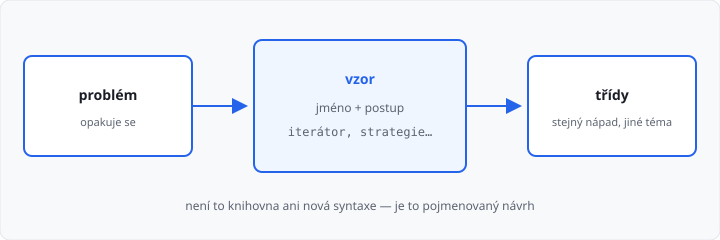

# Návrhové vzory — základ

## Cíle lekce

- Pochopíte, že **návrhový vzor** je pojmenovaný způsob, jak poskládat třídy
- Uvidíte tři vzory, které už z 2. ročníku skoro znáte
- Do pololetního projektu je **nemusíte** umět jmenovat

Tahle lekce **není v 170 hodinách** 2. ročníku. Je **bonus** k [návrhu a pololetnímu projektu](../../2-rocnik/11-oop-navrh-a-procviceni/lekce.md) — smíte ji přeskočit. Nová syntaxe nepřibývá. Přibývají jen **jména** pro postupy, které už děláte.

## Co je návrhový vzor

**Návrhový vzor** (*design pattern*) je opakovaný **návrh**, ne knihovna a ne příkaz jazyka.

Stejný problém (chci procházet skupinu v `for`, chci různé tarify bez `if` v cyklu) řeší lidi pořád stejně. Tomu postupu dali **jméno**. Když řeknete „iterátor“, druhý programátor ví, co v kódu hledat.



Vzory **nepřikazují** téma. Iterátor je u skupiny jmen, u košíku i u filmotéky. Mění se názvy tříd, ne nápad.

Do pololetního projektu stačí splnit seznam z lekce 11. Vzory jsou slovník navíc — ať návrh umíte **popsat**.

## Tři vzory, které už máte

### Iterátor — `for x in objekt`

Problém: chcete `for polozka in kosik`, ne `for polozka in kosik.polozky`.

Postup z [lekce 10](../../2-rocnik/10-vyjimky-a-iterace/lekce.md): objekt má `__iter__` a vrátí iterátor (často `iter(self.seznam)`).

```python
class Skupina:
    def __init__(self):
        self.jmena = []

    def pridej(self, jmeno):
        self.jmena.append(jmeno)

    def __iter__(self):
        return iter(self.jmena)
```

Jméno vzoru: **iterátor**. Cyklus `for` pak bere prvky po jednom, až dojde `StopIteration`.

→ viz `priklady/iterator.py`

### Strategie — stejné volání, jiný postup

Problém: pes i kočka se ozvou jinak, ale v cyklu chcete **jedno** volání.

Postup z [lekce 08](../../2-rocnik/08-polymorfismus/lekce.md): stejná metoda, jiné tělo u potomka. Cyklus bez `if` podle typu.

```python
for zvire in [Pes("Azor"), Kocka("Micka")]:
    print(zvire.ozvi_se())
```

Jméno vzoru: **strategie**. „Jak se ozvat“ je zaměnitelný postup u objektu. Tarify s `cena()` jsou totéž.

→ viz `priklady/strategie.py`

### Továrna — vznik správného potomka

Problém: z textu `"pes"` / `"kocka"` potřebujete **vytvořit** správnou třídu.

Tady `if` **patří**. Rozhodujete se **jednou**, při vzniku — ne v každém kole cyklu.

```python
def udelej_zvire(druh, jmeno):
    if druh == "pes":
        return Pes(jmeno)
    if druh == "kocka":
        return Kocka(jmeno)
    raise ValueError("neznamy druh")


a = udelej_zvire("pes", "Azor")
print(a.ozvi_se())  # Haf!
```

Jméno vzoru: **továrna**. Funkce (nebo statická metoda) vrátí už hotový objekt správné třídy. Pak zase strategie: `a.ozvi_se()` bez dalšího `if`.

→ viz `priklady/tovarna.py`

## Časté chyby

| Chyba | Následek |
|-------|----------|
| vzor = nový příkaz Pythonu | nic se neinstaluje, nic se neučí syntakticky |
| `if` podle typu **v cyklu** | to není strategie — další potomek = další větev |
| `if` v továrně považovat za zakázaný | při **vzniku** je `if` v pořádku |
| do projektu nacpat všechny vzory | stačí splnit zadání lekce 11 |

Existují desítky dalších jmen (jedináček, pozorovatel, dekorátor…). V tomhle kurzu je **nepotřebujete**. Až uvidíte cizí kód s těmito třemi, poznáte nápad.

## Shrnutí

| Vzor | Problém | Co už umíte |
|------|---------|-------------|
| iterátor | `for x in objekt` | `__iter__`, lekce 10 |
| strategie | stejné volání, jiný výsledek | přepis metody, lekce 08 |
| továrna | z údaje vznikne správný potomek | `if` **jen** při vytváření |

Zpět k projektu: [Lekce 11 — návrh a pololetní projekt](../../2-rocnik/11-oop-navrh-a-procviceni/lekce.md).
