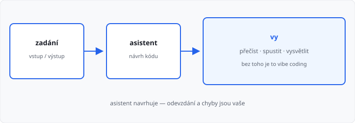

# Vibe coding

## Cíle lekce

- Pochopíte, co se myslí **vibe codingem**
- Odlišíte ho od **asistenta**, kterého řídíte vy
- Budete vědět, kdy asistent pomáhá a kdy škodí — zvlášť u úkolů do AMOS

Tahle lekce **není v 81 hodinách** 1. ročníku. Je **bonus** po [funkcích](../../1-rocnik/15-funkce-zaklady/lekce.md) — smíte ji přeskočit. Nový příkaz Pythonu nepřibývá. Přibývá jen **jak** (ne)používat nástroje, které vám nabízí kód.

Hodí se, jakmile umíte přečíst krátký program: proměnné, podmínky, cykly, funkce.

## Co ten název znamená

**Vibe coding** (kódování „podle pocitu“) je styl: napíšete volné přání, přijmete, co model vypíše, a kód **pořádně nečtete**. Když to nefunguje, znovu napíšete „oprav to“ — pořád bez toho, abyste věděli, *co* se v souboru děje.

Název se ujal v roce 2025. Není to produkt ani předmět v ŠVP. Je to **popis návyku**.

| | Asistent pod kontrolou | Vibe coding |
|--|------------------------|-------------|
| Zadání | konkrétní: jazyk, vstup, výstup, co nesmí | „udělej mi úkol“ |
| Kód | přečtete, spustíte, umíte vysvětlit | jen vložíte a doufáte |
| Chyba | hledáte v kódu | další prompt naslepo |
| Zodpovědnost | vaše | „vždyť to napsala AI“ |

Asistent (chat, doplňování v editoru, agent v IDE) **není zakázaný nástroj**. Zakázané je odevzdat práci, které **nerozumíte**.



## Co model umí a neumí

Model skládá text, který **vypadá** jako program. Neví, jestli u vás AMOS ten výstup přijme. Nevidí vaši obrazovku, pokud mu ji neukážete. Neučí se „vaši“ lekci — hádá z podobných textů na internetu.

Proto běžně:

- vymyslí funkci, kterou v kurzu ještě nemáte (`map`, dekorátor, knihovna),
- napíše `input("Zadej cislo: ")`, ačkoli test chce `input()` **bez textu**,
- „opraví“ jednu chybu a rozbije druhou,
- tvrdí, že kód spustil, i když ho nespustil.

Tomu se říká **halucinace**: sebevědomá věta, která neplatí. U kódu ji poznáte jedině **spuštěním** a čtením.

Doplňování v editoru je totéž v malém: nabídne řádek. Šipka vpravo ho přijme. Pořád platí, že řádek musí dávat smysl *vám*.

## Zadání, ze kterého jde pracovat

Špatně: `napiš mi python program na prumer`.

Lépe — jako školní úloha:

1. **jazyk** — Python 3, bez knihoven navíc,
2. **vstup** — co přesně načíst (`input()` bez textu),
3. **výstup** — přesný tvar (`Prumer: 4.5`),
4. **omezení** — co nesmí (`while`, `sort()`, dekorátor),
5. **příklad** — jeden vstup a očekávaný výstup.

```text
Python 3, žádný import.

Načti jedno celé n. Pak načti n celých čísel, každé na řádku.
Vypiš průměr na jeden řádek ve tvaru: Prumer: 4.5
input() bez textu. Žádný while.
```

Čím víc vypadá zadání jako AMOS (vstup / výstup), tím míň si model vymýšlí. Pořád to **není** hotový úkol — je to jen návrh, který musíte ověřit.

Když asistent vidí **váš** soubor, napište, co je špatně teď (`u vstupu 0 spadne ZeroDivisionError`), ne „něco nefunguje“.

Do chatu **nevkládejte** hesla, klíče, cizí osobní údaje, celé zadání známkovaného tajného úkolu, pokud to učitel zakáže.

## Jak kód zkontrolovat

Než ho odevzdáte:

1. **Přečtěte** ho. Každý řádek umíte říct česky.
2. **Spusťte** ho s příkladem ze zadání.
3. Zkuste **okraj** (nula, jedno číslo, záporné).
4. Porovnejte s tím, co už z lekce umíte. Když je tam `lambda` a vy ji neznáte, **nepatří** do odevzdání — přepište to látkou z hodiny.
5. Učitel se může zeptat „proč je tu `range(len(cisla) - 1)`?“. Odpověď „to napsal chat“ **nestačí**.

Typická past: kód *vypadá* čistě a počítá špatně.

```python
def prumer(cisla):
    soucet = 0
    for i in range(len(cisla) - 1):
        soucet += cisla[i]
    return soucet / len(cisla)
```

`range(len(cisla) - 1)` vynechá **poslední** prvek. Průměr `[2, 4, 6]` vyjde `2.0`, ne `4.0`. Asistent klidně přidá docstring a typové nápovědy — chyba zůstane.

→ viz `priklady/chyba_prumer.py`

## Škola, AMOS a poctivost

Cvičení v hodině má v materiálu řešení. Úkol v AMOS **nemá**. Cíl úkolu je, abyste **vy** složili program.

| Použití | Hodnocení |
|---------|-----------|
| Zeptat se na syntaxi, kterou už znáte (`jak se píše f-řetězec`) | v pořádku, jako učebnice |
| Nechat si navrhnout postup a **sami** ho napsat a otestovat | v pořádku, pokud kód umíte |
| Vložit zadání úkolu, zkopírovat výstup, Evaluate je zelené, kódu nerozumíte | **podvod** — stejné jako opsat od spolužáka |
| Tajný známkovaný úkol od učitele do chatu | zakázané, pokud učitel neřekne jinak |

Zelené Evaluate dokazuje shodu výstupu, ne že program umíte. Ústní ověření a další testy, které v materiálu nejsou, to rychle poznají.

V práci později asistent uvidíte denně. Tam taky platí: **vy** commitujete, **vy** vysvětlujete review. Vibe coding končí u rozbitého nasazení a u otázky, kterou neumíte zodpovědět.

## Časté chyby

| Chyba | Proč vadí |
|-------|-----------|
| „AI to spustila, takže to funguje“ | nespustila to u vás ani v AMOS |
| prompt bez formátu vstupu | model si vymyslí `Zadej n:` a test spadne |
| přijmout neznámou konstrukci | u zkoušení to neobhájíte |
| další prompt místo čtení tracebacku | asistent hádá, vy máte chybovou hlášku |
| odevzdat, čemu nerozumím | to není použití nástroje, to je odevzdání cizí práce |

## Shrnutí

| Pojem | Význam |
|-------|--------|
| vibe coding | kód od modelu berete, aniž byste ho četli |
| asistent | chat / doplňování / agent — nástroj, ne autor odevzdání |
| zadání | jazyk, vstup, výstup, omezení, příklad |
| ověření | číst, spustit, okrajové hodnoty, umět vysvětlit |
| halucinace | jistě znějící nesmysl |

## Co dál

Zpět do 1. ročníku: [Lekce 15 — Funkce, základy](../../1-rocnik/15-funkce-zaklady/lekce.md).

Volitelně nástroj okolo kódu: [Git a GitHub](../02-git-a-github/lekce.md).
